## JAVA基础

### 一 编译

在一个目录下Main.java文件

```java
public class Main {
    public static void main(String[] args) {
        System.out.println("Hello world!");
    }
}
```

然后在命令行输入

```bash	
javac Main.java   # 执行编译命令
# 执行无误之后会生成一个Main.class文件

java Main  # 执行程序
```

### 二 基础知识点

#### 2.1 数据类型

| 数据类型 | 关键字  |              取值范围              |
| :------: | :-----: | :--------------------------------: |
|   整数   |  byte   |              -128-127              |
|   整数   |  short  |            -32768-32767            |
|   整数   |   int   |        -214783648-214783647        |
|   整数   |  long   |             （10位数）             |
|  浮点数  |  float  |   -3.041298 e-38到3.402823 e+38    |
|  浮点数  | double  | -4.9000000 e-324 到 1.797693 + 308 |
|   字符   |  char   |              0-65535               |
|   布尔   | boolean |             true false             |

```java
public class Main {
    public static void main(String[] args) {
        // byte
        byte b = 10;
        System.out.println(b);
        // short
        short s = 10;
        System.out.println(s);
        // int
        int i = 10;
        System.out.println(i);
        // long
        // 如果要定义long 类型的变量的时候，需要在数值后面加一个L作为后缀  L可以是大写也可以是小写
        long n = 9999999999L;
        System.out.println(n);
        // float
        // 如果要定义一个类型为float类型的变量的时候，数值后面也需要加一个F作为后缀
        float f = 10.1F;
        System.out.println(f);
        // double
        // 定义double同理
        double d = 10.2D;
        System.out.println(d);
        // char //字符
        char c = '中';
        System.out.println(c);
    }
}
```

案例

```java
public class pra1 {
    public static void main(String[] args) {
        int age = 18;
        char sex = '男';
        double height = 180.1D;
        boolean married = true;
        String name  = "黑马王钰滔";      //字符串
        System.out.println(name);
        System.out.println(age);
        System.out.println(sex);
        System.out.println(height);
        System.out.println(married);
    }
}
```

#### 2.2 输入输出

第一步先导包

```java
import java.util.Scanner;

public class pra2 {
    public static void main(String[] args) {
        // 1 导入包
        // 2 穿件对象
        System.out.println("请输入数据");
        Scanner sc = new Scanner(System.in);
        // 3 获取输入的值
        int i = sc.nextInt();
        System.out.println(i);
    }
}
```

#### 2.3 运算符

```java
+ - * / % 加 减 乘 除 取余，取模
    
public class pra4 {
    public static void main(String[] args) {
        System.out.println(3 + 2);
        System.out.println(3 - 2);
        System.out.println(3 * 2);
        System.out.println(3 / 2);
        System.out.println(3 % 2);
        // 代码中存在小数参与运算，结果有可能是不准确的
        System.out.println(1.1 + 1.01);  // 2.1100000000000003
    }
}

import java.util.Scanner;

public class pra5 {
    public static void main(String[] args) {
        Scanner sc = new Scanner(System.in);
        System.out.println("请输入一个三位数整数：");
        int num = sc.nextInt();
        int a = num % 10;
        int c = num / 100;
        int b = (num - (100 * c)) / 10;
        System.out.println(a);
        System.out.println(b);
        System.out.println(c);
    }
}
```

#### 2.4 算数运算符


##### 2.4.1 数字相加


```java
package com.makermaker;

public class pra1 {
    public static void main(String[] args) {
        byte b1 = 10;
        byte b2 = 10;
        byte result = (byte)(b1 + b2);
        System.out.println(result);
    }
}
```

当 "+" 的操作中出现字符串的时候，这个"+"就是字符串连接符，而不是算数运算符


当字符+ 的时候 会把字符通过ASCII码查询到对应的数字再进行计算

#### 2.5 自增自减运算符

```java
a++  // 先用后加
int a = 10;
int b = a++;  // b=10 
    
int a = 10;
int b = ++a   // b=11
```

#### 2.6 赋值运算符


```java
赋值运算符隐含了强制类型转换
```

#### 2.7 关系运算符


### 三 循环

#### 3.1 if语句

```java
package com.makermaker;
import java.util.*;

public class pra4 {
    public static void main(String[] args){
        System.out.println("请输入小伙子酒量");
        Scanner sc = new Scanner(System.in);
        int wine = sc.nextInt();
        if (wine<=200 && wine>=100) {
            System.out.println("小伙子酒量不求占");
        }
        else{
            System.out.println("小伙子牛逼");
        }
    }
}

package com.makermaker;
import java.util.*;

public class pra4 {
    public static void main(String[] args){
        System.out.println("请输入小伙子酒量");
        Scanner sc = new Scanner(System.in);
        int wine = sc.nextInt();
        if (wine<=200 && wine>=100) {
            System.out.println("小伙子酒量不求占");
        }else if (wine>200 && wine <=300) {
            System.out.println("酒量一般般");
        }else{
            System.out.println("酒量牛逼");
        }
    }
}
```

#### 3.2 switch

```java
package com.makermaker;
import java.util.Scanner;

public class pra5 {
    public static void main(String[] args){
        Scanner sc = new Scanner(System.in);
        String food = sc.nextLine();
        switch(food){
            case "兰州拉面":
                System.out.println("我要吃兰州拉面");
                break;
            case "白切鸡":
                System.out.println("我要吃白切鸡");
                break;
            case "宝塔肉":
                System.out.println("我要吃宝塔肉");
                break;
            default:
                System.out.println("吃屎");
        }
    }
}
```

#### 3.3 for循环

```java
package com.makermaker;

import java.lang.reflect.Array;

public class pra6 {
    public static void main(String[] args){
        for(int i = 1;i<=5;i++) {
            System.out.println(i);
        }
        for(int j = 5;j>=0;j--) {
            System.out.println(j);
        }
    }
}
```

#### 3.4 while循环和do while循环

```java
package com.makermaker;

public class pra7 {
    public static void main(String[] args) {
        int i = 0;
        do{
            i = i + 1;
            System.out.println(i);
        }while(i <= 10);
    }
}
```

#### 3.5 无限循环

```java
for(;;){
    
}
while(true){
    
}
do{
    
}while(true);
```

#### 3.6 break和continue

```java
package com.makermaker;

public class pra7 {
    public static void main(String[] args) {
        for(int i = 1;i<=5;i++){
            if(i == 3){
                continue;
            }
            System.out.println(i);
        }
    }
}
result: 1 2 4 5

public class pra7 {
public static void main(String[] args) {
        for(int i = 1;i<=5;i++){
            if(i == 3){
                continue;
            }
            System.out.println(i);
        }
    }
}
result: 1 2
```

### 四 数组

#### 4.1 数组基础

数组的定义

```java
package com.makermaker;

public class array {
    public static void main(String[] args) {
        int[] arr1 = {10,20,30,40};
        int[] arr2 = new int[]{12,13,14};
        String[] arr3 = new String[]{"a","b","c"};
        double[] arr4 = new double[]{1.1,2.2,3.3};
        System.out.println(arr1[1]); // System.out.println(arr1);  打印出来的是数组的地址值
    }
}
```

遍历数组

```java
package com.makermaker;

public class array {
    public static void main(String[] args) {
        int[] arr1 = {10,20,30,40};
        int[] arr2 = new int[]{12,13,14};
        String[] arr3 = new String[]{"a","b","c"};
        double[] arr4 = new double[]{1.1,2.2,3.3};
        System.out.println(arr1[1]); // System.out.println(arr1);  打印出来的是数组的地址值
        
    }
}
```

#### 4.2 数组动态初始化

```java
package com.makermaker;

public class array {
    public static void main(String[] args) {
        int[] arry = new int[10];
        arry[0] = 1;
        System.out.println(arry[1]);
    }
}
```

#### 4.3 数组常见操作

```java
package com.makermaker;
import java.util.*;

public class array {
    public static void main(String[] args) {
        Random r = new Random();
        int[] arry = new int[10];
        for(int i=0;i < arry.length;i++){
            int x = r.nextInt(100) + 1;
            arry[i] = x;
        }
        for(int j=0;j< arry.length;j++){
            System.out.println(arry[j]);
        }
    }
}
```

### 五 方法

#### 5.1 方法的定义与调用

```java
package com.makermaker;

public class function {
    public static void main(String[] args) {
        honor();
    }
    public static void honor() {
        int a =7;
        System.out.println("we are the honor");
    }
}
```

#### 5.2 传参函数

```java
package com.makermaker;

public class function {
    public static void main(String[] args) {
        honor(10,20);
    }
    public static void honor(int num1, int num2) {
        int sum = num1 + num2;
        System.out.println("we are the honor");
    }
}
```

#### 5.3 带返回值的函数

```java
public static 返回值类型 方法名 (参数){
    方法体;
    return 返回值;
}
```

ex

```java
public static int getSum(int a,int b){
    int c = a + b;
    return c;
}

package com.makermaker;

public class function {
    public static void main(String[] args) {
        double res = Gets(10.2,10.5);
        System.out.println(res);
    }
    public static double Gets(double a, double b) {
        return a * b;
    }
}
```

#### 5.4 方法的重载

在同一个类当中定义了多种同名的方法，这些同名的方法具有相同的功能，每个方法具有不同的参数类型和参数个数，这些同名的方法构成了重载关系

```java
package com.makermaker;

public class function {
    public static void main(String[] args) {
         int a = Getsum.sum(10,10);
    }
    public static class Getsum{
        public static int sum(int a, int b){
            return a+b;
        }
        public static int sum(int a, int b, int c){
            return a+b+c;
        }
    }
}

```

#### 5.5 二维数组

```java
package com.makermaker;

public class two_arry {
    public static void main(String[] args) {
        int[][] arry1 = new intp[2][3] //动态定义数组，没有赋值的地方初始化为0
        int[][] arry = {
                {1,2,3},
                {4,5,6},
                {7,8,9}                //静态定义数组
        };
        System.out.println(arry[0][0]);
    }
}
public static void main(String[] args){
	int[][] arr = new int[2][];
	int[] arr1 ={11,22};
	int[] arr2 ={44,55,66};
	arr[0] = arr1;
    arr[1j = arr2;
}
```


### 六 面向对象

#### 6.1 定义

```java
public class Phone{
    //属性
}
如何得到这个类
类名 对象名 = new 类名();
package toclass;

public class phoneTest {
    public static void main(String[] args) {
        phone p = new phone();
    }
}

package toclass;

public class phoneTest {
    public static void main(String[] args) {
        phone p = new phone();
        p.brand = "小米";
        p.price = 2000;
        System.out.println(p.brand);
        System.out.println(p.price);
        p.call();
        p.playGame();
    }
}
```

```java
定义类的补充注意事项
    用来描述一类事物的类，专业叫做:javabean类。
    在javabean类当中，是不写main方法的
        
    在以前编写main方法的类叫做测试类
    我们可以在测试类当中创建javabean类的对象并进行赋值调用
```


#### 6.2 封装

```java
package pravt;

public class pra {
    private String name;
    private int age;
    private String gender;

    public void SetAge(int a) {
        if(a <= 0){
            System.out.println("Invalid Age");
        }else {
            age = a;
        }
    }

    public void SetGender(String g) {
        gender = g;
    }

    public void SetName(String n) {
        name = n;
    }

    public String GetName() {
        return name;
    }

    public int GetAge() {
        return age;
    }

    public String GetGender() {
        return gender;
    }

    public void Sleep() {
        System.out.println("Sleeping");
    }
}

package pravt;

public class getinfo {
    public static void main(String[] args) {
        pra gf1 = new pra();
        gf1.SetAge(18);
        gf1.SetGender("男");
        gf1.SetName("小诗诗");
        System.out.println(gf1.GetName());
        System.out.println(gf1.GetAge());
        System.out.println(gf1.GetGender());
    }
}
```

#### 6.3 就近原则和this指针

```java
package pra2;

public class girfriend {
    private int age;

    public girfriend(int age) {
        this.age = age;
    }

    public void Setage(int people_age) {
        this.age = people_age;
    }

    public int GetAge() {
        return this.age;
    }
}

package pra2;

public class getgirfriend {
    public static void main(String[] args) {
        girfriend girfriend = new girfriend(19);
        System.out.println(girfriend.GetAge());
    }
}
```

#### 6.4 构造方法

```java
package pra2;

public class girfriend {
    private int age;

    public girfriend(int age) {
        this.age = age;
    }

    public void Setage(int people_age) {
        this.age = people_age;
    }

    public int GetAge() {
        return this.age;
    }
}

package pra2;

public class getgirfriend {
    public static void main(String[] args) {
        girfriend girfriend = new girfriend(19);
        System.out.println(girfriend.GetAge());
    }
}
```

### 七 字符串

#### 7.1 API和API帮助文档

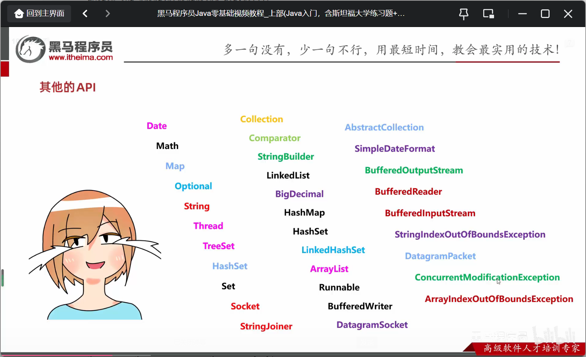

#### 7.2 构造方法

```java
String s1 = "1234";
String s2 = new String("213");

char[] chs = {'a','b'};
String s1 = new String(chs)
```

#### 7.3 字符串的比较

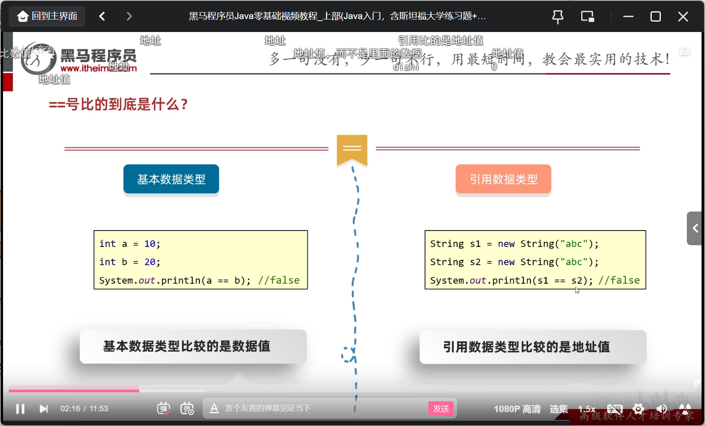

```java
package zifuchuan;

public class par2 {
    public static void main(String[] args) {
        String s1 = "abc";
        String s2 = "abc";
        System.out.println(s1 == s2);  //true

        String s3 = new String("abc");
        String s4 = new String("abc"); 
        System.out.println(s3 == s4);  //false

        String s5 = "abc";
        String s6 = new String("abc");
        System.out.println(s5 == s6);  //false
        
    }
}
```

```java
package zifuchuan;

public class par2 {
    public static void main(String[] args) {
        String s1 = "abc";
        String s2 = "abc";
        String s3 = new String("Abc");
        String s4 = new String("abc");
        boolean b = s1.equals(s3);               //完全相同
        boolean b1 = s1.equalsIgnoreCase(s3);     //忽略大小写
        System.out.println(b);
        System.out.println(b1);    
    }
}
```

```java
package zifuchuan;

import java.util.Scanner;

public class pra3 {
    public static void main(String[] args) {
        String password = "adb";
        Scanner sc = new Scanner(System.in);
        String str = sc.nextLine();   //输入相当于new了一个对象
        while(true){
            if(password.equals(str)){
                System.out.println("登录成功");
                break;
            }else {
                System.out.println("登录失败");
                str = sc.nextLine();
            }
        }
    }
}
```

#### 7.4 字符串的遍历

```java
package zifuchuan;

import java.util.Scanner;

public class pra4 {
    public static void main(String[] args) {
        Scanner sc = new Scanner(System.in);
        String str = sc.nextLine();
        for (int i = 0; i < str.length(); i++) {
            char ch = str.charAt(i);          
            System.out.println(ch);
        }
    }
}

package zifuchuan;

import java.util.Scanner;

public class pra5 {
    public static void main(String[] args) {
        Scanner sc = new Scanner(System.in);
        System.out.print("请输入一个字符串");
        String s = sc.nextLine();
        int bigcount = 0;
        int smallcount = 0;
        int numbercount = 0;
        for (int i = 0; i < s.length(); i++) {
            char c = s.charAt(i);
            if(c>='a' && c<='z'){
                smallcount++;
            }else if(c>='A' && c<='Z'){
                bigcount++;                        //ASCII表
            }else if(c>='0' && c<='9'){
                numbercount++;
            }else {
                continue;
            }
        }
        System.out.printf("大写字母有%d,小写字母有%d,数字有%d",bigcount,smallcount,numbercount);
    }
}
```

#### 7.5 StringBuidlder

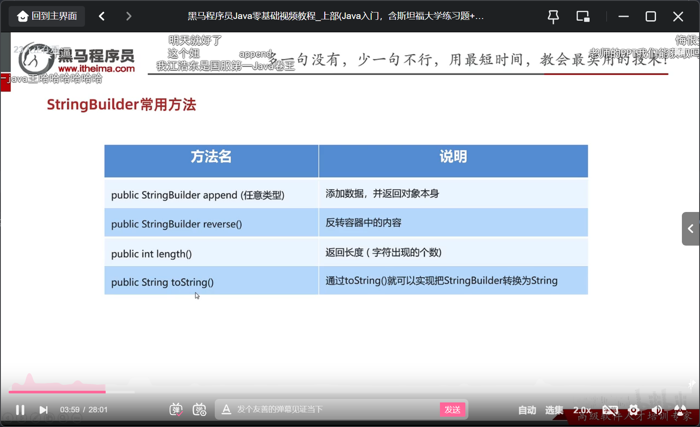

```java
package zifuchuan;

public class pra7 {
    public static void main(String[] args) {
        // 创建元素
        StringBuilder sb = new StringBuilder();
        // 添加元素
        sb.append("adkojwq");
        sb.append("12314");
        // 翻转元素
        sb.reverse();
        System.out.println(sb);
        // 获取字符串长度
        System.out.println(sb.length());
        // 转换成字符串
        String str = sb.toString();
        System.out.println(str);
    }
}
```

```java
substring(1)从第一个开始截取
```

#### 7.6 StringJoinner

```java
```

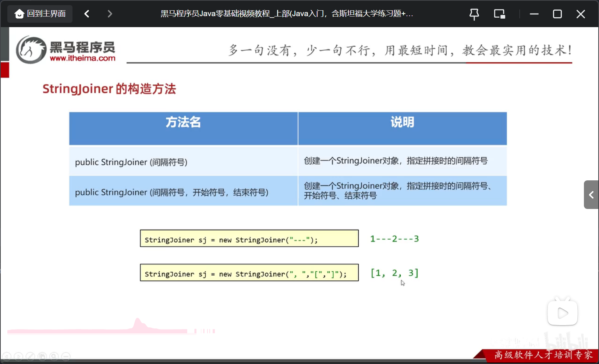

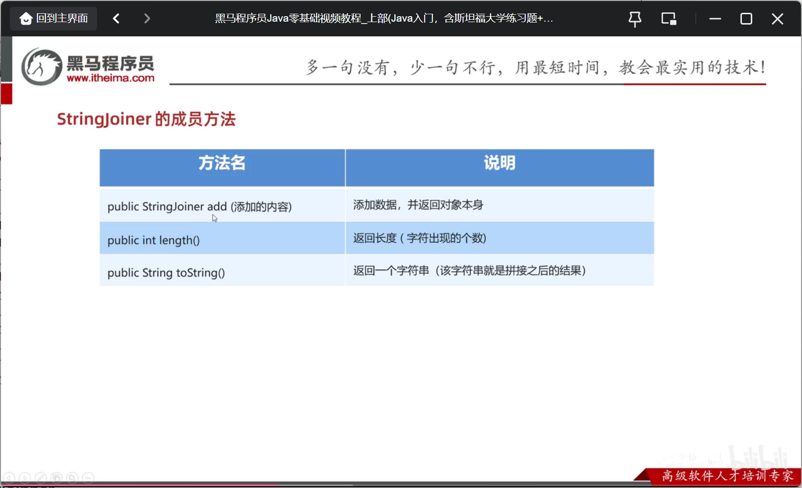

### 八 ArrayList 集合

```java
package arrlistpra;

import java.util.ArrayList;

public class pra1 {
    public static void main(String[] args) {
        // 1.创建集合的对象
        // 泛型，限定集合中存储数据的类型
        ArrayList<String> list = new ArrayList<>();
        System.out.println(list);
    }
}
```

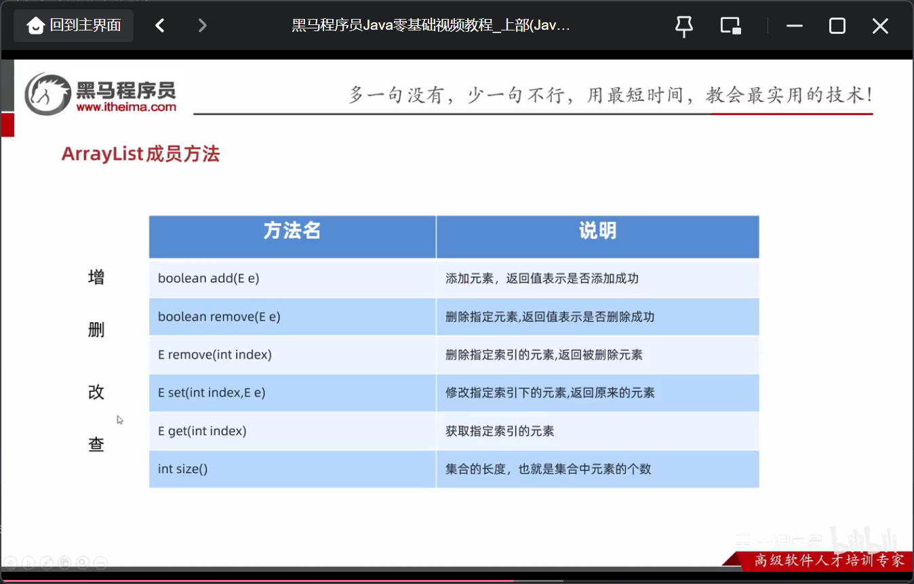

```java
package arrlistpra;

import java.util.ArrayList;

public class pra1 {
    public static void main(String[] args) {
        // 1.创建集合的对象
        // 泛型，限定集合中存储数据的类型
        ArrayList<String> list = new ArrayList<>();
        // 添加元素
        list.add("aaa");
        System.out.println(list);
        // 删除元素 返回一个布尔值
        boolean result = list.remove("bbb");
        boolean result2 = list.remove("aaa");
        System.out.println(result);
        System.out.println(result2);
        System.out.println(list);
        list.add("aaa");
        list.add("bbb");
        list.add("ccc");
        list.add("vvv");
        // 获取被删除的值
        String sb = list.remove(0);
        System.out.println(sb);
        // 获取指定位置的值
        System.out.println(list.get(2)); //从0开始
    }
}
```

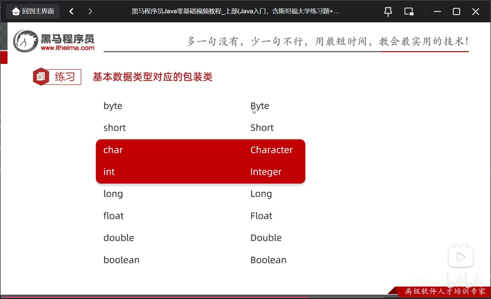

#### 案例：添加学生对象并且遍历

```java
package arrlistpra;

import java.util.ArrayList;

public class par2 {
    public static void main(String[] args) {
        ArrayList<Student> list = new ArrayList<>();
        Student s1 = new Student("张三",12);
        Student s2 = new Student("李四",16);

        list.add(s1);
        list.add(s2);
    }
}
```

### 九 面向对象进阶

#### 9.1 static

静态，静态变量被所有对象共享

```java
package mianxiangduixiangjinjie;

public class Student {
    private String name;
    private int age;
    private String gender;
    public static String teachername;

    public Student() {
    }

        public Student(String name, int age, String gender) {
        this.name = name;
        this.age = age;
        this.gender = gender;
    }

    public String getName() {
        return name;
    }

    public void setName(String name) {
        this.name = name;
    }

    public int getAge() {
        return age;
    }

    public void setAge(int age) {
        this.age = age;
    }

    public String getGender() {
        return gender;
    }

    public void setGender(String gender) {
        this.gender = gender;
    }

    public void study(){
        System.out.println(this.name + "正在学习");
    }

    public void show(){
        System.out.println(this.name + ", " + this.age + ", " + this.gender + ", " + teachername);
    }
}
对teachername进行静态复制
    package mianxiangduixiangjinjie;

public class pra1 {
    public static void main(String[] args) {
        Student s1 = new Student("张三",12,"男");
        Student s2 = new Student("李四",19,"女");
        Student.teachername = "老师名字";
        s1.show();
        s2.show();
    }
}
所有对象都能获取
```

#### 9.2 静态变量方法和工具类

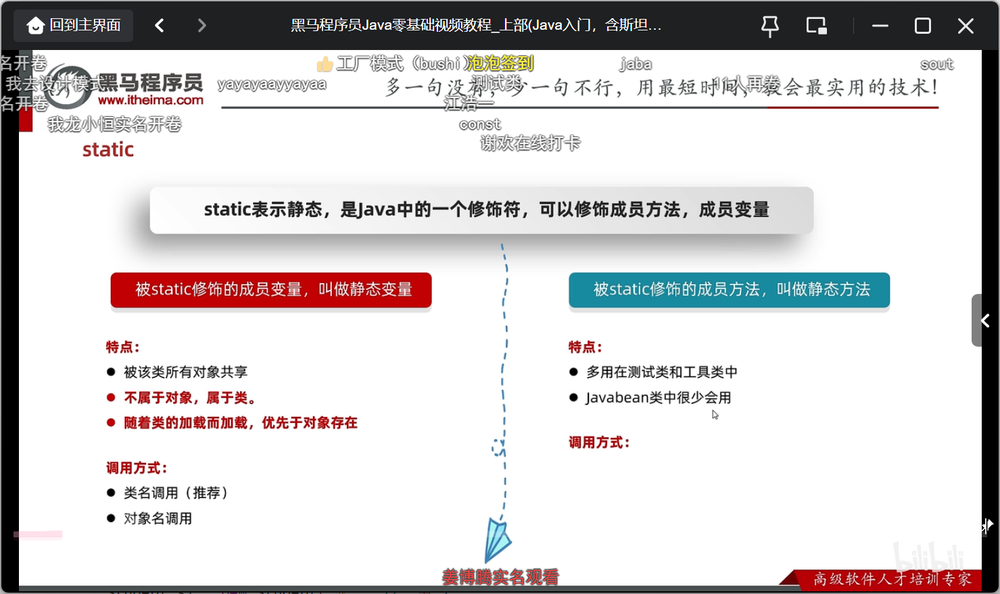

```java
package demo3;

import java.util.ArrayList;

public class StudentUtil {
    private StudentUtil() {}

    public static int getMaxAgeStudent(ArrayList<Student> students) {
        int maxAge = students.get(0).getAge();
        for(int i = 1; i < students.size(); i++) {
            if(students.get(i).getAge() > maxAge) {
                maxAge = students.get(i).getAge();
            }else {
                continue;
            }
        }
        return maxAge;
    }
}
私有化属性防止他人调用，定义自己的静态方法
```

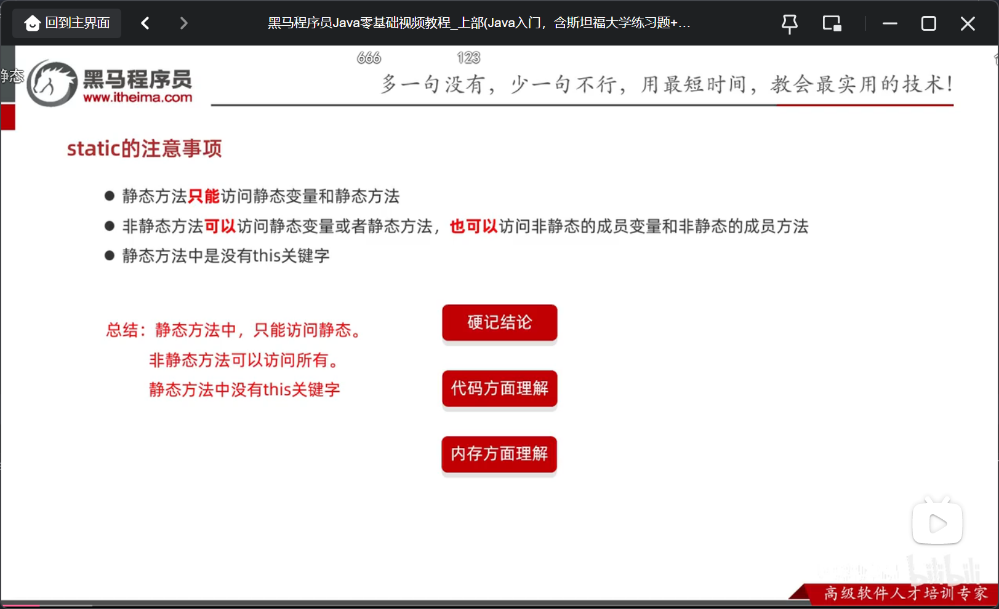

#### 9.3 类的继承

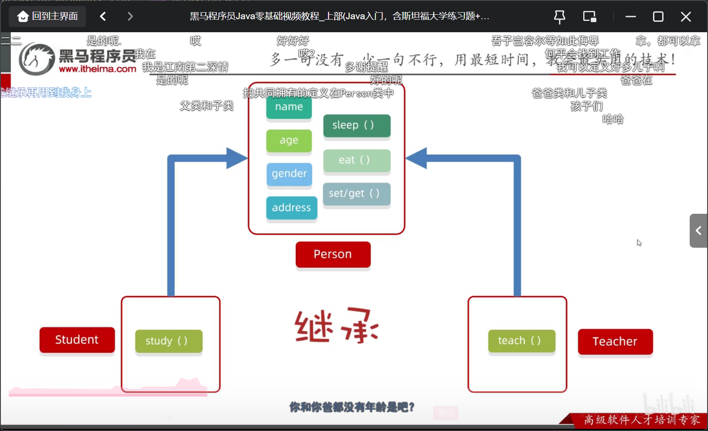

```java
extends 用这个挂念自，我们可以让一个类和另一个类建立起继承关系
public class Student extends Person{
    
}
```

##### 继承的特点

```java
java只支持单继承，不支持多继承，但是支持多层继承
```

#### 9.4 子类能继承那些内容

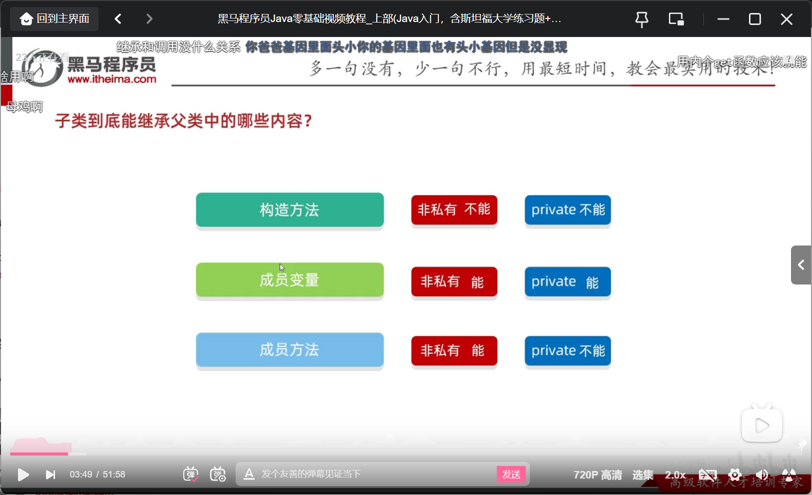

```java
构造方法不能被继承
```

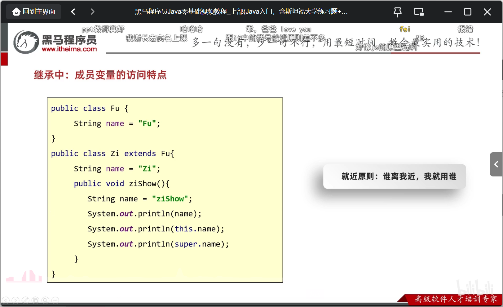

```java
package demo5;

public class Zi extends Fu{
    String name = "ZI";
    public void zishow(){
        String name = "zishow";
        System.out.println(name);
        System.out.println(this.name);
        System.out.println(super.name);
    }
}

方法重写@Override在方法前面加上这个
```

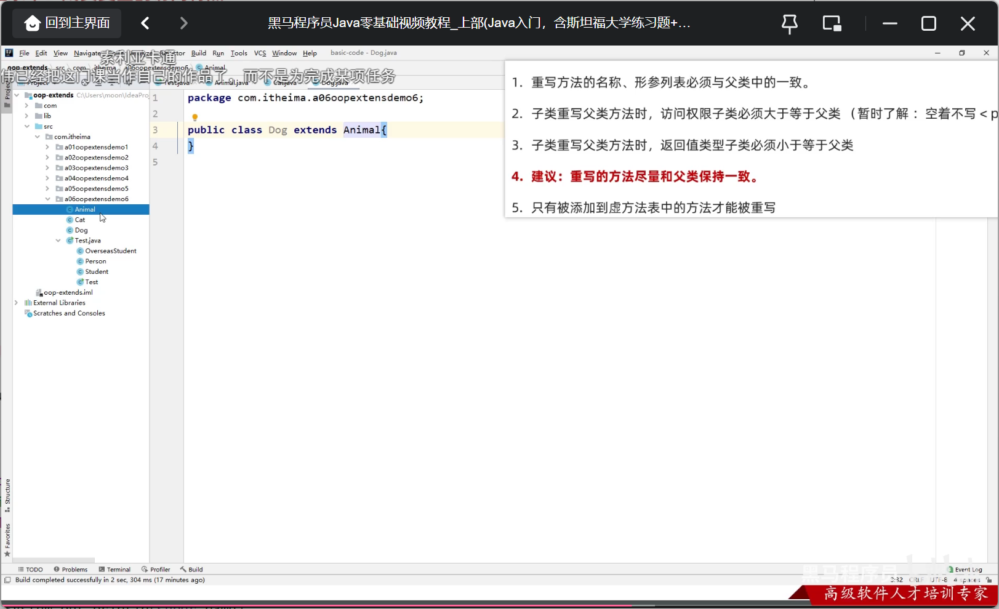

```java
父类中的构造方法不会被子类继承
子类中所有的构造方法默认先访问父类当中的无参构造，再执行自己
    
package demo6;

public class Student extends Person {
    public Student() {
        super();
        System.out.println("子类无参构造");
    }

    public Student(String name,int age) {
        super(name, age);
    }
}
```

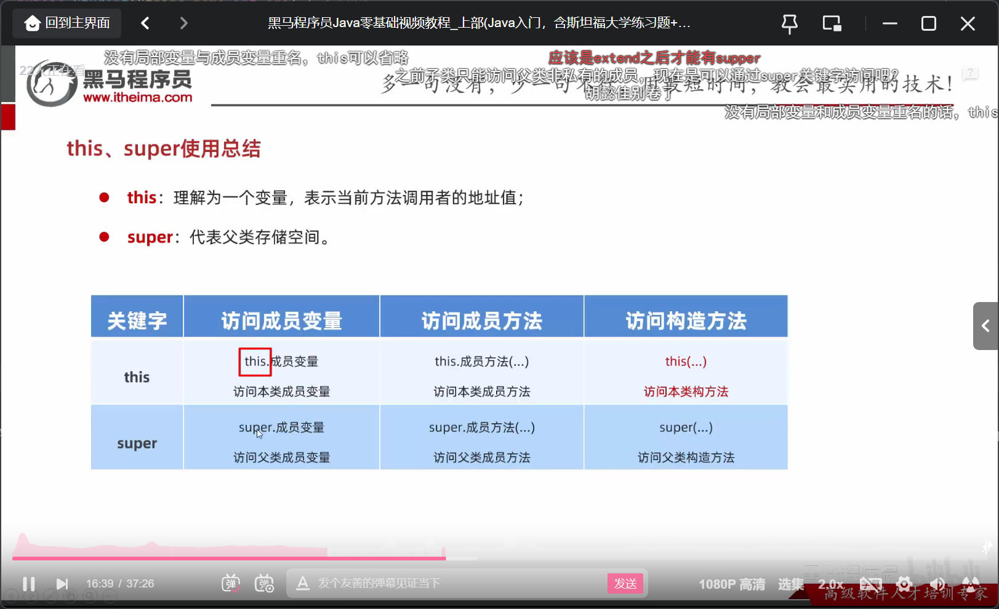

#### 9.5 多态

```java
package duotai_pra;

public class Test {
    public static void main(String[] args) {
        Student s = new Student();
        s.setName("李华");
        s.setAge(19);
        Teacher t = new Teacher();
        t.setName("王建国");
        t.setAge(38);
        Admin a = new Admin();
        a.setAge(25);
        a.setName("管理员");
        register(s);
        register(t);
        register(a);
    }

    public static void register(Person p) {
        p.show();
    }
}

```

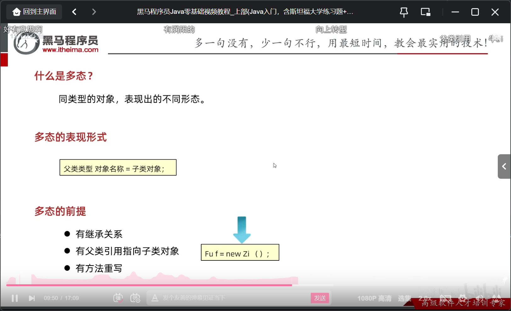

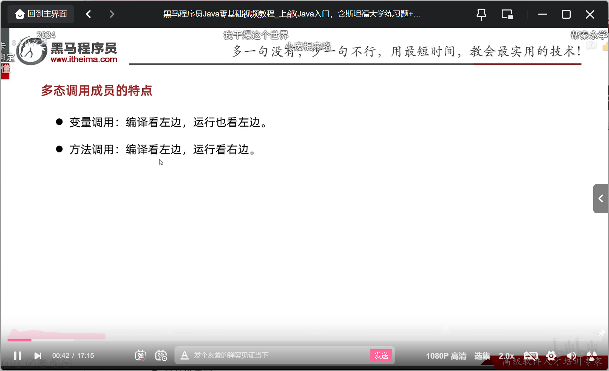

```java
Anaimal a = new Dog();


package duotai_pra;

public class Test_one {
    public static void main(String[] args) {
        Person a = new Admin();
        Admin b = (Admin)a;
        b.admin();
        Teacher c = (Teacher)a;
        c.teach();         //报错不能乱强制转换
    }
}
先判断后强转
package duotai_pra;

public class Test_one {
    public static void main(String[] args) {
        Person a = new Admin();
        if(a instanceof Admin b){
            b.admin();
        }
    }
}
```

#### 9.6 包

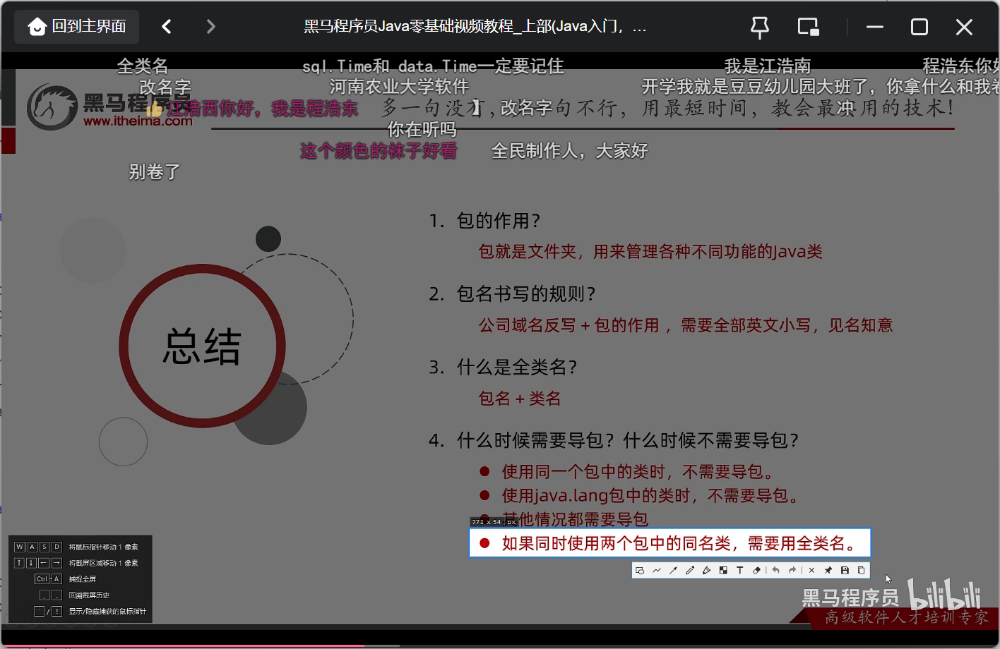

#### 9.7 final关键字

```java
可以修饰方法（不能被重写），类（不能被继承），变量（只能赋值一次）
```

#### 9.8 权限修饰符

##### 其他淘汰代码块

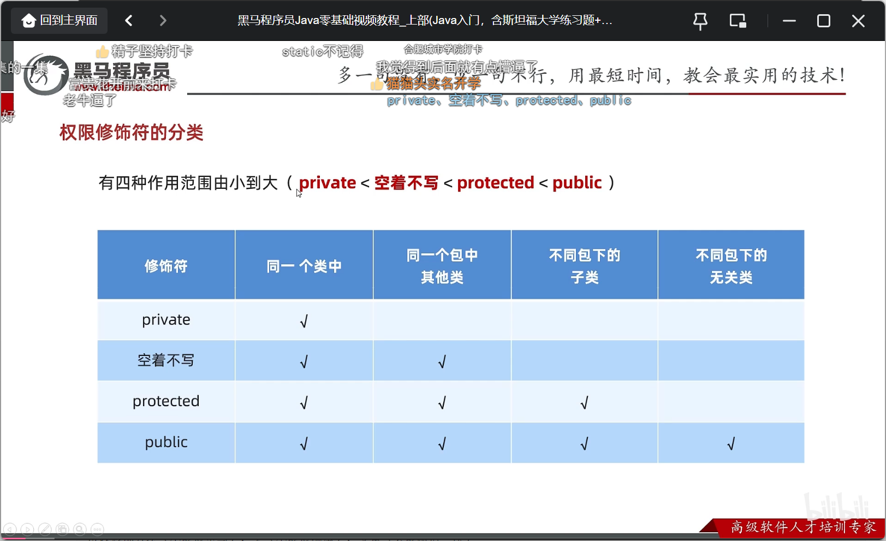

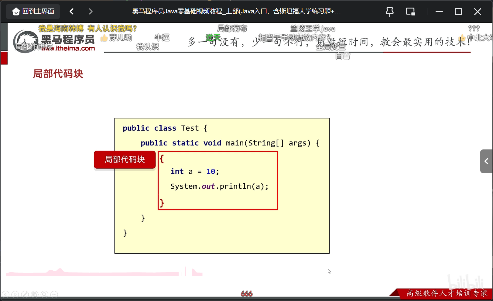

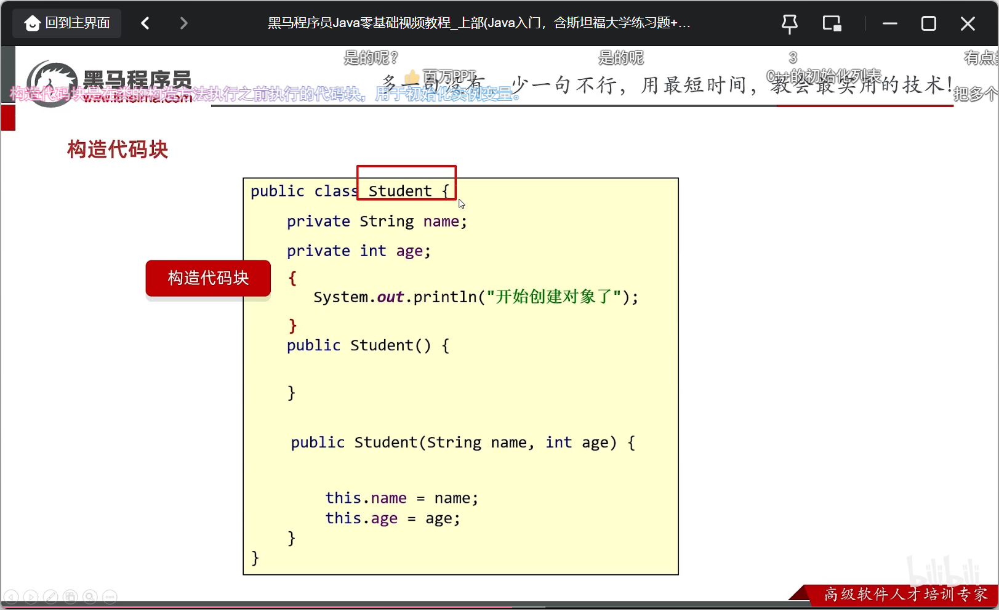

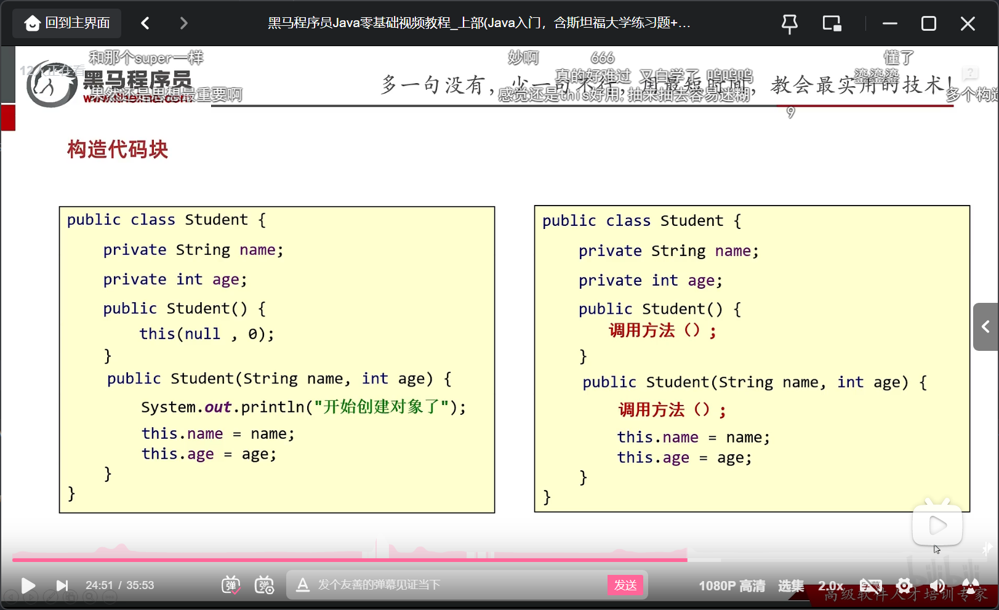

##### 静态代码块

```java
package bao.test;

public class Test {
    public static void main(String[] args) {
        Student s1 = new Student();
        Student s2 = new Student();
    }
}

package bao.test;

public class Student {
    private String name;
    private int age;
    // 可以把多个构造方法中的抽取出来
    // 执行时机，我们在创建蓓蕾对象的时候先执行构造代码块
    static {
        System.out.println("静态代码块，只执行一次");
    }

    public Student() {
    }

    public Student(String name, int age) {
        this.name = name;
        this.age = age;
    }

    /**
     * 获取
     * @return name
     */
    public String getName() {
        return name;
    }

    /**
     * 设置
     * @param name
     */
    public void setName(String name) {
        this.name = name;
    }

    /**
     * 获取
     * @return age
     */
    public int getAge() {
        return age;
    }

    /**
     * 设置
     * @param age
     */
    public void setAge(int age) {
        this.age = age;
    }

    public String toString() {
        return "Student{name = " + name + ", age = " + age + "}";
    }
}
```

#### 9.9 抽象类

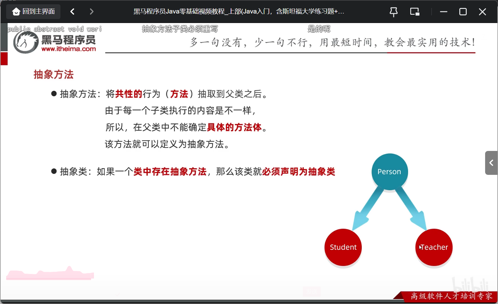

```java
public abstrate class 类名{}
public abstrate 返回值类型 方法名(列表参数);
```

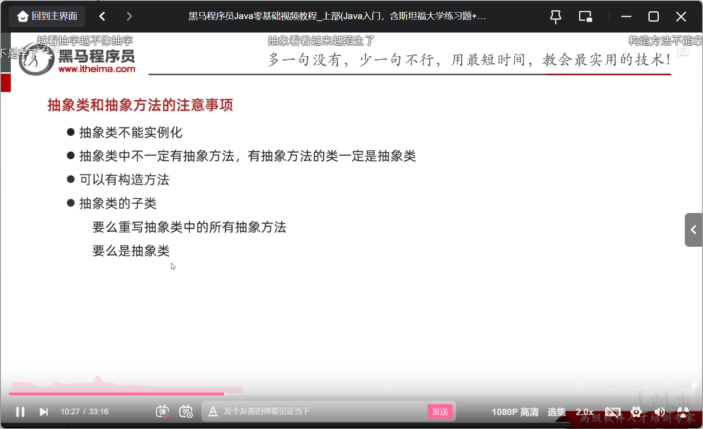

```java
父类不能创造对象，但是子类可以
package demo1;

public abstract class Person {
    String name;

    public Person() {
    }

    public Person(String name) {
        this.name = name;
    }

    public String getName() {
        return name;
    }

    public void setName(String name) {
        this.name = name;
    }

    public abstract void word();

}
```

```java
package demo1;

public class Student extends Person {
    public Student() {}

    public Student(String name) {
        super(name);
    }

    @Override
    public void word(){

    }
}
```

#### 9.10 接口

```java
接口就是一种规则
```

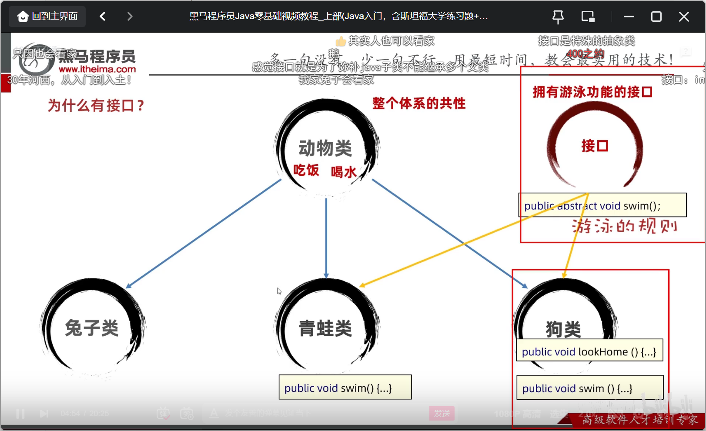

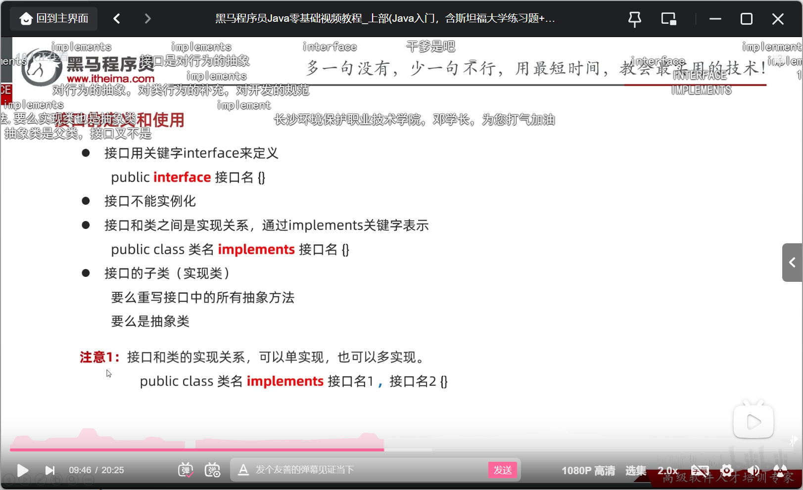

```java
//1
package demo2;

public interface Swim {
    public abstract void swim();
}
//2
package demo2;

public class Frog extends Animal implements Swim{
    @Override
    public void swim() {

    }

    @Override
    public void eat() {

    }

}
//3
package demo2;

public abstract class Animal {
    private String name;
    private int age;
    public Animal(String name, int age) {}
    public Animal() {}
    public String getName() {
        return name;
    }
    public void setName(String name) {
        this.name = name;
    }
    public int getAge() {
        return age;
    }
    public void setAge(int age) {
        this.age = age;
    }
    public abstract void eat();
}
```

##### 接口当中成员的特点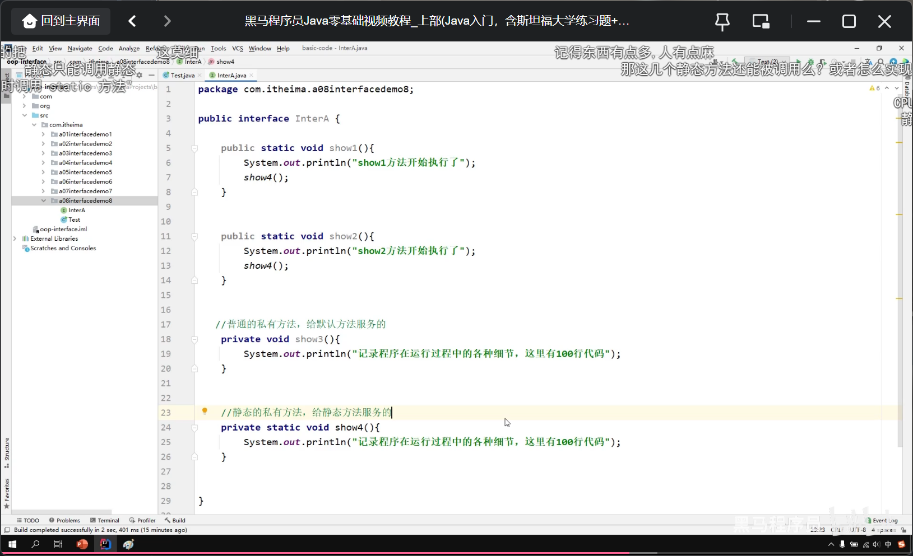

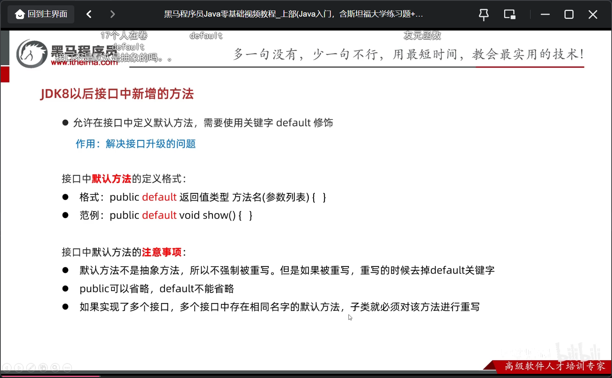

适配器设置模式

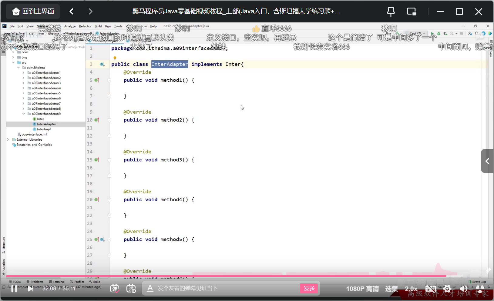

#### 9.11 内部类

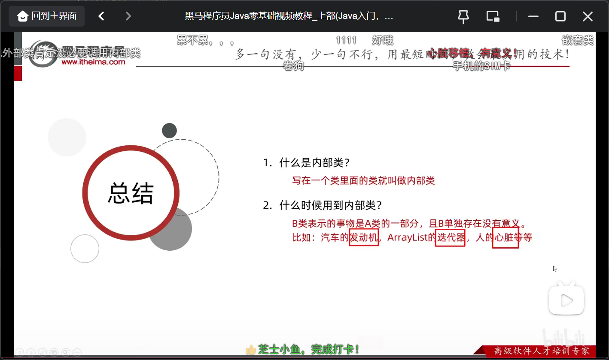

```java
package demo3;

public class Car {
    String carName;
    String carColor;
    int carAge;

    public void show(Car this){
        System.out.println(this.carName);
        Engine e = new Engine();
        e.show();
    }

    class Engine {
        String engineName;
        int engineAge;

        public void show(){
            System.out.println("engineName: " + this.engineName);
            System.out.println("engineAge: " + this.engineAge);
        }
    }

}
```

```java
package demo3;

public class Car {
    String carName;
    String carColor;
    int carAge;

    public void show(Car this){
        System.out.println(this.carName);
        Engine e = new Engine();
        e.show();
    }

    private class Engine {
        String engineName;
        int engineAge;

        public void show(){
            System.out.println("engineName: " + this.engineName);
            System.out.println("engineAge: " + this.engineAge);
        }
    }

    public Engine getEngine(){
        return new Engine();
    }
}
```

```java
package demo4;

public class Car {
    private int a = 10;

    class Inner{
        private int a = 20;

        public void print(){
            int a = 30;
            System.out.println(a); //30
            System.out.println(this.a); //20
            System.out.println(Car.this.a); //10
        }
    }
}
```

##### 匿名内部类

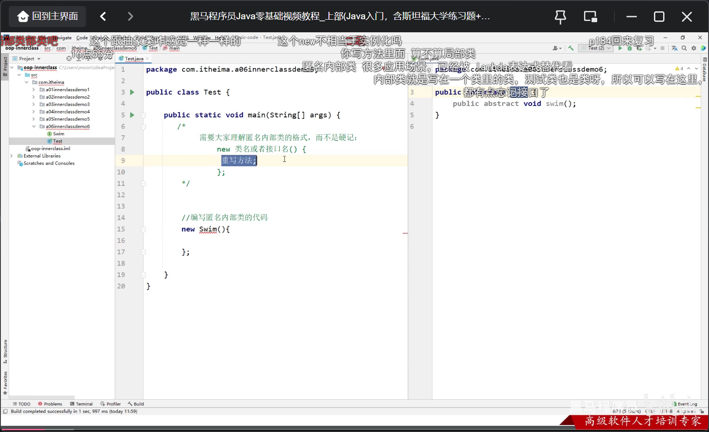

```java
1，把前面的class删掉，剩余的内容变成了一个没有名字的累的
2，这个没有名字的类想要实现Swim接口，把Swim卸载大括号前面，表示这个没有名字的类实现了Swim接口，所以需要在类中重写接口里面所有的抽象方法
```

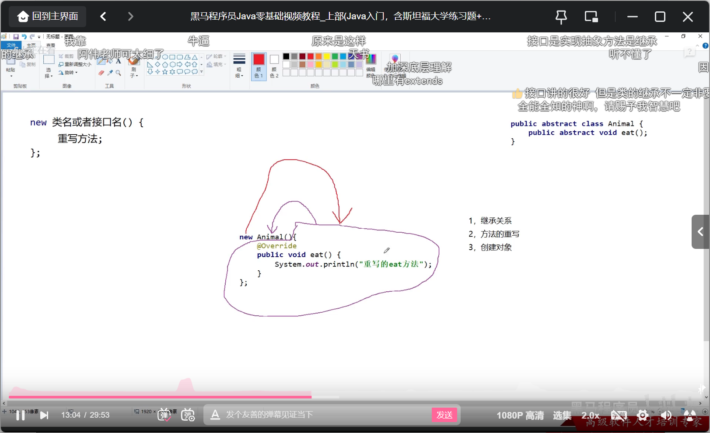

```java
package demo4;

import demo2.Animal;

public class Test {
    public static void main(String[] args) {
        method(
                new Animal(){
                    @Override
                    public void eat(){
                        System.out.println("eat");
                }
            }
        );
    }

    public static void method(Animal animal) {
        animal.eat();
    }
}编译看左边，运行看右边
```

```java
Swim s = new Swim(){@Override public void swim(){System.out.println("swim");}};
s.swim();

接口的多态
```

### 十 集合进阶

#### 10.1 arrays

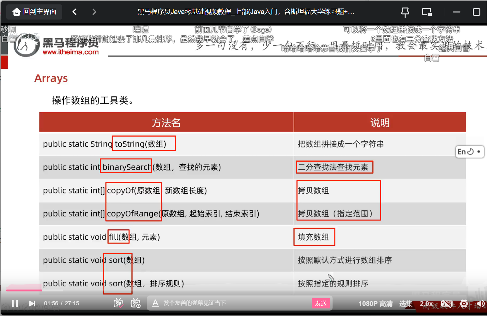

```java
package arrays_ora;

import java.util.Arrays;

public class MyarraysDemo1 {
    public static void main(String[] args) {
        System.out.println("----------------------toString------------------------");
        int[] arr1 = {1,2,3,4,5,6,7,8,9};
        System.out.println(Arrays.toString(arr1));

        System.out.println("-------------------binarySearch------------------------");
        // binarySearch:二分查找法查找元素
        // 细节：二分查找的前提。数组中的元素必须是有序的，数组中的元素必须是升序的
        // 但是如果查找的元素是不存在的，返回的是插入点-1
        // 如果我现在要查找数字0，那么如果返回的值是负插入点， -0
        System.out.println(Arrays.binarySearch(arr1, 2)); //1
        System.out.println(Arrays.binarySearch(arr1, 9)); //8
        System.out.println(Arrays.binarySearch(arr1, 120)); // -9-1

        System.out.println("-------------------copyOf-----------------------");
        // copyOf:拷贝数组
        // 参数一： 老数组 参数二：新数组长度
        // 如果老数组长度小于新数组长度，那么新数组会补上初始值
        // 如果老数组长度大于新数组长度，新数组会拷贝部分数
        // 如果等于，则完全拷贝
        System.out.println(Arrays.toString(Arrays.copyOf(arr1, 5)));
        System.out.println(Arrays.toString(Arrays.copyOf(arr1, 15)));
        System.out.println(Arrays.toString(Arrays.copyOf(arr1, 9)));

        System.out.println("-------------------copyOfRange---------------------------");
        // copyOfRange：拷贝数组
        // 细节：包头不包尾，包左不包右
        System.out.println(Arrays.toString(Arrays.copyOfRange(arr1, 0, 8)));
        System.out.println(Arrays.toString(Arrays.copyOfRange(arr1, 0, 10)));

        System.out.println("-------------------fill---------------------------");
        Arrays.fill(arr1,15);
        System.out.println(Arrays.toString(arr1));

        System.out.println("------------------sort-------------------------");
        // 升序排列
        int[] arr2 = {7,2,14,15,12,9,10,8,5};
        Arrays.sort(arr2);
        System.out.println(Arrays.toString(arr2));
    }
}


//打印结果
----------------------toString------------------------
[1, 2, 3, 4, 5, 6, 7, 8, 9]
-------------------binarySearch------------------------
1
8
-10
-------------------copyOf-----------------------
[1, 2, 3, 4, 5]
[1, 2, 3, 4, 5, 6, 7, 8, 9, 0, 0, 0, 0, 0, 0]
[1, 2, 3, 4, 5, 6, 7, 8, 9]
-------------------copyOfRange---------------------------
[1, 2, 3, 4, 5, 6, 7, 8]
[1, 2, 3, 4, 5, 6, 7, 8, 9, 0]
-------------------fill---------------------------
[15, 15, 15, 15, 15, 15, 15, 15, 15]
------------------sort-------------------------
[2, 5, 7, 8, 9, 10, 12, 14, 15]
```

```java
//降序排列，重写方法
package arrays_ora;

import java.util.Arrays;
import java.util.Comparator;

public class MyArraysDemo2 {
    public static void main(String[] args) {
        Integer[] myArray = {19,12,14,4,2,51,3,1};
        //底层原理:
        //利用插入排序 +二分查找的方式进行排序的。
        //默认把[0]数据当做是有序的序列，[1]到最后认为是无序的序列。
        //遍历无序的序列得到里面的每一个元素，假设当前遍历得到的元素是A元素
        //把A往有序序列中进行插入，在插入的时候，是利用二分查找确定A元素的插入点
        //拿着A元素，跟插入点的元素进行比较，比较的规则就是compare方法的方法体
        //如果方法的返回值是负数，拿着A继续跟前面的数据进行比较
        //如果方法的返回值是正数，拿着A继续跟后面的数据进行比较
        //如果方法的返回值是8，也拿着A跟后面的数据进行比较
        //直到能确定A的最终位置为止。

        // compare方法的形式参数
        // 参数一o1 表示在无序序列当中遍历的每一个元素
        // 参数二o2 有序序列元素

        // 返回值
        // 负数：表示当前插入元素是小的，放在前面
        // 证书：表示当前插入的元素是大的，放在后面
        // 0 表示当前插入的元素跟现在的元素相比是一样的，他们也会放在后面
        Arrays.sort(myArray,new Comparator<Integer>() {
            @Override
            public int compare(Integer o1, Integer o2) {
                return o2-o1; //降序排列
            }
        });
        System.out.println(Arrays.toString(myArray));
    }
}
```

#### 10.2 lambda表达式

```java
//降序排列，重写方法
package arrays_ora;

import java.util.Arrays;
import java.util.Comparator;

public class MyArraysDemo2 {
    public static void main(String[] args) {
        Integer[] myArray = {19,12,14,4,2,51,3,1};
        Arrays.sort(myArray,new Comparator<Integer>() {
            @Override
            public int compare(Integer o1, Integer o2) {
                return o2-o1; //降序排列
            }
        });
        System.out.println(Arrays.toString(myArray));
    }
}
```

```java
//代码简化后
Arrays.sort(myArray,(Integer o1, Integer o2) -> {
        return o2-o1; //降序排列
    }
);
```

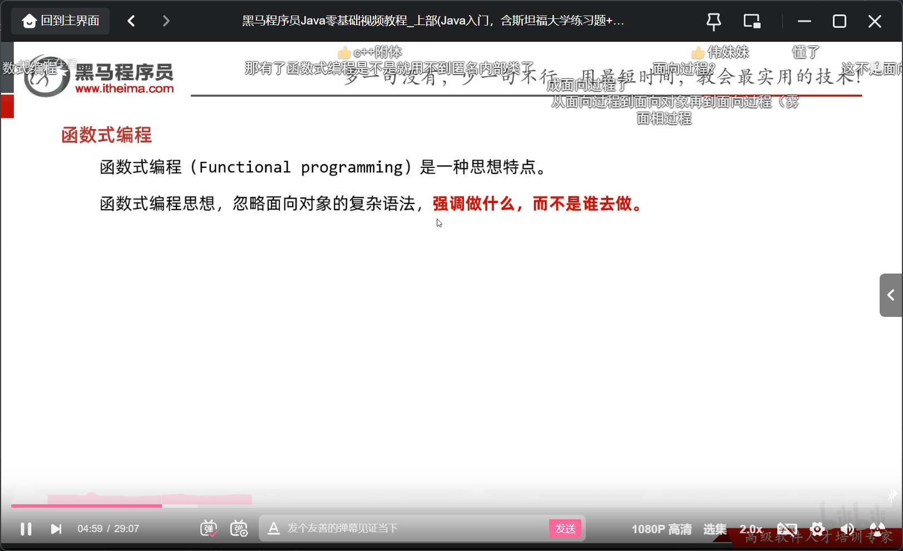

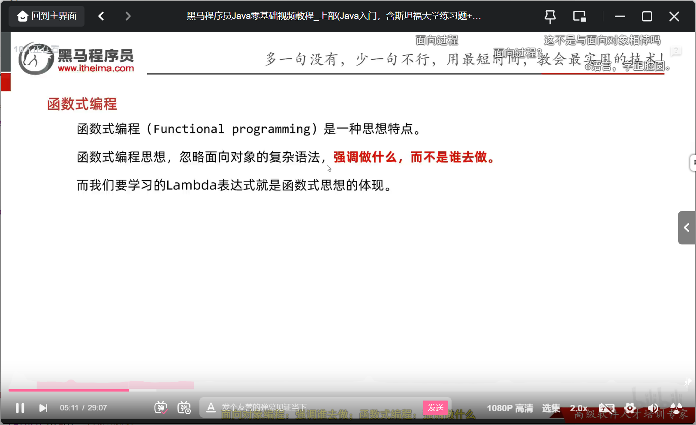

```java
() ->{  
    
}
()代表形参 -> 固定格式 {}对应方法体
```

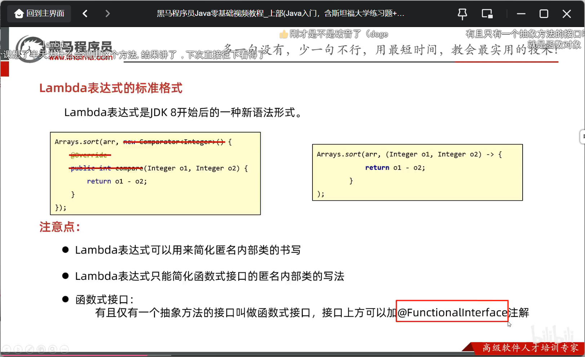
