## JAVA基础

### 一 编译

在一个目录下Main.java文件

```java
public class Main {
    public static void main(String[] args) {
        System.out.println("Hello world!");
    }
}
```

然后在命令行输入

```bash	
javac Main.java   # 执行编译命令
# 执行无误之后会生成一个Main.class文件

java Main  # 执行程序
```

### 二 基础知识点

#### 2.1 数据类型

| 数据类型 | 关键字  |              取值范围              |
| :------: | :-----: | :--------------------------------: |
|   整数   |  byte   |              -128-127              |
|   整数   |  short  |            -32768-32767            |
|   整数   |   int   |        -214783648-214783647        |
|   整数   |  long   |             （10位数）             |
|  浮点数  |  float  |   -3.041298 e-38到3.402823 e+38    |
|  浮点数  | double  | -4.9000000 e-324 到 1.797693 + 308 |
|   字符   |  char   |              0-65535               |
|   布尔   | boolean |             true false             |

```java
public class Main {
    public static void main(String[] args) {
        // byte
        byte b = 10;
        System.out.println(b);
        // short
        short s = 10;
        System.out.println(s);
        // int
        int i = 10;
        System.out.println(i);
        // long
        // 如果要定义long 类型的变量的时候，需要在数值后面加一个L作为后缀  L可以是大写也可以是小写
        long n = 9999999999L;
        System.out.println(n);
        // float
        // 如果要定义一个类型为float类型的变量的时候，数值后面也需要加一个F作为后缀
        float f = 10.1F;
        System.out.println(f);
        // double
        // 定义double同理
        double d = 10.2D;
        System.out.println(d);
        // char //字符
        char c = '中';
        System.out.println(c);
    }
}
```

案例

```java
public class pra1 {
    public static void main(String[] args) {
        int age = 18;
        char sex = '男';
        double height = 180.1D;
        boolean married = true;
        String name  = "黑马王钰滔";      //字符串
        System.out.println(name);
        System.out.println(age);
        System.out.println(sex);
        System.out.println(height);
        System.out.println(married);
    }
}
```

#### 2.2 输入输出

第一步先导包

```java
import java.util.Scanner;

public class pra2 {
    public static void main(String[] args) {
        // 1 导入包
        // 2 穿件对象
        System.out.println("请输入数据");
        Scanner sc = new Scanner(System.in);
        // 3 获取输入的值
        int i = sc.nextInt();
        System.out.println(i);
    }
}
```

#### 2.3 运算符

```java
+ - * / % 加 减 乘 除 取余，取模
    
public class pra4 {
    public static void main(String[] args) {
        System.out.println(3 + 2);
        System.out.println(3 - 2);
        System.out.println(3 * 2);
        System.out.println(3 / 2);
        System.out.println(3 % 2);
        // 代码中存在小数参与运算，结果有可能是不准确的
        System.out.println(1.1 + 1.01);  // 2.1100000000000003
    }
}

import java.util.Scanner;

public class pra5 {
    public static void main(String[] args) {
        Scanner sc = new Scanner(System.in);
        System.out.println("请输入一个三位数整数：");
        int num = sc.nextInt();
        int a = num % 10;
        int c = num / 100;
        int b = (num - (100 * c)) / 10;
        System.out.println(a);
        System.out.println(b);
        System.out.println(c);
    }
}
```

#### 2.4 算数运算符

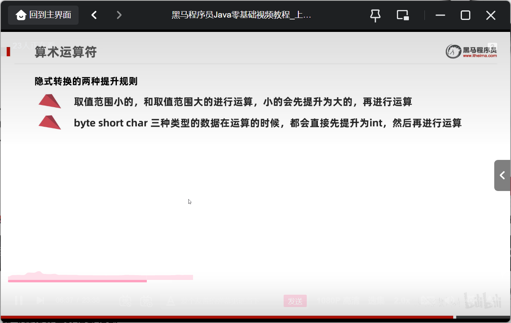

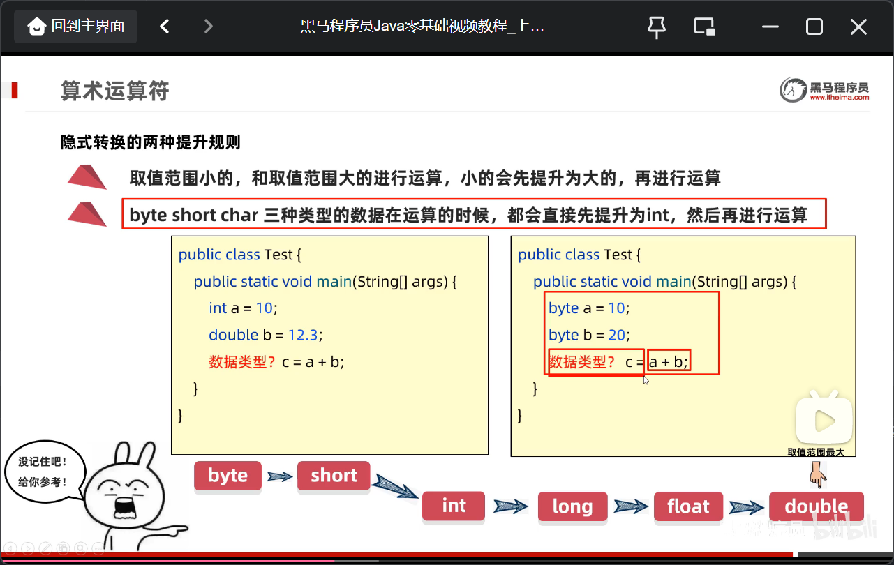

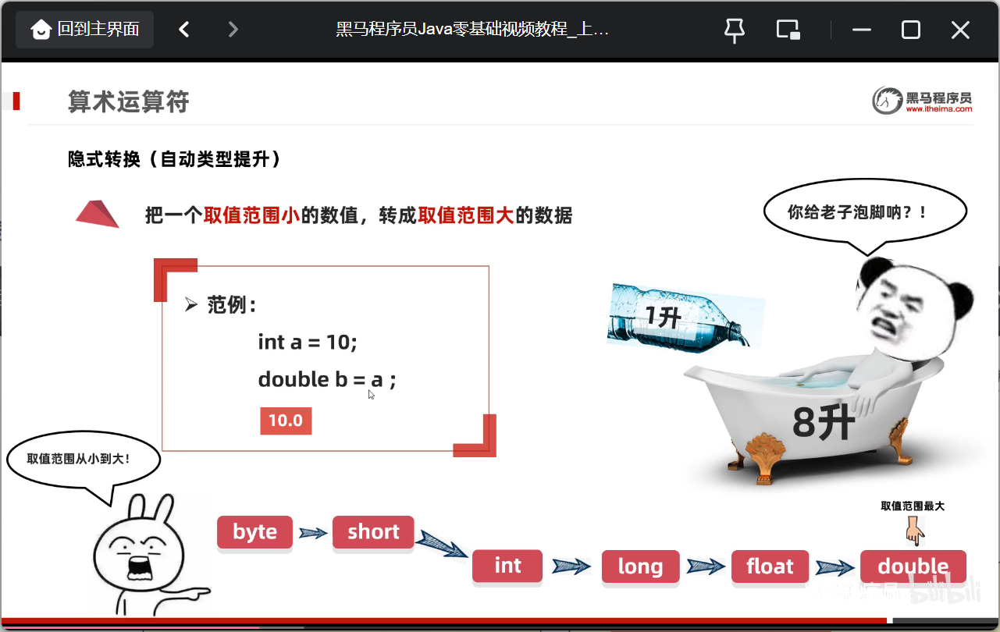

##### 2.4.1 数字相加

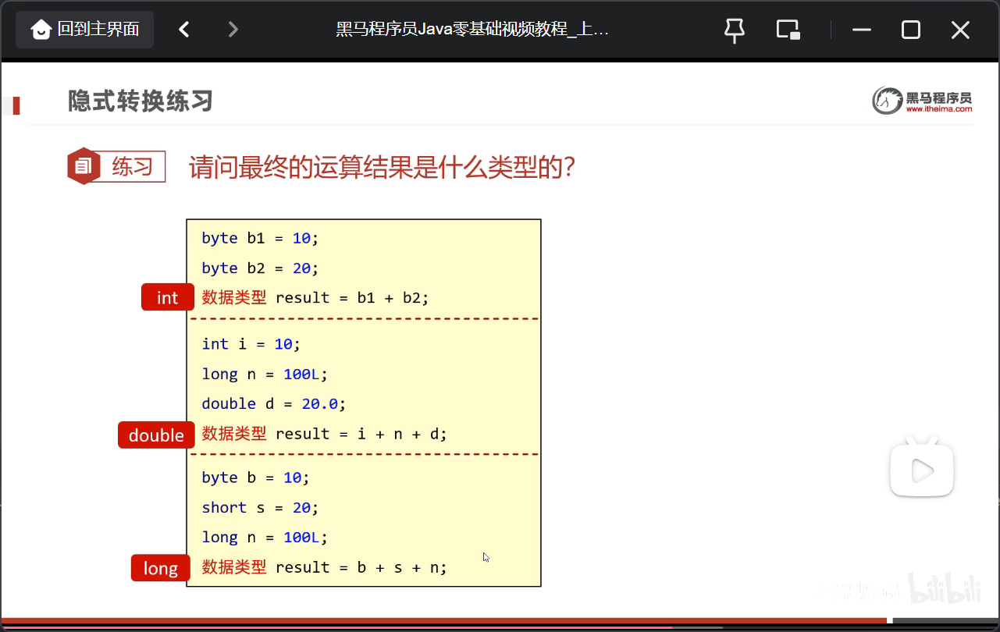

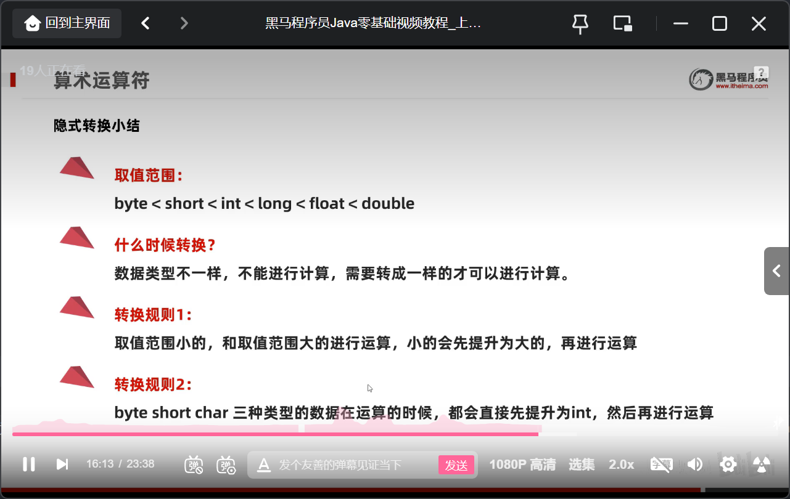

```java
package com.makermaker;

public class pra1 {
    public static void main(String[] args) {
        byte b1 = 10;
        byte b2 = 10;
        byte result = (byte)(b1 + b2);
        System.out.println(result);
    }
}
```

当 "+" 的操作中出现字符串的时候，这个"+"就是字符串连接符，而不是算数运算符

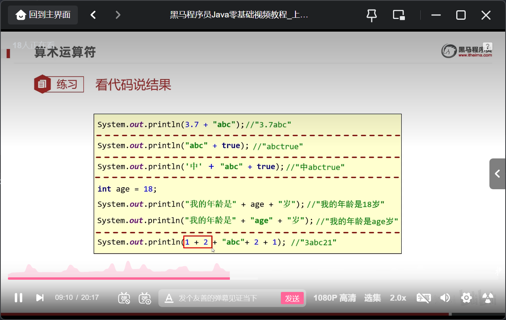

当字符+ 的时候 会把字符通过ASCII码查询到对应的数字再进行计算

#### 2.5 自增自减运算符

```java
a++  // 先用后加
int a = 10;
int b = a++;  // b=10 
    
int a = 10;
int b = ++a   // b=11
```

#### 2.6 赋值运算符

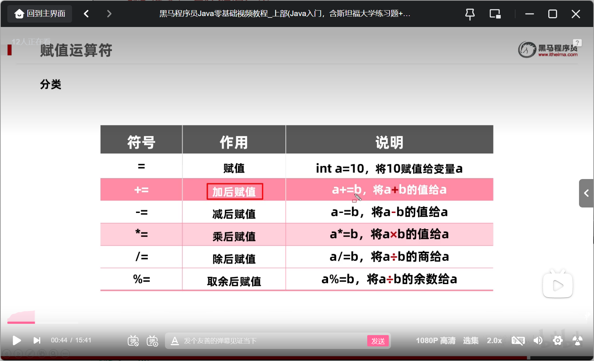

```java
赋值运算符隐含了强制类型转换
```

#### 2.7 关系运算符

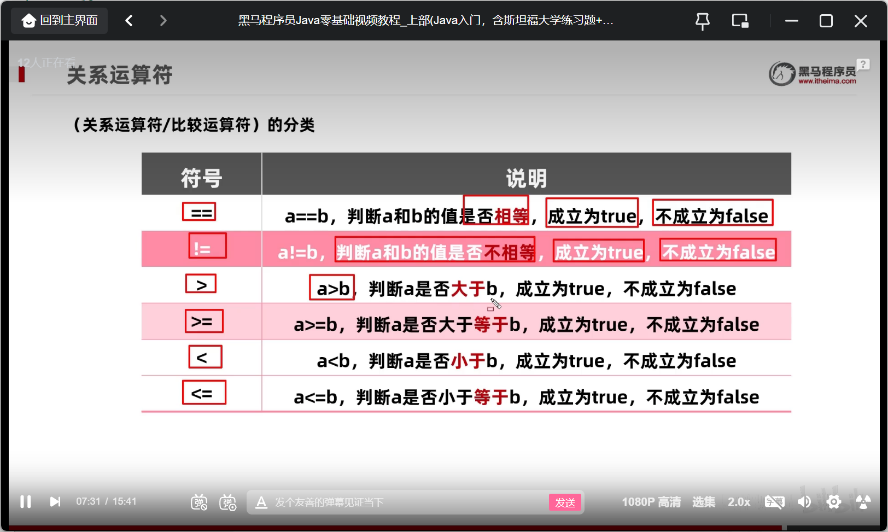

### 三 循环

#### 3.1 if语句

```java
package com.makermaker;
import java.util.*;

public class pra4 {
    public static void main(String[] args){
        System.out.println("请输入小伙子酒量");
        Scanner sc = new Scanner(System.in);
        int wine = sc.nextInt();
        if (wine<=200 && wine>=100) {
            System.out.println("小伙子酒量不求占");
        }
        else{
            System.out.println("小伙子牛逼");
        }
    }
}

package com.makermaker;
import java.util.*;

public class pra4 {
    public static void main(String[] args){
        System.out.println("请输入小伙子酒量");
        Scanner sc = new Scanner(System.in);
        int wine = sc.nextInt();
        if (wine<=200 && wine>=100) {
            System.out.println("小伙子酒量不求占");
        }else if (wine>200 && wine <=300) {
            System.out.println("酒量一般般");
        }else{
            System.out.println("酒量牛逼");
        }
    }
}
```

#### 3.2 switch

```java
package com.makermaker;
import java.util.Scanner;

public class pra5 {
    public static void main(String[] args){
        Scanner sc = new Scanner(System.in);
        String food = sc.nextLine();
        switch(food){
            case "兰州拉面":
                System.out.println("我要吃兰州拉面");
                break;
            case "白切鸡":
                System.out.println("我要吃白切鸡");
                break;
            case "宝塔肉":
                System.out.println("我要吃宝塔肉");
                break;
            default:
                System.out.println("吃屎");
        }
    }
}
```

#### 3.3 for循环

```java
package com.makermaker;

import java.lang.reflect.Array;

public class pra6 {
    public static void main(String[] args){
        for(int i = 1;i<=5;i++) {
            System.out.println(i);
        }
        for(int j = 5;j>=0;j--) {
            System.out.println(j);
        }
    }
}
```

#### 3.4 while循环和do while循环

```java
package com.makermaker;

public class pra7 {
    public static void main(String[] args) {
        int i = 0;
        do{
            i = i + 1;
            System.out.println(i);
        }while(i <= 10);
    }
}
```

#### 3.5 无限循环

```java
for(;;){
    
}
while(true){
    
}
do{
    
}while(true);
```

#### 3.6 break和continue

```java
package com.makermaker;

public class pra7 {
    public static void main(String[] args) {
        for(int i = 1;i<=5;i++){
            if(i == 3){
                continue;
            }
            System.out.println(i);
        }
    }
}
result: 1 2 4 5

public class pra7 {
public static void main(String[] args) {
        for(int i = 1;i<=5;i++){
            if(i == 3){
                continue;
            }
            System.out.println(i);
        }
    }
}
result: 1 2
```

### 四 数组

#### 4.1 数组基础

数组的定义

```java
package com.makermaker;

public class array {
    public static void main(String[] args) {
        int[] arr1 = {10,20,30,40};
        int[] arr2 = new int[]{12,13,14};
        String[] arr3 = new String[]{"a","b","c"};
        double[] arr4 = new double[]{1.1,2.2,3.3};
        System.out.println(arr1[1]); // System.out.println(arr1);  打印出来的是数组的地址值
    }
}
```

遍历数组

```java
package com.makermaker;

public class array {
    public static void main(String[] args) {
        int[] arr1 = {10,20,30,40};
        int[] arr2 = new int[]{12,13,14};
        String[] arr3 = new String[]{"a","b","c"};
        double[] arr4 = new double[]{1.1,2.2,3.3};
        System.out.println(arr1[1]); // System.out.println(arr1);  打印出来的是数组的地址值
        
    }
}
```

#### 4.2 数组动态初始化

```java
package com.makermaker;

public class array {
    public static void main(String[] args) {
        int[] arry = new int[10];
        arry[0] = 1;
        System.out.println(arry[1]);
    }
}
```

#### 4.3 数组常见操作

```java
package com.makermaker;
import java.util.*;

public class array {
    public static void main(String[] args) {
        Random r = new Random();
        int[] arry = new int[10];
        for(int i=0;i < arry.length;i++){
            int x = r.nextInt(100) + 1;
            arry[i] = x;
        }
        for(int j=0;j< arry.length;j++){
            System.out.println(arry[j]);
        }
    }
}
```

### 五 方法

#### 5.1 方法的定义与调用

```java
package com.makermaker;

public class function {
    public static void main(String[] args) {
        honor();
    }
    public static void honor() {
        int a =7;
        System.out.println("we are the honor");
    }
}
```

#### 5.2 传参函数

```java
package com.makermaker;

public class function {
    public static void main(String[] args) {
        honor(10,20);
    }
    public static void honor(int num1, int num2) {
        int sum = num1 + num2;
        System.out.println("we are the honor");
    }
}
```

#### 5.3 带返回值的函数

```java
public static 返回值类型 方法名 (参数){
    方法体;
    return 返回值;
}
```

ex

```java
public static int getSum(int a,int b){
    int c = a + b;
    return c;
}

package com.makermaker;

public class function {
    public static void main(String[] args) {
        double res = Gets(10.2,10.5);
        System.out.println(res);
    }
    public static double Gets(double a, double b) {
        return a * b;
    }
}
```

#### 5.4 方法的重载

在同一个类当中定义了多种同名的方法，这些同名的方法具有相同的功能，每个方法具有不同的参数类型和参数个数，这些同名的方法构成了重载关系

```java
package com.makermaker;

public class function {
    public static void main(String[] args) {
         int a = Getsum.sum(10,10);
    }
    public static class Getsum{
        public static int sum(int a, int b){
            return a+b;
        }
        public static int sum(int a, int b, int c){
            return a+b+c;
        }
    }
}

```

#### 5.5 二维数组

```java
package com.makermaker;

public class two_arry {
    public static void main(String[] args) {
        int[][] arry1 = new intp[2][3] //动态定义数组，没有赋值的地方初始化为0
        int[][] arry = {
                {1,2,3},
                {4,5,6},
                {7,8,9}                //静态定义数组
        };
        System.out.println(arry[0][0]);
    }
}
public static void main(String[] args){
	int[][] arr = new int[2][];
	int[] arr1 ={11,22};
	int[] arr2 ={44,55,66};
	arr[0] = arr1;
    arr[1j = arr2;
}
```

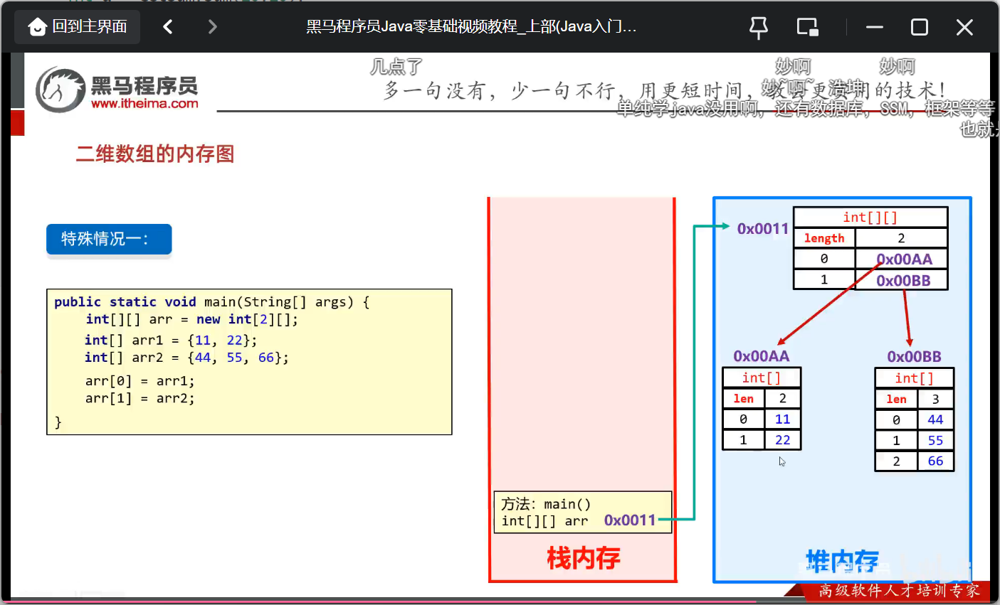

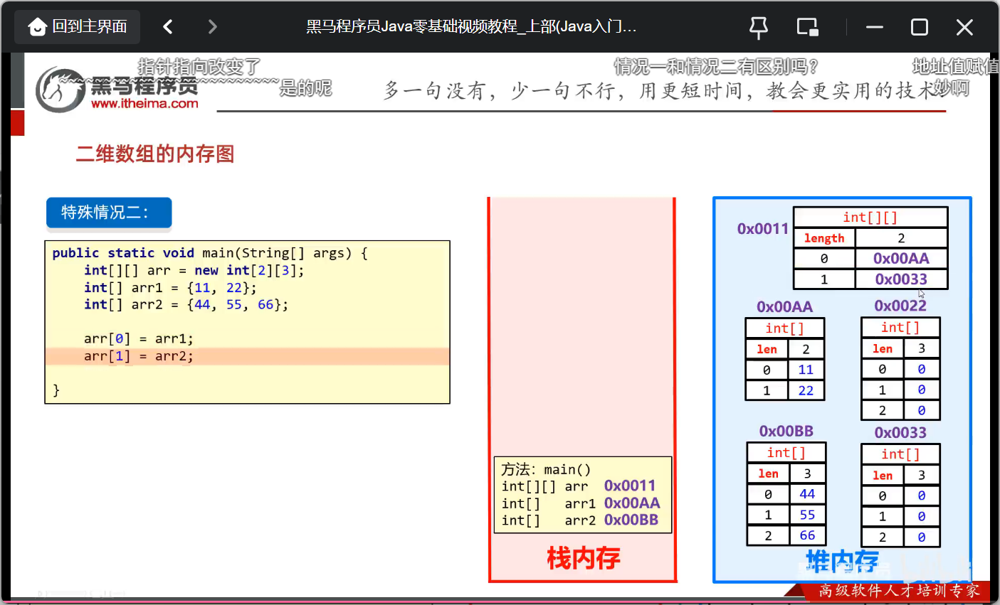

### 六 面向对象

#### 6.1 定义

```java
public class Phone{
    //属性
}
如何得到这个类
类名 对象名 = new 类名();
package toclass;

public class phoneTest {
    public static void main(String[] args) {
        phone p = new phone();
    }
}

package toclass;

public class phoneTest {
    public static void main(String[] args) {
        phone p = new phone();
        p.brand = "小米";
        p.price = 2000;
        System.out.println(p.brand);
        System.out.println(p.price);
        p.call();
        p.playGame();
    }
}
```

```java
定义类的补充注意事项
    用来描述一类事物的类，专业叫做:javabean类。
    在javabean类当中，是不写main方法的
        
    在以前编写main方法的类叫做测试类
    我们可以在测试类当中创建javabean类的对象并进行赋值调用
```

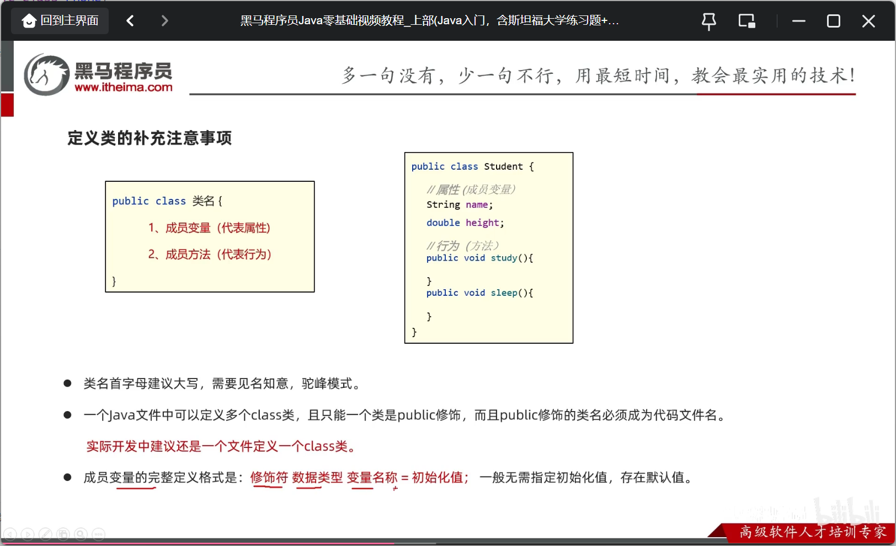
