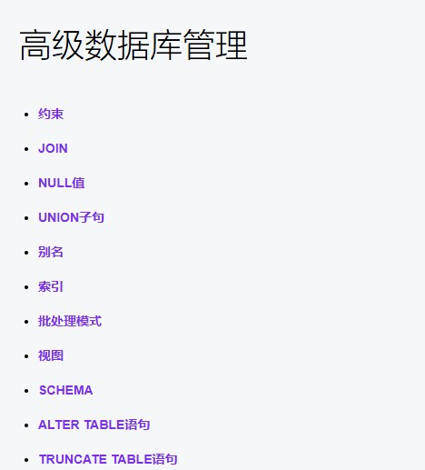
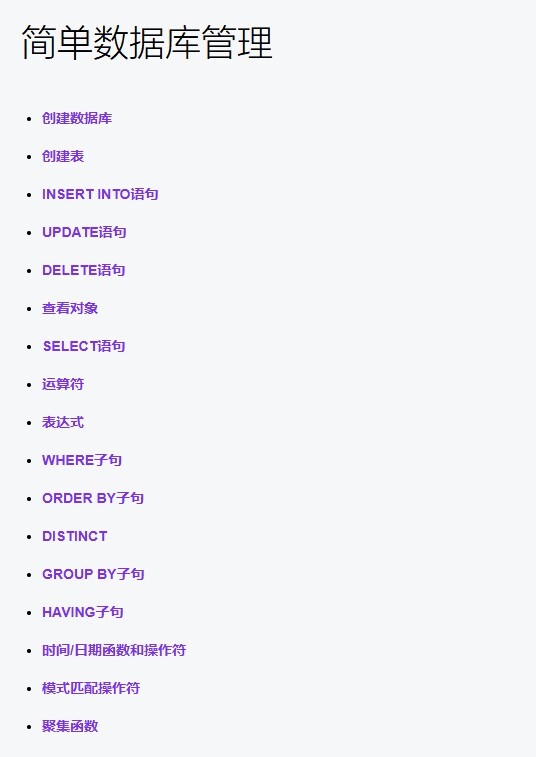
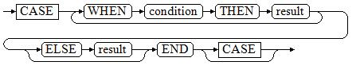
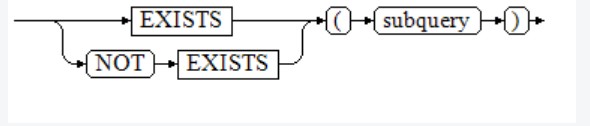
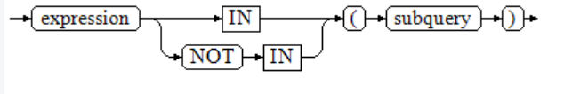
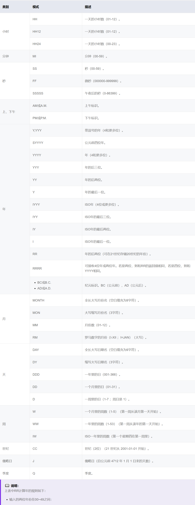

# opengauss

## 目录





## 数据库基本命令

```sql
登录  su - opengauss
gsql -d postgres
openGauss=# =#表示管理员  =>普通用户

查看所有数据库
\l

选择数据库
\c (数据库名字) 例：\c school

创建数据库
CREATE DATABASE (数据库名字)

删除数据库
DROP DATABASE (数据库名字);

数据库重命名
ALTER DATABASE (database_name) RENAME TO (new_name);
```

## 查看操作

```sql
切换数据库
\c table_name;
查看所有数据库
\l;
查看数据库里面的所有表
\dt;
查看表结构
\d table_name;
```

## 表的基本命令

### 创建表

```sql
CREATE TABLE demo(name char(50),age integer);
CREATE TABLE table_name 
    (column_name data_type [, ... ]);

要创建的表名:table_name
新表中要创建的字段名:column_name
字段的数据类型:data_type
```

### 插入数据

```sql
insert into (表的名字) values('wyt',18);
常规
INSERT INTO {table_name}({键1},{键2},{键3}) VALUES ({值1}, {值2}, {值2});
如果知道键的顺序，可以进行省略
INSERT INTO {table_name} VALUES ({值1}, {值2}, {值2});
插入多条数据
INSERT INTO customer_t1 (c_customer_sk, c_customer_id, c_first_name,Amount) VALUES 
    (6885, 'maps', 'Joes',2200),
    (4321, 'tpcds', 'Lily',3000),
    (9527, 'world', 'James',5000);
```

### 查询数据

```sql
SELECT * FROM (表的名字);
maker=# select * from demo;
                        name                        | age
----------------------------------------------------+-----
 wyt                                                |  18
 zyx                                                |  19
 wyt                                                |  19
 wqt                                                |  20


select {键} from demo;
maker=# select name from demo;
                        name
----------------------------------------------------
 zyx
 wqt
 www
 www
 www
```

### 运算符

#### 数学运算符

```sql
加:+
减:-
乘:*
除:/
取余:%
绝对值:@

    maker=# select @-5 as result;
     result
    --------
          5

幂:^

    maker=# select 2^3 as result;
     result
    --------
          8

平方根:|/

    maker=# select |/8 as result;
          result
    ------------------
     2.82842712474619

立方根:||/

    maker=# select ||/81 as a;
            a
    ------------------
     4.32674871092223

阶乘:!(后缀操作符)
	!!(前缀操作符)

    maker=# select 5! as a;     maker=# select !!5 as a;
      a                           a 
    -----                       -----
     120                         120
```

#### 比较运算符

```sql
< 小于
> 大于
<= 小于或等于
>= 大于或等于
= 等于
<> 或 !=或^= 不等于
```

### 表达式

#### 简单表达式

##### between

```sql
BETWEEN操作符
a BETWEEN x AND y等效于a >= x AND a <= y
a NOT BETWEEN x AND y等效于a < x OR a > y
maker=# select age between 19 and 20 from demo;
 ?column?
----------
 t
 t
 f
 t
 t
```

##### is distinct from/is not distinct from

```sql
is distinct from
A和B的数据类型、值不完全相同时为true。
A和B的数据类型、值完全相同时为false。
将空值视为相同。

is not distinct from
A和B的数据类型、值不完全相同时为false。
A和B的数据类型、值完全相同时为true。
将空值视为相同。
```

#### 条件表达式

##### case



case 的执行流程

```sql
CASE子句可以用于合法的表达式中。condition是一个返回BOOLEAN数据类型的表达式：

如果结果为真，CASE表达式的结果就是符合该条件所对应的result。
如果结果为假，则以相同方式处理随后的WHEN或ELSE子句。
如果各WHEN condition都不为真，表达式的结果就是在ELSE子句执行的result。如果省略了ELSE子句且没有匹配的条件，结果为NULL。
```

```sql
maker=# select age ,case when age = 19 then 'one' else 'other' end from demo;
 age | case
-----+-------
  19 | one
  19 | one
  18 | other
  19 | one
  19 | one
```

##### GREATEST（最大值），LEAST（最小值

```sql
maker=# SELECT greatest(9000,155555,2.01);
 greatest
----------
   155555
(1 row)

maker=# SELECT least(9000,2);
 least
-------
     2
(1 row)
```

##### EXISTS/NOT EXISTS



```sql
EXISTS的参数是一个任意的SELECT语句，或者说子查询。系统对子查询进行运算以判断它是否返回行。如果它至少返回一行，则EXISTS结果就为"真"；如果子查询没有返回任何行， EXISTS的结果是"假"。

这个子查询通常只是运行到能判断它是否可以生成至少一行为止，而不是等到全部结束。
maker=# select age from demo where not exists (select name from demo where name = 'www');
 age
-----
(0 rows)

maker=# select age from demo where exists (select name from demo where name = 'www');
 age
-----
  19
  19
  18
  19
  19
(5 rows)
```

##### IN/NOT IN



```sql
右边是一个圆括弧括起来的子查询，它必须只返回一个字段。左边表达式对子查询结果的每一行进行一次计算和比较。如果找到任何相等的子查询行，则IN结果为"真"。如果没有找到任何相等行，则结果为"假"（包括子查询没有返回任何行的情况）。

表达式或子查询行里的NULL遵照SQL处理布尔值和NULL组合时的规则。如果两个行对应的字段都相等且非空，则这两行相等；如果任意对应字段不等且非空，则这两行不等；否则结果是未知（NULL）。如果每一行的结果都是不等或NULL ，并且至少有一个NULL ，则IN的结果是NULL 
maker=# select age from demo where name in (select name from demo where name = 'www');
 age
-----
  18
  19
  19
(3 rows)

maker=#  select name,age from demo where name not in (select name from demo where name = 'www');
 name        | age
-------------+-----
 zyx         |  19
 wqt         |  19
```

##### ANY/SOME

```sql
右边是一个圆括弧括起来的子查询，它必须只返回一个字段。左边表达式使用operator对子查询结果的每一行进行一次计算和比较，其结果必须是布尔值。如果至少获得一个真值，则ANY结果为“真”。如果全部获得假值，则结果是“假”（包括子查询没有返回任何行的情况）。SOME是ANY的同义词。IN与ANY可以等效替换 

maker=# select * from demo where age < any (select age from demo where age = 19);
                        name                        | age
----------------------------------------------------+-----
 www                                                |  18
(1 row)
```

##### ALL

```SQL
右边是一个圆括弧括起来的子查询，它必须只返回一个字段。左边表达式使用operator对子查询结果的每一行进行一次计算和比较，其结果必须是布尔值。如果全部获得真值，ALL结果为"真"（包括子查询没有返回任何行的情况）。如果至少获得一个假值，则结果是"假"。

maker=#  select * from demo where age < all(select age from demo where name = 'www');
 name | age
------+-----
(0 rows)
```

#### 数组表达式

##### IN|NOT IN

```sql
右侧括号中的是一个表达式列表。左侧表达式的结果与表达式列表的内容进行比较。如果列表中的内容符合左侧表达式的结果，则IN的结果为true。如果没有相符的结果，则IN的结果为false。

maker=# SELECT 8000+500 IN (10000, 9000) AS RESULT;
 result
--------
 f
(1 row)

maker=# SELECT 8000+500 NOT IN (10000, 9000) AS RESULT;
 result
--------
 t
(1 row)
```

##### ANY|SOME

```sql
右侧括号中的是一个数组表达式，它必须产生一个数组值。左侧表达式的结果使用操作符对数组表达式的每一行结果都进行计算和比较，比较结果必须是布尔值。

1 如果对比结果至少获取一个真值，则ANY的结果为true。
2 如果对比结果没有真值，则ANY的结果为false。
3 如果结果没有真值，并且数组表达式生成至少一个值为null，则ANY的值为NULL，而不是false。这样的处理方式和SQL返回空值的布尔组合规则是一致的。
4 SOME是ANY的同义词。
```

##### ALL

```sql
右侧括号中的是一个数组表达式，它必须产生一个数组值。左侧表达式的结果使用操作符对数组表达式的每一行结果都进行计算和比较，比较结果必须是布尔值。

1 如果所有的比较结果都为真值（包括数组不含任何元素的情况），则ALL的结果为true。
2 如果存在一个或多个比较结果为假值，则ALL的结果为false。
3 如果数组表达式产生一个NULL数组，则ALL的结果为NULL。如果左边表达式的值为NULL ，则ALL的结果通常也为NULL(某些不严格的比较操作符可能得到不同的结果)。另外，如果右边的数组表达式中包含null元素并且比较结果没有假值，则ALL的结果将是NULL(某些不严格的比较操作符可能得到不同的结果)， 而不是真。这样的处理方式和SQL返回空值的布尔组合规则是一致的。

maker=# SELECT 8000+500 < ALL (array[10000,9000]) AS RESULT;
 result
--------
 t
(1 row)
```

### 更新行数据

```sql
update demo set name='wytwyt' where name='wyt';
UPDATE {table_name} SET column_name = 'xxx' where column_name='xxx';

maker=# update demo set name='www' where name='wyt';
UPDATE 3
maker=# select * from demo;
                        name                        | age
----------------------------------------------------+-----
 zyx                                                |  19
 wqt                                                |  20
 zcy                                                |  20
 wqt                                                |  19
 www                                                |  18
 www                                                |  19
 www                                                |  19
```

### 删除数据

```sql
delete from demo where (条件);
例：delete from demo where age=19;

maker=# delete from demo where age=20;
DELETE 2
maker=# select * from demo;
                        name                        | age
----------------------------------------------------+-----
 zyx                                                |  19
 wqt                                                |  19
 www                                                |  18
 www                                                |  19
 www                                                |  19
 
```

### WHERE查询

```sql
模版：SELECT { * | [column, ...] }[ FROM from_item [, ...] ][ WHERE condition ];
```

#### 和and

```sql
maker=# select * from demo where age = 19 and name = 'www';
                        name                        | age
----------------------------------------------------+-----
 www                                                |  19
 www                                                |  19
(2 rows)
```

#### 和or

```sql
maker=# select * from demo where age = 19 or name = 'wyt';
                        name                        | age
----------------------------------------------------+-----
 zyx                                                |  19
 wqt                                                |  19
 www                                                |  19
 www                                                |  19
(4 rows)
```

#### 和not null

```sql
maker=# select * from demo where age is not null;
                        name                        | age
----------------------------------------------------+-----
 zyx                                                |  19
 wqt                                                |  19
 www                                                |  18
 www                                                |  19
 www                                                |  19
(5 rows)
```

#### 和between

```sql
maker=# select * from demo where age between 18 and 20;
                        name                        | age
----------------------------------------------------+-----
 zyx                                                |  19
 wqt                                                |  19
 www                                                |  18
 www                                                |  19
 www                                                |  19
(5 rows)
```

### ORDER BY升序降序查询

```sql
模版：SELECT { * | [column, ...] }[ FROM from_item [, ...] ][ ORDER BY {expression [ ASC | DESC ] }];
```

#### 升序

```sql
select * from demo order by age ASC;
                        name                        | age
----------------------------------------------------+-----
 wyt                                                |  18
 zyx                                                |  19
 wyt                                                |  19
 wqt                                                |  20
```

#### 降序

```sql
select * from demo order by age DESC;
                        name                        | age
----------------------------------------------------+-----
 wqt                                                |  20
 zyx                                                |  19
 wyt                                                |  19
 wyt                                                |  18
```

### DISTINCT关键字：查询去重

```sql
模版：SELECT  DISTINCT [ ON ( expression [, ...] ) ] ]{ * | [column, ...] }[ FROM from_item [, ...] ];
```

#### name唯一查询

```sql
select distinct name from demo;
          name
-----------------------
 wqt
 wyt
 zyx
```

#### name唯一查询，携带age数据

```sql
select distinct name,age from demo;
                        name                        | age
----------------------------------------------------+-----
 wqt                                                |  20
 zyx                                                |  19
 wyt                                                |  18
 wyt                                                |  19
```

### GROUP BY字句：分组查询

```sql
模版：SELECT { * | [column, ...] }[ FROM from_item [, ...] ][ WHERE condition ][ GROUP BY grouping_element [, ...] ][ ORDER BY {expression [ ASC | DESC ] }];
```

```sql
maker=# select name,sum(age) from demo group by name;
                        name                        | sum
----------------------------------------------------+-----
 wqt                                                |  19
 www                                                |  56
 zyx                                                |  19
(3 rows)
```

### HAVING子句：用于在分组的基础上筛选数据

```sql
模版：SELECT { * | [column, ...] }[ FROM from_item [, ...] ][ WHERE condition ][ GROUP BY grouping_element [, ...] ][ HAVING condition [, ...] ][ ORDER BY {expression [ ASC | DESC ] }];
```

```sql
maker=# select name from demo group by name having count(name) > 2;
                        name
----------------------------------------------------
 www
(1 row)
```

### 求一列数据的和

```sql
select sum(age) from demo;
  sum
-------
  76
```

### 求一列数据的平均值

```sql
select avg(age) from demo;
     avg
----------------------
 19.0000000000000000
```

### 最大值最小值

```sql
SELECT MAX(age) FROM demo;
   max 
-----------
    2
SELECT MIN(age) FROM demo;
   min 
-----------
    1
```

## 创建

```sql
创建用户
create user 用户名 with password "密码";
create user jack password "******";

为用户授权
给用户授权对某数据库的所有权限
grant all privileges on database (数据库名) to (用户名);
将sysadmin权限授权给用户joe
grant all privileges to (用户名);

切换用户
\c - (用户名)
```

## 时间/日期函数和操作符

### 时间日期操作符

```sql
SELECT date '2001-10-01' - '7' AS RESULT;
上面案例没有明确数据类型就会出现异常错误。

maker=# SELECT date '2001-9-28' + integer '7' AS RESULT;
       result
---------------------
 2001-10-05 00:00:00
(1 row)

maker=# SELECT date '2001-09-28' + interval '1 hour' AS RESULT;
       result
---------------------
 2001-09-28 01:00:00
(1 row)

maker=# SELECT date '2001-09-28' + interval '1 day' as result;
       result
---------------------
 2001-09-29 00:00:00
(1 row)

maker=# SELECT date '2001-09-28' + time '03:00' AS RESULT;
       result
---------------------
 2001-09-28 03:00:00
(1 row)

maker=# SELECT interval '1 day' + interval '1 hour' AS RESULT;
     result
----------------
 1 day 01:00:00
(1 row)

maker=# SELECT time '01:00' + interval '3 hours' AS RESULT;
  result
----------
 04:00:00
(1 row)

maker=# SELECT date '2001-10-01' - date '2001-09-28' AS RESULT;
 result
--------
 3 days
(1 row)

maker=# SELECT timestamp '2001-09-28 23:00' - interval '23 hours' AS RESULT;
       result
---------------------
 2001-09-28 00:00:00
(1 row)
```

### 时间日期函数

#### age(timestamp, timestamp)

```sql
描述：将两个参数相减，并以年、月、日作为返回值。若相减值为负，则函数返回亦为负，入参可以都带timezone或都不带timezone。
返回值类型：interval
maker=# SELECT age(timestamp '2001-04-10', timestamp '1957-06-13');
           age
-------------------------
 43 years 9 mons 27 days
(1 row)
```

#### age(timestamp)

```sql
描述：当前时间和参数相减，入参可以带或者不带timezone。返回值类型：interval
maker=# SELECT age(timestamp '1957-06-13');
           age
--------------------------
 66 years 11 mons 28 days
(1 row)
```

#### clock_timestamp()

```sql
描述：实时时钟的当前时间戳。返回值类型：timestamp with time zone
maker=# SELECT clock_timestamp();
        clock_timestamp
-------------------------------
 2024-06-11 09:01:43.622058+00
(1 row)
```

#### current_date()

```sql
描述：当前日期。返回值类型：date
maker=# SELECT current_date;
    date
------------
 2024-06-11
(1 row)
```

#### current_time

```sql
描述：当前时间。返回值类型：time with time zone
maker=# SELECT current_time;
       timetz
--------------------
 09:04:33.964153+00
(1 row)
```

#### current_timestamp

```sql
描述：当前日期及时间。返回值类型：timestamp with time zone
maker=# SELECT current_timestamp;
       pg_systimestamp
------------------------------
 2024-06-11 09:34:01.44211+00
(1 row)
```

#### date_part(text, timestamp)

```sql
描述：获取日期/时间值中子域的值，例如年或者小时的值。等效于extract(field from timestamp)。

timestamp类型：abstime、date、interval、reltime、time with time zone、time without time zone、timestamp with time zone、timestamp without time zone。返回值类型：double precision

maker=# SELECT date_part('year', timestamp '2024-06-11 20:21:31');
 date_part
-----------
      2024
(1 row)
```

#### date_part(text, interval)

```sql
描述：获取日期/时间值中子域的值。获取月份值时，如果月份值大于12，则取与12的模。等效于extract(field from timestamp)。
返回值类型：double precision
maker=# SELECT date_part('month', interval '2 years 3 months');
 date_part
-----------
         3
(1 row)
```

#### date_trunc(text, timestamp)

```sql
描述：截取到参数text指定的精度。
返回值类型：interval、timestamp with time zone、timestamp without time zone
maker=# SELECT date_trunc('hour', timestamp  '2001-02-16 20:38:40');
     date_trunc
---------------------
 2001-02-16 20:00:00
(1 row)
```

#### trunc(timestamp)

```sql
描述：默认按天截取。
maker=# SELECT trunc(timestamp  '2001-02-16 20:38:40');
        trunc
---------------------
 2001-02-16 00:00:00
(1 row)
```

#### daterange(arg1, arg2)

```sql
描述：获取时间边界信息。arg1和arg2的类型为date。
返回值类型：daterange  arg1 < arg2
maker=# select daterange('2000-05-06','2000-08-08');
        daterange
-------------------------
 [2000-05-06,2000-08-08)
(1 row)
```

#### extract(field from timestamp)

```sql
描述：获取field的值。(year hour month....)
当截取月份的值的时候如果月份大于12，则取与12的模
返回值类型：double precision
maker=# SELECT extract(hour from timestamp '2001-02-16 20:38:40');
 date_part
-----------
        20
(1 row)
maker=# SELECT extract(year from timestamp '2001-02-16 20:38:40');
 date_part
-----------
      2001
(1 row)
```

#### isfinite()

```sql
测试是否为有效日期
```

##### isfinite(date)

```sql
描述：测试是否为有效日期。
返回值类型：Boolean
maker=# SELECT isfinite(date '2001-02-16');
 isfinite
----------
 t
(1 row)
```

##### isfinite(timestamp)

```sql
描述：测试判断是否为有效时间。
返回值类型：Boolean
maker=# SELECT isfinite(timestamp '2001-02-16 21:28:30');
 isfinite
----------
 t
(1 row)
```

##### isfinite(interval)

```sql
描述：测试是否为有效区间。
返回值类型：Boolean
maker=# SELECT isfinite(interval '4 hours');
 isfinite
----------
 t
(1 row)
```

#### justify函数

```sql
justify_days(interval)描述：将时间间隔以月（30天为一月）为单位。返回值类型：interval
justify_hours(interval)描述：将时间间隔以天（24小时为一天）为单位。返回值类型：interval
justify_interval(interval)描述：结合justify_days和justify_hours，调整interval。返回值类型：interval

maker=# SELECT justify_days(interval '35 days');
 justify_days
--------------
 1 mon 5 days

maker=# SELECT JUSTIFY_HOURS(INTERVAL '27 HOURS');
 justify_hours
----------------
 1 day 03:00:00

maker=# SELECT JUSTIFY_INTERVAL(INTERVAL '1 MON -1 HOUR');
 justify_interval
------------------
 29 days 23:00:00
```

#### localtime

```sql
描述：当前时间。
回值类型：time
maker=# SELECT localtime AS RESULT;
     result
-----------------
 10:34:18.797992
(1 row)
```

#### localtimestamp

```sql
描述：当前日期及时间。
返回值类型：timestamp
maker=# SELECT localtimestamp;
         timestamp
----------------------------
 2024-06-11 11:11:56.334987
(1 row)
```

#### now()

```sql
描述：当前日期及时间。
返回值类型：timestamp with time zone
maker=# SELECT now();
              now
-------------------------------
 2024-06-11 11:12:51.015605+00
(1 row)
```

#### timenow

```sql
描述：当前日期及时间。
返回值类型：timestamp with time zone\
maker=# select timenow();
        timenow
------------------------
 2024-06-11 11:13:34+00
(1 row)
```

#### numtodsinterval(num, interval_unit)

```sql
描述：将数字转换为interval类型。num为numeric类型数字，interval_unit为固定格式字符串（'DAY' | 'HOUR' | 'MINUTE' | 'SECOND'）。
maker=# SELECT numtodsinterval(100, 'HOUR');
 numtodsinterval
-----------------
 100:00:00
(1 row)
```

#### pg_sleep(seconds)

```sql
描述：服务器线程延迟时间，单位为秒。
返回值类型：void
```

#### statement_timestamp()

```sql
描述：当前日期及时间。
返回值类型：timestamp with time zone
maker=# SELECT statement_timestamp();
      statement_timestamp
-------------------------------
 2024-06-11 12:38:42.357914+00
(1 row)
```

#### sysdate

```sql
描述：当前日期及时间。
返回值类型：timestamp
maker=# SELECT sysdate;
       sysdate
---------------------
 2024-06-11 12:39:55
(1 row)
```

#### timeofday()

```sql
描述：当前日期及时间（像clock_timestamp，但是返回时为text）。
返回值类型：text
maker=# SELECT timeofday();
              timeofday
-------------------------------------
 Tue Jun 11 12:40:58.438477 2024 UTC
(1 row)
```

#### transaction_timestamp()

```sql
描述：当前日期及时间，与current_timestamp等效。
返回值类型：timestamp with time zone
maker=# SELECT transaction_timestamp();
     transaction_timestamp
-------------------------------
 2024-06-11 12:41:45.162142+00
(1 row)
```

#### add_months(d,n)

```sql
描述：用于计算时间点d再加上n个月的时间，可通过end_month_calculate兼容性配置项控制表现。
返回值类型：timestamp
maker=# SELECT add_months(to_date('2017-5-29', 'yyyy-mm-dd'), 11) FROM sys_dummy;
     add_months
---------------------
 2018-04-29 00:00:00
(1 row)
```

#### last_day(d)

```sql
描述：用于计算时间点d当月最后一天的时间。
返回值类型：timestamp
maker=# select last_day(to_date('2017-01-01', 'YYYY-MM-DD')) AS cal_result;
     cal_result
---------------------
 2017-01-31 00:00:00
(1 row)
```

#### next_day(x,y)

```sql
描述：用于计算时间点x开始的下一个星期几（y）的时间。
返回值类型：timestamp
maker=# select next_day(timestamp '2017-05-25 00:00:00','Sunday')AS cal_result;
     cal_result
---------------------
 2017-05-28 00:00:00
(1 row)
```

#### tinterval(abstime, abstime )

```sql
描述：用两个绝对时间创建时间间隔。
返回值类型：tinterval
maker=# call tinterval(abstime 'May 10, 1947 23:59:12', abstime 'Mon May  1 00:30:30 1995');
                      tinterval
-----------------------------------------------------
 ["1947-05-10 23:59:12+00" "1995-05-01 00:30:30+00"]
(1 row)
```

#### tintervalend(tinterval)

```sql
描述：返回tinteval的结束时间。
返回值类型：abstime
maker=# select tintervalend('["Sep 4, 1983 23:59:12" "Oct4, 1983 23:59:12"]');
      tintervalend
------------------------
 1983-10-04 23:59:12+00
(1 row)
```

#### tintervalrel(tinterval)

```sql
描述：计算并返回tinterval的相对时间。
返回值类型：reltime
maker=# select tintervalrel('["Sep 4, 1983 23:59:12" "Oct4, 1983 23:59:12"]');
 tintervalrel
--------------
 1 mon
(1 row)
```

### EXTRACT

```sql
EXTRACT(field_ _FROM source)
extract函数从日期或时间的数值里抽取子域，比如年、小时等。source必须是一个timestamp、time或interval类型的值表达式（类型为date的表达式转换为timestamp，因此也可以用）。field是一个标识符或者字符串，它指定从源数据中抽取的域。extract函数返回类型为double precision的数值。field的取值范围如下所示。
```

##### century

```sql
世纪。
第一个世纪从0001-01-01 00:00:00 AD开始。这个定义适用于所有使用阳历的国家。没有0世纪，直接从公元前1世纪到公元1世纪。
maker=# SELECT EXTRACT(CENTURY FROM TIMESTAMP '2000-12-16 12:21:13');
 date_part
-----------
        20
(1 row)
```

##### day

```sql
如果source为timestamp，表示月份里的日期（1-31）。
makers=# SELECT EXTRACT(DAY FROM TIMESTAMP '2001-02-16 20:38:40');
 date_part 
-----------
        16
(1 row)

如果source为interval，表示天数。
maeker=# SELECT EXTRACT(DAY FROM INTERVAL '40 days 1 minute');
 date_part 
-----------
        40
(1 row)
```

##### decade

```sql
年份除以10
maker=# SELECT EXTRACT(DECADE FROM TIMESTAMP '2001-02-16 20:38:40');
 date_part
-----------
       200
(1 row)
```

##### dow

每周的星期几，星期天（0）到星期六（6）。

```sql
maker=# SELECT EXTRACT(DOW FROM TIMESTAMP '2001-02-16 20:38:40');
 date_part 
-----------
         5
(1 row)
```

##### doy

一年的第几天（1~365/366）。

```sql
maker=# SELECT EXTRACT(DOY FROM TIMESTAMP '2001-02-16 20:38:40');
 date_part 
-----------
        47
(1 row)
```

##### quarter

该天所在的该年的季度（1-4）。

```sql
maker=# SELECT EXTRACT(QUARTER FROM TIMESTAMP '2001-02-16 20:38:40');
 date_part 
-----------
         1
(1 row)
```

##### week

该天在所在的年份里是第几周。

```sql
maker=# SELECT EXTRACT(WEEK FROM TIMESTAMP '2001-02-16 20:38:40');
 date_part 
-----------
         7
(1 row)
```

### date_part

date_part函数是在传统的Ingres函数的基础上制作的（该函数等效于SQL标准函数extract）

```sql
date_part(**'**field**', **source)
```

这里的field参数必须是一个字符串，而不是一个名称。有效的field与extract一样

```sql
maker=# SELECT date_part('day', TIMESTAMP '2001-02-16 20:38:40');
 date_part 
-----------
        16
(1 row)
maker=# SELECT date_part('hour', INTERVAL '4 hours 3 minutes');
 date_part 
-----------
         4
(1 row)
```



## 模式匹配操作符

### LINK

```sql
描述：判断字符串是否能匹配上LIKE后的模式字符串。如果字符串与提供的模式匹配，则LIKE表达式返回为真（NOT LIKE表达式返回假），否则返回为假（NOT LIKE表达式返回真）。
1 此操作符只有在它的模式匹配整个串的时候才能成功。如果要匹配在串内任何位置的序列，该模式必须以百分号开头和结尾。
2 下划线 （_）代表（匹配）任何单个字符； 百分号（%）代表任意串的通配符。
3 要匹配文本里的下划线或者百分号，在提供的模式里相应字符必须前导逃逸字符。逃逸字符的作用是禁用元字符的特殊含义，缺省的逃逸字符是反斜线，也可以用ESCAPE子句指定一个不同的逃逸字符。
4 要匹配逃逸字符本身，写两个逃逸字符。例如要写一个包含反斜线的模式常量，那你就要在SQL语句里写两个反斜线。
5 关键字ILIKE可以用于替换LIKE，区别是LIKE大小写敏感，ILIKE大小写不敏感。
6 操作符~~等效于LIKE，操作符~~*等效于ILIKE

maker=# SELECT 'abc' LIKE 'abc' AS RESULT;
 result
--------
 t
(1 row)
maker=#  SELECT 'abc' LIKE 'abdddd' as result;
 result
--------
 f
(1 row)
maker=# SELECT 'abc' LIKE '_b_' as result;
 result
--------
 t
(1 row)
maker=# SELECT 'abc' LIKE 'a%' AS RESULT;
 result
--------
 t
(1 row)
%可以表示一个或者多个字符
```

### SIMILAR TO

```sql
描述：SIMILAR TO操作符根据自己的模式是否匹配给定串而返回真或者假。他和LIKE非常类似，只不过他使用SQL标准定义的正则表达式理解模式。

1 和LIKE一样，此操作符只有在它的模式匹配整个串的时候才能成功。如果要匹配在串内任何位置的序列，该模式必须以百分号开头和结尾。
2 下划线 （_）代表（匹配）任何单个字符； 百分号（%）代表任意串的通配符。
3 SIMILAR TO也支持下面这些从POSIX正则表达式借用的模式匹配元字符。
```

| 元字符 |                  含义                   |
| :----: | :-------------------------------------: |
|   \|   |        表示选择（两个候选之一）         |
|   *    |      表示重复前面的项零次或更多次       |
|   +    |      表示重复前面的项一次或更多次       |
|   ?    |       表示重复前面的项零次或一次        |
|  {m}   |         表示重复前面的项刚好m次         |
|  {m,}  |       表示重复前面的项m次或更多次       |
| {m,n}  |  表示重复前面的项至少m次并且不超过n次   |
|   ()   |        把多个项组合成一个逻辑项         |
| [...]  | 声明一个字符类，就像POSIX正则表达式一样 |

```sql
maker=# SELECT 'abc' SIMILAR TO 'a' AS RESULT;
 result
--------
 f
(1 row)
maker=# SELECT 'abc' SIMILAR TO '(b|c)%'  AS RESULT;
 result
--------
 f
(1 row)
```

### POSIX正则表达式

```sql
正则表达式是一个字符序列，它是定义一个串集合（一个正则集）的缩写。 如果一个串是正则表达式描述的正则集中的一员时， 我们就说这个串匹配该正则表达式。 POSIX正则表达式提供了比LIKE和SIMILAR TO操作符更强大的含义。表1列出了所有可用于POSIX正则表达式模式匹配的操作符。
描述：正则表达式是一个字符序列，它是定义一个串集合（一个正则集）的缩写。 如果一个串是正则表达式描述的正则集中的一员时， 我们就说这个串匹配该正则表达式。 POSIX正则表达式提供了比LIKE和SIMILAR TO操作符更强大的含义。下表列出了所有可用于POSIX正则表达式模式匹配的操作符
```

| 操作符 | 描述                           | 例子                     |
| :----- | :----------------------------- | :----------------------- |
| ~      | 匹配正则表达式，大小写敏感     | 'thomas' ~ '.*thomas.*'  |
| ~*     | 匹配正则表达式，大小写不敏感   | 'thomas' ~* '.*Thomas.*' |
| !~     | 不匹配正则表达式，大小写敏感   | 'thomas' !~ '.*Thomas.*' |
| !~*    | 不匹配正则表达式，大小写不敏感 | 'thomas' !~* '.*vadim.*' |

1. 与LIKE不同，正则表达式允许匹配串里的任何位置，除非该正则表达式显式地挂接在串的开头或者结尾。

2. 除了上文提到的元字符外， POSIX正则表达式还支持下列模式匹配元字符。

   | 元字符 |       含义       |
   | :----: | :--------------: |
   |   ^    | 表示串开头的匹配 |
   |   $    | 表示串末尾的匹配 |
   |   .    | 匹配任意单个字符 |

```sql
maker=# SELECT 'abc' ~ 'Abc' AS RESULT;
 result
--------
 f
(1 row)
maker=# SELECT 'abc' ~* 'Abc' AS RESULT;
 result
--------
 t
(1 row)
maker=# SELECT 'abc' !~ 'Abcdddd' as a;
 a
---
 t
(1 row)
maker=# SELECT 'abc'!~* 'Abc' AS RESULT;
 result
--------
 f
(1 row)
maker=# SELECT 'abc' ~ '^a' AS RESULT;
 result 
--------
 t
maker=# SELECT 'abc' ~ '(b|d)'AS RESULT;
 result 
--------
 t
(1 row)
maker=# SELECT 'abc' ~ '^(b|c)'AS RESULT;
 result 
--------
 f
(1 row)
```

## 聚集函数

#### sum(expression)

```sql
所有输入行的expression总和。

通常情况下输入数据类型和输出数据类型是相同的，但以下情况会发生类型转换：
对于SMALLINT或INT输入，输出类型为BIGINT。
对于BIGINT输入，输出类型为NUMBER 。
对于浮点数输入，输出类型为DOUBLE PRECISION。
maker=# select sum(age) from demo;
 sum
-----
  94
(1 row)
```

#### max(expression)

```sql
所有输入行中expression的最大值。
参数类型：任意数组、数值、字符串、日期/时间类型、IPV4和IPV6地址（INET型和CIDR型）。
返回类型：与参数数据类型相同
maker=# select max(age) from demo;
 max
-----
  19
(1 row)
```

#### min(expression)

```sql
所有输入行中expression的最小值。
参数类型：任意数组、数值、字符串、日期/时间类型、IPV4和IPV6地址（INET型和CIDR型）。
返回类型：与参数数据类型相同
maker=# select min(age) from demo;
 min
-----
  18
(1 row)
```

#### avg(expression)

```sql
所有输入值的均值（算术平均）。
对于任何整数类型输入，结果都是NUMBER类型。
对于任何浮点输入，结果都是DOUBLE PRECISION类型。
否则和输入数据类型相同。
maker=# select avg(age) from demo;
         avg
---------------------
 18.8000000000000000
(1 row)
```

#### count(expression)

```sql
返回表中满足expression不为NULL的行数。
返回类型：BIGINT
maker=# select count(name) from demo;
 count
-------
     5
(1 row)
```

#### count(*)

```sql
返回表中的记录行数。
返回类型：BIGINT
maker=# SELECT COUNT(*) FROM demo;
 count
-------
     5
(1 row)
```

#### mode() within group (order by value anyelement)

```sql
返回某列中出现频率最高的值，如果多个值频率相同，则返回最小的那个值。排序方式和该列类型的默认排序方式相同。其中value为输入参数，可以为任意类型。

返回类型：与输入参数类型相同。
maker=# select mode() within group (order by age) from (select * from demo) v(name,age);
 mode
------
   19
(1 row)
maker=# select mode() within group (order by name) from (select * from demo) v(name,age);
                        mode
----------------------------------------------------
 www
(1 row)
```

## 约束

```sql
约束通过创建表的时候规定，插入的数值必须满足这些规定才能插入成新数据
NOT NULL：指示某列不能存储NULL值。
UNIQUE：确保某列的值都是唯一的。
PRIMARY KEY：NOT NULL 和 UNIQUE 的结合。确保某列（或两个列多个列的结合）有唯一标识，有助于更容易更快速地找到表中的一个特定的记录。
FOREIGN KEY： 保证一个表中的数据匹配另一个表中的值的参照完整性。
CHECK： 保证列中的值符合指定的条件。

```

### NOT NULL约束

```sql
创建表时，如果不指定约束，默认值为NULL，即允许列插入空值。如果您不想某列存在NULL值，那么需要在该列上定义NOT NULL约束，指定在该列上的值不允许存在NULL值。插入数据时，如果该列存在NULL值，则会报错，插入失败。
maker=# CREATE TABLE staff(
   ID             INT      NOT NULL,
   NAME           char(8)    NOT NULL,
   AGE            INT     ,
   ADDRESS        CHAR(50),
   SALARY         REAL
);
如果不允许为空的地方为空，会报错，禁止新数据插入
maker=# insert into staff(name,age) values('wyt',12);
ERROR:  null value in column "id" violates not-null constraint
DETAIL:  Failing row contains (null, wyt     , 12, null).
```

### UNIQUE约束

```sql
UNIQUE约束表示表里的一个字段或多个字段的组合必须在全表范围内唯一。
对于唯一约束，NULL被认为是互不相等的。
例如maker=# CREATE TABLE staff1(
   ID             INT      NOT NULL     UNIQUE,
   NAME           char(8)    NOT NULL,
   AGE            INT   NOT NULL,
   ADDRESS        CHAR(50),
   SALARY         REAL
);
id唯一，当id重复插入的时候，会报错
maker=# INSERT INTO staff1 VALUES (1,'wytwyt',21);
ERROR:  duplicate key value violates unique constraint "staff1_id_key"
DETAIL:  Key (id)=(1) already exists.
```

### PRIMARY KEY

```sql
PRIMARY KEY为主键，是数据表中每一条记录的唯一标识。主键约束声明表中的一个或者多个字段只能包含唯一的非NULL值。主键是非空约束和唯一约束的组合。一个表只能声明一个主键。
 create table staff2(
     id int primary key,
     name char(8) not null,
     age int,
     address char(50)
 );
主键是非空的而且唯一，当插入数值主键为空的时候或者主键重复的时候，插入新数据会发生报错
maker=# insert into staff2(name,age) values('wytwyt',21);
ERROR:  null value in column "id" violates not-null constraint
DETAIL:  Failing row contains (null, wytwyt  , 21, null).
```

### FOREIGN KEY

```sql
FOREIGN KEY即外键约束，指定列(或一组列)中的值必须匹配另一个表的某一行中出现的值。通常一个表中的FOREIGN KEY指向另一个表中的 UNIQUE KEY（唯一约束的键），即维护了两个相关表之间的引用完整性。
```

```sql
maker=# CREATE TABLE staff3(
   ID             INT    PRIMARY KEY  NOT NULL,
   NAME           TEXT    NOT NULL,
   AGE            INT     NOT NULL,
   ADDRESS        CHAR(50),
   SALARY         REAL
);
```

创建一张DEPARTMENT表，并添加3个字段，其中EMP_ID为外键，参照staff3的ID字段：

```sql
maker=# CREATE TABLE DEPARTMENT(
   ID INT PRIMARY KEY      NOT NULL,
   DEPT           CHAR(50) NOT NULL,
   EMP_ID         INT      references staff3(ID)
);
```

案例

```sql
maker=# create table t1(id int, name varchar);
CREATE TABLE
maker=# create table t2(id int, a_id int);
CREATE TABLE
maker=# create index a_index_1 on t1(id);
CREATE INDEX

maker=# ALTER TABLE t1 ADD UNIQUE (id);
NOTICE:  ALTER TABLE / ADD UNIQUE will create implicit index "t1_id_key" for table "t1"
ALTER TABLE

引用的t1表的id列并没有被一个唯一约束（如主键约束或唯一约束）所保护。在关系型数据库中，外键必须引用一个具有唯一性的列或列组合，以确保引用的一致性。

这条SQL语句是在t2表上添加一个外键约束（foreign key constraint），这个外键关联到t1表的id列。具体来说：
maker=# alter table t2 add constraint t2_fk foreign key (a_id) references t1(id);
ALTER TABLE
maker=# \d t1;
           Table "public.t1"
 Column |       Type        | Modifiers
--------+-------------------+-----------
 id     | integer           |
 name   | character varying |
Indexes:
    "t1_id_key" UNIQUE CONSTRAINT, btree (id) TABLESPACE pg_default
    "a_index_1" btree (id) TABLESPACE pg_default
Referenced by:
    TABLE "t2" CONSTRAINT "t2_fk" FOREIGN KEY (a_id) REFERENCES t1(id)

maker=# \d t2;
      Table "public.t2"
 Column |  Type   | Modifiers
--------+---------+-----------
 id     | integer |
 a_id   | integer |
Foreign-key constraints:
    "t2_fk" FOREIGN KEY (a_id) REFERENCES t1(id)

maker=#  insert into t1 values(1,'a'),(2,'b');
INSERT 0 2
maker=# select * from t1;
 id | name
----+------
  1 | a
  2 | b
(2 rows)

maker=# insert into t2 values(1,1);
INSERT 0 1
maker=# select * from t2;
 id | a_id
----+------
  1 |    1
(1 row)

当插入的a_id 在t1表中不存在的时候会发生报错

maker=# insert into t2 values(1,3);
ERROR:  insert or update on table "t2" violates foreign key constraint "t2_fk"
DETAIL:  Key (a_id)=(3) is not present in table "t1".

这条SQL语句用于从t2表中删除一个名为t2_fk的外键约束。当你不再需要某个外键约束，或者需要修改它时，可以使用这条语句来删除它。

maker=# alter table t2 drop constraint t2_fk;
ALTER TABLE

这条SQL语句在t2表上添加了一个名为t2_fk的外键约束，该外键关联到t1表的id列，并指定了一个ON UPDATE CASCADE动作
ON UPDATE CASCADE: 这是一个引用动作（referential action）。当t1表的id列的值被更新时，t2表中所有引用这个id的a_id列的值也会被自动更新为新的值。这有助于保持两个表之间的数据一致性。

maker=# alter table t2 add constraint t2_fk foreign key (a_id) references t1(id) on update cascade;
ALTER TABLE

maker=# select * from t1;
 id | name
----+------
  1 | a
  2 | b
  3 | s
(3 rows)
maker=# select * from t2;
 id | a_id
----+------
  1 |    1
(1 row)
maker=# update t1 set id = 123 where name = 'a';
UPDATE 1
maker=# select * from t2;
 id | a_id
----+------
  1 |  123
(1 row)

这条SQL语句在openGauss数据库中为t2表添加了一个名为t2_fk的外键约束，该外键关联到t1表的id列，并指定了一个ON DELETE CASCADE动作。
ON DELETE CASCADE: 这是一个引用动作（referential action）。当t1表中的某行被删除时（即其id值被删除），t2表中所有引用这个id的a_id列的行也会被自动删除。这有助于保持两个表之间的数据一致性。

maker=# alter table t2 add constraint t2_fk foreign key (a_id) references t1(id) on delete cascade;
ALTER TABLE

maker=# select * from t1;
 id  | name
-----+------
   2 | b
   3 | s
 123 | a
(3 rows)
maker=# select * from t2;
 id | a_id
----+------
  1 |  123
  1 |    2
  3 |    3
  5 |    2
(4 rows)
maker=# delete from t1 where name = 's';
DELETE 1
maker=# select * from t2;
 id | a_id
----+------
  1 |  123
  1 |    2
  5 |    2
(3 rows)
```

### CHECK约束

```sql
CHECK约束声明一个布尔表达式，每次要插入的新行或者要更新的行的新值必须使表达式结果为真或未知才能成功，否则会抛出一个异常并且不会修改数据库。
例如
maker=# CREATE TABLE staff4(
   ID INT PRIMARY KEY     NOT NULL,
   NAME           TEXT    NOT NULL,
   AGE            INT     NOT NULL,
   ADDRESS        CHAR(50),
   SALARY         REAL    CHECK(SALARY > 0)
);
当插入的salary的值不大于0的时候，会发生报错
maker=# INSERT INTO staff4(ID,NAME,AGE,SALARY) VALUES (2, 'JUCE',16,0);
ERROR:  new row for relation "staff4" violates check constraint "staff4_salary_check"
DETAIL:  N/A
```

## JOIN

```sql
JOIN子句用于把来自两个或多个表的行结合起来，基于这些表之间的共同字段。

在openGauss中，JOIN有五种连接类型：

CROSS JOIN ：交叉连接
INNER JOIN：内连接
LEFT OUTER JOIN：左外连接
RIGHT OUTER JOIN：右外连接
FULL OUTER JOIN：全外连接

交叉连接
maker=# select * from table1 cross join table2;
   name   |   city   | id |   name   |   city
----------+----------+----+----------+----------
 jose     | BJ       |  1 | tommy    | IT
 jose     | BJ       |  2 | Lily     | IT
 jose     | BJ       |  3 | Li       | BJ
 james    | BJ       |  1 | tommy    | IT
 james    | BJ       |  2 | Lily     | IT
 james    | BJ       |  3 | Li       | BJ
 james    | SP       |  1 | tommy    | IT
 james    | SP       |  2 | Lily     | IT
 james    | SP       |  3 | Li       | BJ
(9 rows)

内连接
用内连接时，如果两个表的相关字段满足连接条件，就从这两个表中提取数据并组合成新的记录，创建一个新的结果表。也就是在内连接查询中，只有满足条件的元组才能出现在结果关系中。
maker=# select * from table1 a inner join table2 b on a.name=b.name;
 name | city | id | name | city
------+------+----+------+------
(0 rows)

左外连接
左外连接是指在连接查询中，将关键字左端表中所有的元组都列出来，如果能在右端的表中找到匹配的元组，显示匹配元组内容。如果在右端的表中，不能找到匹配的元组，那么对应的元组是空值（NULL）
maker=# select * from table1 a left outer join table2 b on a.name=b.name;
   name   |   city   | id |   name   |   city
----------+----------+----+----------+----------
 jose     | BJ       |    |          |
 james    | BJ       |    |          |
 james    | SP       |    |          |
 Lily     | BJ       |  2 | Lily     | IT
 
右外连接
右外连接与左外连接类似，只是关键字右端表中的所有元组都列出，限制左端表的数据必须满足连接条件，而右端表中的数据无论是否满足连接条件，均输出表中的内容。
maker=# select * from table1 a right outer join table2 b on a.name=b.name;
   name   |   city   | id |   name   |   city
----------+----------+----+----------+----------
 Lily     | BJ       |  2 | Lily     | IT
          |          |  3 | Li       | BJ
          |          |  1 | tommy    | IT
(3 rows)

全连接
全外连接查询的特点是左、右两端表中的元组都输出，如果没能找到匹配的元组，就使用NULL来代替。
maker=# SELECT * FROM table1 a FULL OUTER JOIN table2 b ON a.name = b.name;
   name   |   city   | id |   name   |   city
----------+----------+----+----------+----------
 jose     | BJ       |    |          |
 james    | BJ       |    |          |
 james    | SP       |    |          |
 Lily     | BJ       |  2 | Lily     | IT
          |          |  3 | Li       | BJ
          |          |  1 | tommy    | IT
(6 rows)
```

## NULL

```sql
NULL值代表未知数据。无法比较NULL和0，因为它们是不等价的。
```

```sql
maker=# SELECT * FROM customer_t1;
 c_customer_sk | c_customer_id | c_first_name | c_last_name | amount
---------------+---------------+--------------+-------------+--------
          3869 | hello         | Grace        |             |   1000
          3869 |               | Grace        |             |
          3869 | hello         |              |             |
          6985 | maps          | Joes         |             |   2200
          9976 | world         | James        |             |   5000
          4421 | Admin         | Local        |             |   3000
(6 rows)
```

### IS NOT NULL

```sql
在WHERE子句中查找为NULL值的字段

maker=# SELECT * FROM customer_t1 WHERE c_customer_id IS NOT NULL;
 c_customer_sk | c_customer_id | c_first_name | c_last_name | amount
---------------+---------------+--------------+-------------+--------
          3869 | hello         | Grace        |             |   1000
          3869 | hello         |              |             |
          6985 | maps          | Joes         |             |   2200
          9976 | world         | James        |             |   5000
          4421 | Admin         | Local        |             |   3000
(5 rows)
```

### IS NULL

```sql
在WHERE子句中查找为NULL值的字段。

maker=# SELECT * FROM customer_t1 WHERE c_customer_id IS NULL;
 c_customer_sk | c_customer_id | c_first_name | c_last_name | amount
---------------+---------------+--------------+-------------+--------
          3869 |               | Grace        |             |
(1 row)
```

## UNION

```sql
UNION计算多个SELECT语句返回行集合的并集。UNION内部的SELECT语句必须拥有相同数量的列，列也必须拥有相似的数据类型。同时，每条SELECT语句中的列的顺序必须相同。
```

#### 语法格式

UNION：结果中如果出现相同的值，仅保留一个。

```sql
SELECT column_name(s) FROM table_name1
UNION
SELECT column_name(s) FROM table_name2;
```

UNION ALL：显示所有结果，包括重复的值。

```sql
SELECT column_name(s) FROM table_name1
UNION ALL
SELECT column_name(s) FROM table_name2;
```

#### UNION

列出两张表中所有雇员的姓名，重复值仅保留一个。

```sql
maker=# SELECT name FROM table1 UNION SELECT name FROM table2;
   name
----------
 james
 Li
 tommy
 Lily
 jose
(5 rows)
```

#### UNION ALL

列出两张表中所有雇员的姓名，包括重复值。

```sql
maker=# SELECT name FROM table1 UNION ALL SELECT name FROM table2;
   name
----------
 jose
 james
 james
 Lily
 tommy
 Lily
 Li
(7 rows)
```

## 别名

SQL可以重命名一张表或者一个字段的名称，这个名称为该表或该字段的别名。创建别名是为了让表名或列名的可读性更强。SQL中使用AS来创建别名。

### 语法格式

列别名语法

```less
SELECT { * | [column [ AS ] output_name, ...] }[ FROM from_item [, ...] ][ WHERE condition ];
```

表别名语法

```sql
SELECT column1, column2.... FROM table_name AS output_name WHERE [condition];
```

### 示例

```sqlite
maker=# select name as a from table1;
    a
----------
 jose
 james
 james
 Lily
(4 rows)
```

## 索引

```sql
索引是一个指向表中数据的指针。一个数据库中的索引与一本书的索引目录是非常相似的。

索引可以用来提高数据库查询性能，但是不恰当的使用将导致数据库性能下降。建议仅在匹配如下某条原则时创建索引：

1 经常执行查询的字段。

2 在连接条件上创建索引，对于存在多字段连接的查询，建议在这些字段上建立组合索引。例如，select * from t1 join t2 on t1.a=t2.a and t1.b=t2.b，可以在t1表上的a，b字段上建立组合索引。

3 WHERE子句的过滤条件字段上（尤其是范围条件）。

4 经常出现在ORDER BY、GROUP BY和DISTINCT后的字段。
```

### 语法格式

单列索引

单列索引是一个只基于表的一个列上创建的索引。

```scss
CREATE INDEX [ [schema_name.]index_name ] ON table_name  (column_name);
```

组合索引

组合索引是基于表的多列上创建的索引。

```scss
CREATE INDEX [ [schema_name.]index_name ] ON table_name  (column1_name,column2_name,...);
```

唯一索引

指定唯一索引的字段不允许重复值插入。

```scss
CREATE  UNIQUE INDEX [ [schema_name.]index_name ] ON table_name  (column_name);
```

局部索引

在表的子集上构建索引，子集由一个条件表达式定义。

```scss
CREATE INDEX [ [schema_name.]index_name ] ON table_name  (expression);
```

部分索引

部分索引是一个只包含表的一部分记录的索引，通常是该表中比其他部分数据更有用的部分。

```scss
CREATE INDEX [ [schema_name.]index_name ] ON table_name  (column_name)  [ WHERE predicate ]
```

删除索引

```sql
DROP INDEX index_name;
```

### 示例

创建表tpcds.ship_mode_t1。

```sql
openGauss=# CREATE SCHEMA tpcds;
openGauss=# CREATE TABLE tpcds.ship_mode_t1
(
    SM_SHIP_MODE_SK           INTEGER               NOT NULL,
    SM_SHIP_MODE_ID           CHAR(16)              NOT NULL,
    SM_TYPE                   CHAR(30)                      ,
    SM_CODE                   CHAR(10)                      ,
    SM_CARRIER                CHAR(20)                      ,
    SM_CONTRACT               CHAR(20)
) ;
```

在表tpcds.ship_mode_t1上的SM_SHIP_MODE_ID字段上创建单列索引。

```makefile
openGauss=# CREATE UNIQUE INDEX ds_ship_mode_t1_index0 ON tpcds.ship_mode_t1(SM_SHIP_MODE_ID);
```

在表tpcds.ship_mode_t1上的SM_SHIP_MODE_SK字段上创建普通的唯一索引。

```makefile
openGauss=# CREATE UNIQUE INDEX ds_ship_mode_t1_index1 ON tpcds.ship_mode_t1(SM_SHIP_MODE_SK);
```

在表tpcds.ship_mode_t1上SM_CODE字段上创建表达式索引。

```makefile
openGauss=# CREATE INDEX ds_ship_mode_t1_index2 ON tpcds.ship_mode_t1(SUBSTR(SM_CODE,1 ,4));
```

在表tpcds.ship_mode_t1上的SM_SHIP_MODE_SK字段上创建SM_SHIP_MODE_SK大于10的部分索引。

```makefile
openGauss=# CREATE UNIQUE INDEX ds_ship_mode_t1_index3 ON tpcds.ship_mode_t1(SM_SHIP_MODE_SK) WHERE SM_SHIP_MODE_SK>10;
```

删除已创建索引。

```makefile
openGauss=# DROP INDEX tpcds.ds_ship_mode_t1_index2;
```

## 批处理模式

```sql
openGauss支持从文本文件执行SQL语句。openGauss提供了gsql工具实现SQL语句的批量处理。

以下场景建议使用批处理：

1 如果您重复运行查询（例如，每天或每周），将其设为脚本可以让您避免每次进行重复输入。
2 您可以通过复制和编辑脚本文件从现有的相似查询生成新查询。
3 对于多行语句或多语句序列，如果中间出现错误，不必重新键入所有内，只需编辑脚本以更正错误，然后再次执行它。
4 您可以将脚本分发给其他人，以便他们也可以运行这些语句。
5 某些情况不允许交互式使用时，您必须使用批处理模式。
```

### 语法格式

```css
gsql -d dbname -p port -f filename
```

### 示例

1. 创建本地sql文本文件。文件内容如下：

   ```sql
   CREATE TABLE customer
   (
       c_customer_sk             integer,
       c_customer_id             char(5),
       c_first_name              char(6),
       c_last_name               char(8),
       Amount                    integer
   );
   
   INSERT INTO customer(c_customer_sk, c_customer_id, c_first_name,Amount) VALUES (3769, 'hello', 'Grace', 1000);
   INSERT INTO customer (c_customer_sk, c_first_name) VALUES (3769, 'Grace');
   INSERT INTO customer (c_customer_sk, c_customer_id, c_first_name) VALUES (3769, 'hello', DEFAULT);
   INSERT INTO customer (c_customer_sk, c_customer_id, c_first_name,Amount) VALUES 
       (6885, 'maps', 'Joes',2200),
       (4321, 'tpcds', 'Lily',3000),
       (9527, 'world', 'James',5000);
   ```

2. 使用如下命令执行sql.txt中的SQL语句。

   ```bash
   gsql -d postgres -p 21013 -f /home/user/sql.txt
   ```

   结果如下。

   ```sql
   CREATE TABLE
   INSERT 0 1
   INSERT 0 1
   INSERT 0 1
   INSERT 0 3
   ```

## 视图

视图与基本表不同，是一个虚拟的表。数据库中仅存放视图的定义，而不存放视图对应的数据，这些数据仍存放在原来的基本表中。若基本表中的数据发生变化，从视图中查询出的数据也随之改变。从这个意义上讲，视图就像一个窗口，透过它可以看到数据库中用户感兴趣的数据及变化。

### 语法格式

创建视图

```css
CREATE [ TEMP | TEMPORARY ] VIEW view_name [ ( column_name [, ...] ) ] AS query;
```

删除视图

```sql
DROP VIEW  view_name ;
```

### 参数说明

```sql
TEMP | TEMPORARY
创建临时视图。

view_name
要创建的视图名称。可以用模式修饰。
取值范围：字符串，符合标识符命名规范。

column_name
可选的名称列表，用作视图的字段名。如果没有给出，字段名取自查询中的字段名。
取值范围：字符串，符合标识符命名规范。

query
为视图提供行和列的SELECT或VALUES语句。
```

### 示例

表customer_t1 ，数据内容如下：

```sql
maker=# select * from table1;
   name   |   city
----------+----------
 jose     | BJ
 james    | BJ
 james    | SP
 Lily     | BJ
(4 rows)
```

从customer_t1表创建视图，视图只从customer_t1表中选取几列：

```sql
maker=# create view as_view as select name from table1;
CREATE VIEW
```

```sqlite
maker=# SELECT * FROM as_view;
   name
----------
 jose
 james
 james
 Lily
(4 rows)
```

## SCHEMA

```sql
SCHEMA又称作模式。通过管理SCHEMA，允许多个用户使用同一数据库而不相互干扰，可以将数据库对象组织成易于管理的逻辑组，同时便于将第三方应用添加到相应的SCHEMA下而不引起冲突。

每个数据库包含一个或多个SCHEMA。数据库中的每个SCHEMA包含表和其他类型的对象。数据库创建初始，默认具有一个名为PUBLIC的SCHEMA，且所有用户都拥有此SCHEMA的USAGE权限，只有系统管理员和初始化用户可以在public Schema下创建普通函数、聚合函数、存储过程和同义词对象，只有初始化用户可以在public Schema下创建操作符，其他用户即使赋予create权限后也不可以创建上述五种对象。可以通过SCHEMA分组数据库对象。SCHEMA类似于操作系统目录，但SCHEMA不能嵌套。

相同的数据库对象名称可以应用在同一数据库的不同SCHEMA中，而没有冲突。例如，a_schema和b_schema都可以包含名为mytable的表。具有所需权限的用户可以访问数据库的多个SCHEMA中的对象。

通过CREATE USER创建用户的同时，系统会在执行该命令的数据库中，为该用户创建一个同名的SCHEMA。
```

创建SCHEMA

```sql
CREATE SCHEMA schema_name [ AUTHORIZATION user_name ] ;
```

修改SCHEMA

- 修改模式的名称。

  ```css
  ALTER SCHEMA schema_name RENAME TO new_name;
  ```

- 修改模式的所有者。

  ```css
  ALTER SCHEMA schema_name OWNER TO new_owner;
  ```

- 删除SCHEMA及其对象。

  ```sql
  DROP SCHEMA  schema_name;
  ```

  不要随意删除pg_temp或pg_toast_temp开头的模式，这些模式是系统内部使用的，如果删除，可能导致无法预知的结果。

### 参数说明

- **schema_name**

  模式名称

  注意：模式名不能和当前数据库里其他的模式重名。 模式的名称不可以“pg_”开头。

  取值范围：字符串，要符合标识符的命名规范。

- **AUTHORIZATION user_name**

  指定模式的所有者。当不指定schema_name时，把user_name当作模式名，此时user_name只能是角色名。

  取值范围：已存在的用户名/角色名。

- **schema_element**

  在模式里创建对象的SQL语句。目前仅支持CREATE TABLE、CREATE VIEW、CREATE INDEX、CREATE PARTITION、CREATE SEQUENCE、CREATE TRIGGER、GRANT子句。

  子命令所创建的对象都被AUTHORIZATION子句指定的用户所拥有。

### 示例

创建一个属于用户user1的模式。

创建一个用户user1。

```sql
openGauss=# CREATE USER user1 IDENTIFIED BY 'XXXXXXXX';
CREATE ROLE
```

根据用户名创建模式。

```sql
openGauss=# CREATE SCHEMA test AUTHORIZATION user1;
CREATE SCHEMA
```

修改模式test的名称为test1。

```makefile
openGauss=# ALTER SCHEMA test RENAME TO test1;
ALTER SCHEMA
```

修改模式的所有者。

创建一个用户user2。

```sql
openGauss=# CREATE USER user2 IDENTIFIED BY 'XXXXXXXXX';
CREATE ROLE
```

修改模式 test1的所有者为user2。

```makefile
openGauss=# ALTER SCHEMA test1  OWNER TO user2;
ALTER SCHEMA
```

查看当前搜索路径

```php
openGauss=# SHOW SEARCH_PATH;
  search_path
----------------
 "$user",public
(1 row)
```

更改当前会话的默认Schema。

```vbnet
openGauss=# SET SEARCH_PATH TO test1, public;
SET
```

删除SCHEMA及其对象。

```makefile
openGauss=# DROP SCHEMA test1;
DROP SCHEMA
```

## ALTER TABLE语句

修改表，包括修改表的定义、重命名表、重命名表中指定的列、重命名表的约束、设置表的所属模式、添加/更新多个列、打开/关闭行访问控制开关。

### 语法格式

在一张已经存在的表上添加列。

```sql
ALTER TABLE  table_name ADD column_name data_type;
```

在一张已经存在的表上删除列。

```sql
ALTER TABLE table_name DROP COLUMN column_name;
```

修改表的字段类型。

```sql
ALTER TABLE  table_name MODIFY column_name data_type;
```

为一张已经存在表的列增加/删除非空约束（NOT NULL）。

```sql
ALTER TABLE  table_name ALTER column_name { SET | DROP } NOT NULL;
```

重命名表中指定的列。

```sql
ALTER TABLE table_name RENAME  column_name TO new_column_name;
```

更新多个列。

```sql
ALTER TABLE  table_name 
    MODIFY ( { column_name data_type | column_name [ CONSTRAINT constraint_name ] NOT NULL [ ENABLE ] | column_name [ CONSTRAINT constraint_name ] NULL } [, ...] );
```

对名称的修改不会影响所存储的数据。

```sql
ALTER TABLE table_name RENAME TO new_table_name;
```

```sqlite
maker=# select * from table1;
   name   |   city
----------+----------
 jose     | BJ
 james    | BJ
 james    | SP
 Lily     | BJ
(4 rows)
```

新增列  在上面的表中添加新的列。

```sqlite
maker=# alter table table1 add date time;
ALTER TABLE
```

```sql
maker=# \d table1;
            Table "public.table1"
 Column |          Type          | Modifiers
--------+------------------------+-----------
 name   | character(8)           |
 city   | character(8)           |
 date   | time without time zone |
```

修改列数据类型

```sql
maker=# alter table table1 modify city char(12);
ALTER TABLE
maker=# \d table1;
            Table "public.table1"
 Column |          Type          | Modifiers
--------+------------------------+-----------
 name   | character(8)           |
 city   | character(12)          |
 date   | time without time zone |
```

新增列约束   为列name增加非空约束。

```sql
maker=# alter table table1 alter name set not null;
ALTER TABLE
maker=# \d table1;
            Table "public.table1"
 Column |          Type          | Modifiers
--------+------------------------+-----------
 name   | character(8)           | not null
 city   | character(12)          |
 date   | time without time zone |
```

修改列名称   修改列date名称为purchase date。

```sql
maker=# alter table table1 rename date to purchase_date;
ALTER TABLE
maker=# \d table1;
               Table "public.table1"
    Column     |          Type          | Modifiers
---------------+------------------------+-----------
 name          | character(8)           | not null
 city          | character(12)          |
 purchase_date | time without time zone |
```

删除列  删除列purchase_date。

```sql
maker=# ALTER TABLE table1 DROP purchase_date;
```

## TRUNCATE TABLE语句

```sql
清理表数据，TRUNCATE TABLE用于删除表的数据，但不删除表结构。也可以用DROP TABLE删除表，但是这个命令会连表的结构一起删除，如果想插入数据，需要重新建立这张表。

它和在目标表上进行无条件的DELETE有同样的效果，但由于TRUNCATE不做表扫描，因而快得多。在大表上操作效果更明显。此外，TRUNCATE TABLE 可以立即释放表空间，而不需要后续 VACUUM 操作。
```

### 语法格式

```sql
TRUNCATE  TABLE  table_name ;
```

### 示例

使用TRUNCATE TABLE 来清除table1表内数据。查询表customer_t1，结果如下。

```sql
maker=# truncate table table1;
TRUNCATE TABLE
maker=# select * from table1;
 name | city | purchase_date
------+------+---------------
(0 rows)
```
