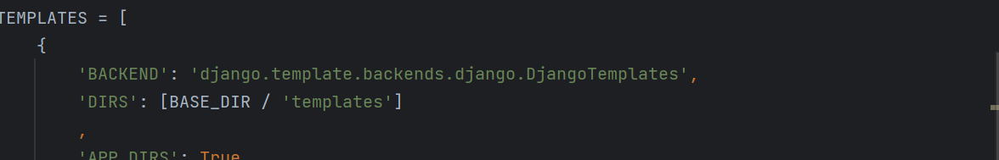

### Django

#### 默认文件介绍

```python
manage.py			#项目管理，启动项目，创建APP，数据管理，不要动
djangoproject
	__init__.py
    settings.py		#项目配置文件
    urls.py			#URL和函数的对应关系 常常操作
    asgi.py			#接受网络请求
    wsgi.py			#接受网络请求 
```

#### app

```python
app
	__init__.py
    admin.py		#固定不要动 django提供了默认的后台管理
    apps.py			#APP启动类
    migrations		#数据库变更记录
    	__init__.py
    modes.py		## 对数据库进行操作
    tests.py    	#固定不要动
    views.py		#函数
manage.py
djangoproject
	__init__.py
    settings.py		#项目配置文件
    urls.py			#URL和函数的对应关系 常常操作
    asgi.py			#接受网络请求
    wsgi.py			#接受网络请求 

控制台创建APP：python manage.py startapp (app名字)
```

#### 快速上手

```python
1.确保APP已经注册 在settings.py文件中的INSTALLED_APPS下写上注册APP名字
2.在urls.py中编写 URL和视图函数的关系
3.在views.py编写函数
4.启动django项目 (1)命令行启动 python manage.py runserve
			    (2)pycharm内django自动启动
```

#### templates

```python
1.优先去项目根目录temlates中寻找
2.根据APP注册顺序，在每个APP templates寻找

下图Django自动配置了DIRS 所以优先去与项目同级目录下的templates中寻找
```



#### 静态文件


```html
引用静态文件
1.在APP下创建静态文件夹
2.导入一个load


<!DOCTYPE html>
<html lang="en">
<head>
    <meta charset="UTF-8">
    <title>Title</title>
    <link rel="stylesheet" href="">
</head>
<body>
<h1>用户列表，根目录</h1>

</body>
</html>
```

#### 模版语法

```python
本质上：在html上写一些占位符，用数据对占位符进行显示
<!DOCTYPE html>
<html lang="en">
<head>
    <meta charset="UTF-8">
    <title>Title</title>
</head>
<body>
    <h1>模版语法的学习</h1>
    {{ n1 }}
    <div>{{ n2.0 }}</div>   #列表内容的访问
    <div>{{ n2.1 }}</div>
    <div>{{ n2.2 }}</div>
    <div>
        
            <span>{{ item }}</span>   #列表的循环
        
    </div>
    <hr/>
    {{ n3 }}
    {{ n3.name }}    /字典value值的访问
    {{ n3.salary }}
    {{ n3.role }}
    <ul>
        
            <li>{{ k }} = {{ v }}</li>    #字典的遍历
        
    </ul>

    <hr/>
    {{ n4.1 }}
    {{ n4.1.name }}      #列表内套字典的访问
    {{ n4.1.role }}      
    
            <h2>{{ item.name }}  {{ item.salary }}</h2>
    

    <hr/>

    			/if 判断
        <li>哒哒哒</li>
    
        <h1>哒哒哒</h1>
    
</body>
</html>

对应views.py文件
def tpl(request):
    name = "韩超"
    roles = ["管理员","CEO","保安"]
    user_info = {"name":"wang","salary":"root","role":"c10"}

    data_info=[
        {"name": "wang", "salary": "root", "role": "c10"},
        {"name": "yu", "salary": "root", "role": "c10"},
        {"name": "tao", "salary": "root", "role": "c10"},
    ]
    return render(
                  request,
                  "tpl.html",
                  {
                   "n1":name,
                   "n2":roles,				#传入数据
                   "n3":user_info,
                   "n4":data_info,
                  }
            )
```

#### 请求和响应

```python
request是一个对象内部封装了用户所有请求的数据
request.methon 获取用户请求的类型
request.GET 获取获取url传递参数
request.POST 获取请求体传来的数据 
return HttpResponse() 返回字符串给请求者  作响应
return render() 返回html  作响应
return redirect("网站") 让浏览器重定向
```


关于重定向（浏览器向某个网站发起请求，某个网站返回地址告诉浏览器去那个地方，浏览器自己再向某个地址发起请求）

##### 案例：用户登录

```python
views.py文件

def login(request):
    if request.method == "GET":
        return render(request,'login.html')   # 跳转页面 页面输入数据后以POST类型又回来
    else:
        print(request.POST)
        username = request.POST.get("user")   # 获取账号
        password = request.POST.get("pwd")    # 获取密码
        if username == "root" and password == "123":   # 如果符合下一步跳转到联通网站
            return redirect("https://www.chinaunicom.com.cn/")
        else:
            return render(request,'login.html',{"error_msg":"登录失败"})  # 如果不符合显示红色的登录错误
```

```html
<!DOCTYPE html>
<html lang="en">
<head>
    <meta charset="UTF-8">
    <title>Title</title>
</head>
<body>

<h1>用户登录</h1>
<form method="post" action="/login/">

    

    <input type="text" name="user" placeholder="用户名">
    <input type="password" name="pwd" placeholder="密码">
    <input type="submit" value="提交">
    <span style="color:red;"> {{ error_msg }} </span>
</form>

</body>
</html>
```


#### 数据库操作

```python
django开发才做数据库更简单，内部提供了ORM框架。
```


##### ORM

```python
ORM可以帮助我们做两件事
*创建，修改，删除数据库的表，不用谢sql语句，但是无法创建数据库
*操作表中的数据

1 自己创建数据库
 启动MYSQOL服务
 创建数据库
2 Django连接数据库
  settings.py 修改
    DATABASES = {
    'default': {
        'ENGINE': 'django.db.backends.mysql',  数据库类型
        'NAME': 'maker',                       数据库名字
        'USER': 'root',                       账户
        'PASSWORD': '234182',                  mysql密码
        'HOST': '127.0.0.1',               本机
        'PORT': 3306,                        端口
    }
}
3 基于Django创建操作表
	确保APP已经注册
	
    python manage.py makemigrations
	python manage.py migrate
    
在表中修改表的时候，由于已存在列表中可能已有的数据，所以新增列必须要指定新增列对应的数据
    （1）设置默认值
    	age = models.IntegerField(default = 2)
    （2）允许为空
    	data = models.IntegerField(null = True,blank = True)
4 操作操作表中的数据   
	*增删
	表名.objects.creat()
    表名.objects.filter(id=3).delete()  #删除id为3的
    表名.objects.all().delect()    #删除表内所有数据
    *获取数据
     my_list = user_info.objects.all()  #获取一个列表[对象，对象] 	Queryset类型
        访问对象内的信息 for i in my_list:
            			 print(i.id,i.name,i.password,i.age)
     a = user_info.objects.filter(id=3)    #获取符合条件的对象
     a = user_info.objects.filter(id=3).first	#获取符合条件的第一个对象
        a.name a.id a.password a.age
    *更新数据
    	user_info.objects.all().update(name=)
        a = user_info.objects.filter(id=3).update(name=)
```

#### 案例：登录

```python
def info_list(request):
    # 1.获取数据库所有用户信息
    data_list = UserInfo.objects.all()
    print(data_list)
    return render(request,"info_list.html",{"data_list":data_list})

def info_add(request):
    if request.method == "GET":
        return render(request,"info_add.html")
    user = request.POST.get("user")
    pwd = request.POST.get("pwd")
    age = request.POST.get("age")
    UserInfo.objects.create(name=user,password=pwd,age=age)
    return redirect("/info/list/")
```

```html
<!DOCTYPE html>
<html lang="en">
<head>
    <meta charset="UTF-8">
    <title>Title</title>
</head>
<body>
<h1>用户注册</h1>
<form method="post" action="/info/add/">
    
    <input type="text" name="user" placeholder="用户名">
    <input type="test" name="pwd" placeholder="密码">
    <input type="test" name="age" placeholder="年龄">
    <input type="submit" value="提交">
</form>

</body>
</html>

<!DOCTYPE html>
<html lang="en">
<head>
    <meta charset="UTF-8">
    <title>Title</title>
</head>
<body>
<h1>INFO列表</h1>
<table border="2">
    <thead>
        <tr>
            <th>ID</th>
            <th>姓名</th>
            <th>密码</th>
            <th>年龄</th>
        </tr>
    </thead>
    <tbody>
    
        <tr>
            <th>{{ i.id }}</th>
            <th>{{ i.name }}</th>
            <th>{{ i.password }}</th>
            <th>{{ i.age }}</th>
        </tr>
    
    </tbody>
</table>
</body>
</html>
```

#### 表结构

```python
 1 用户表存储部门的名称？ID？
		ID,数据库范式，常见开发是这样的
    	名称，特别大的公司，查询次数多，连表花费时间
class UserInfo(models.Model):
    name = models.CharField(verbose_name='姓名',max_length=16)
    password = models.CharField(verbose_name='密码',max_length=64)
    age = models.IntegerField(verbose_name='年龄')
    account = models.DecimalField(verbose_name='账户余额',max_digits=10,decimal_places=2,default=0)    #最大长度10位  小数点2位
    create_time = models.DateTimeField(verbose_name='入职时间')

class Department(models.Model):
    title = models.CharField(verbose_name='标题',max_length=32)

2 约束
   to 与哪张表关联
   to_field 表中哪一类关联
   Django自动 写的depart 生成depart_id
 #如果部门删除
 1,级联删除，删除用户
   depart = models.ForeignKey(to="Department",to_fields="id",on_delete=models.CASCADE)
 2.允许为空
   depart = models.ForeignKey(to="Department",to_field="id",null=True,blank=True,on_delete=models.SET_NULL)

3 设置性别
 # 在Django中约束
 gender_choices =(
	(1,"男"),
	(2,"女"),
 )
gender = models.SmallIntegerField(verbose_name="性别",choices=gender_choices)
```

#### 案例：部门用户管理

```python
新知识点：url传递一些值
path('depart/<int:nid>/edit/', views.depart_edit)
```

##### 部门列表/增加部门/删除部门/编辑部门

```python
def depart_list(request):
    """ 部门列表 """
    queryset = Department.objects.all()
    return render(request,"depart_list.html",{"queryset":queryset})


def depart_add(request):
    """ 添加部门 """
    if request.method == "GET":
        return render(request, "depart_add.html")
    title = request.POST.get("title")
    Department.objects.create(title=title)
    return redirect("/depart/list/")


def depart_delete(request):
    """ 删除部门 """
    # 获取id
    nid = request.GET.get("nid")
    # 删除
    Department.objects.filter(id=nid).delete()
    # 重定向
    return redirect("/depart/list/")


def depart_edit(request,nid):
    """ 编辑部门 """
    # 根据nid获取他的数据
    if request.method == "GET":
        row_object = Department.objects.filter(id=nid).first()
        return render(request, "depart_edit.html",{"row_object":row_object})
    Department.objects.filter(id=nid).update(title=request.POST.get("title"))
    return redirect("/depart/list/")

```

```html

<!DOCTYPE html>
<html lang="en">
<head>
    <meta charset="UTF-8">
    <title>Title</title>
    <link rel="stylesheet" href="">
    <style>
        .navbar {
            border-radius: 0;
        }
    </style>
</head>
<body>
<nav class="navbar navbar-default">
    <div class="container">
        <div class="navbar-header">
            <button type="button" class="navbar-toggle collapsed" data-toggle="collapse"
                    data-target="#bs-example-navbar-collapse-1" aria-expanded="false">
                <span class="sr-only">Toggle navigation</span>
                <span class="icon-bar"></span>
                <span class="icon-bar"></span>
                <span class="icon-bar"></span>
            </button>
            <a class="navbar-brand" href="#"> 联通用户管理系统 </a>
        </div>
        <div class="collapse navbar-collapse" id="bs-example-navbar-collapse-1">
            <ul class="nav navbar-nav">
                <li><a href="/depart/list/">部门管理</a></li>
                <li><a href="/user/list/">用户管理</a></li>
                <li><a href="#">Link</a></li>


            </ul>
            <ul class="nav navbar-nav navbar-right">
                <li><a href="#">登录</a></li>

                <li class="dropdown">
                    <a href="#" class="dropdown-toggle" data-toggle="dropdown" role="button" aria-haspopup="true"
                       aria-expanded="false">武沛齐 <span class="caret"></span></a>
                    <ul class="dropdown-menu">
                        <li><a href="#">个人资料</a></li>
                        <li><a href="#">我的信息</a></li>
                        <li role="separator" class="divider"></li>
                        <li><a href="#">注销</a></li>
                    </ul>
                </li>
            </ul>
        </div>
    </div>
</nav>

<div>
    
</div>


<script src=""></script>
<script src=""></script>
</body>
</html>
```

```html



    <div class="container">
        <div style="margin-bottom: 10px">
            <a class="btn btn-success" href="/depart/add/">
                <span class="glyphicon glyphicon-plus-sign" aria-hidden="true"></span>
                新建部门
            </a>
        </div>
        <div class="panel panel-default">
            <!-- Default panel contents -->
            <div class="panel-heading">
                <span class="glyphicon glyphicon-th-list" aria-hidden="true"></span>
                部门列表
            </div>

            <!-- Table -->
            <table class="table table-bordered">
                <thead>
                <tr>
                    <th>ID</th>
                    <th>名称</th>
                    <th>操作</th>
                </tr>
                </thead>
                <tbody>
                
                    <tr>
                        <th>{{ obj.id }}</th>
                        <td>{{ obj.title }}</td>
                        <td>
                            <a class="btn btn-primary btn-xs" href="/depart/{{ obj.id }}/edit/">编辑</a>
                            <a class="btn btn-danger btn-xs" href="/depart/delete/?nid={{ obj.id }}">删除</a>
                        </td>
                    </tr>
                
                </tbody>
            </table>
        </div>
    </div>

```

```html



    <div class="container">
        <div class="panel panel-default">
            <div class="panel-heading">
                <h3 class="panel-title"> 新建部门 </h3>
            </div>
            <div class="panel-body">
                <form method="post">
                    
                    <div class="form-group">
                        <label>标题</label>
                        <input type="text" class="form-control" placeholder="标题" name="title"/>
                    </div>

                    <button type="submit" class="btn btn-primary">提 交</button>
                </form>
            </div>
        </div>
    </div>

```

```html




    <div class="container">
        <div class="panel panel-default">
            <div class="panel-heading">
                <h3 class="panel-title"> 修改部门 </h3>
            </div>
            <div class="panel-body">
                <form method="post">
                    
                    <div class="form-group">
                        <label>标题</label>
                        <input type="text" class="form-control" placeholder="标题" name="title"
                               value="{{ row_object.title }}"/>
                    </div>

                    <button type="submit" class="btn btn-primary">提 交</button>
                </form>
            </div>
        </div>
    </div>

```

##### 用户展示/增加用户/删除用户/编辑用户

```python
def user_list(request):
    """ 用户管理 """
    # 获取所有用户信息
    queryset = UserInfo.objects.all()
    for i in queryset:
        print(i.create_time.strftime("%Y-%m-%d-%H-%H"),i.gender,i.get_gender_display(),i.depart_id,i.depart.title)
    return render(request,"user_list.html",{"queryset":queryset})

&*&性别展示
 	gender_choices =(
		(1,"男"),
		(2,"女"),
	 )
 	gender = models.SmallIntegerField(verbose_name="性别",choices=gender_choices)
    
	i.get_gender_display()   可以显示性别具体的字符串
&*&展示部门
	在user_info表中部门那一列和Depart表关联
    展示部门ID i.depart_id
    展示部门名称 i.depart  把表depart中部门那一列封装成一个对象(queryset对象)提供给我们
    		   所以要想获取部门的具体名称 i.depart.title
        
        
class UserModelForm(forms.ModelForm):
    class Meta:
        model = UserInfo
        fields = ["name","password","age","account","create_time","gender","depart"]

    def __init__(self,*arge,**kwargs):
        super().__init__(*arge,**kwargs)
		for name,field in self.fields.items():
            field.widget.attrs = {"class":"form-control"}    #长输入框


def user_model_form_add(request):
    """ 添加剂用户 """
    if request.method == "GET":						
        form = UserModelForm()							
        return render(request,"user_model_form_add.html",{"form":form})
    form = UserModelForm(data=request.POST)
    if form.is_valid():                 #如果合法
        form.save()						#数据保存
        return redirect("/user/list")		
    else:
        return render(request,"user_model_form_add.html",{"form":form})		#错误信息
```

###### 在htmel中获取

```html

   <tr>
       <th>{{ obj.id }}</th>
       <td>{{ obj.name }}</td>
       <td>{{ obj.password }}</td>
       <td>{{ obj.age }}</td>
       <td>{{ obj.account }}</td>
       <td>{{ obj.create_time|date:"Y-m-d" }}</td>  #对时间进行获取
       <td>{{ obj.get_gender_display }}</td>		#对性别进行获取，不加括号
       <td>{{ obj.depart.title }}</td>				#对部门名称进行获取
   <td>
```

###### 新建用户

```python
原始的方法理思路：不采用，太麻烦，1，用户提交数据没有校验，
							2，用户输入错误没有提示，
    						3，页面上每一个字段都需要从新写，很费劲，
           					4，关联的数据，需要手动去获取并循环展示（这种开发，漏洞百出）

	def user_add(request):
    """ 添加用户(原始方式) """
    if request.method == "GET":
        context = {
            "gender_choices":UserInfo.gender_choices,
            "depart_list":Department.objects.all()
        }
        return render(request,"user_add.html",context)
    # 获取用户提交的数据
    user = request.POST.get("user")
    pwd = request.POST.get("pwd")
    age = request.POST.get("age")
    account = request.POST.get("ac")
    ctime = request.POST.get("ctime")
    gender_id = request.POST.get("gd")
    depart_id = request.POST.get("dp")
    # 添加到数据库
    UserInfo.objects.create(name=user,password=pwd,age=age,
                            account=account,create_time=ctime,
                            gender=gender_id,depart_id=depart_id)
    return redirect("/user/list")
# Django组件
	*Form组件（小简便）+代码
    只能实现上面三个问题，第四个要加代码
    *ModelForm组件（最简便）
```

###### 初识Form

```python
1.views.py
	class MyForm(Form):
        user = forma.CharField(widget=forma.Input)
        pwd = forma.CharField(widget=forma.Input)
        email = forma.CharField(widget=forma.Input)
        
	def user_add(request):
	if request.method == "GET":
        form = MyForm()
        return render(request,"user_add.html",{"form":form})
```

user_add.html

```html
<form method="post">
    
    	{{ field}}
    
    <!--input type="text" class="form-control" placeholder="余额" name="ac"/>-->
</form>
```

###### ModelForm

```python
&&&& models.py
class UserInfo(models.Model):
    name = models.CharField(verbose_name='姓名',max_length=16)
    password = models.CharField(verbose_name='密码',max_length=64)
    age = models.IntegerField(verbose_name='年龄')
    account = models.DecimalField(verbose_name='账户余额',max_digits=10,decimal_places=2,default=0)
    create_time = models.DateTimeField(verbose_name='入职时间')
    depart = models.ForeignKey(to="Department",to_field="id",on_delete=models.CASCADE)
    gender_choices = (
        (1,"男"),
        (2,"女"),
    )
    gender = models.SmallIntegerField(verbose_name="性别", choices=gender_choices)
&&&& views.py
	class MyForm(ModelForm):
        calss Meta:
			model = UserInfo
			fields = ["name","psaaword"......]        
	def user_add(request):
	if request.method == "GET":
        form = MyForm()
        return render(request,"user_add.html",{"form":form})
```

#### 模版的继承

```html
定义模版
	<!DOCTYPE html>
<html lang="en">
<head>
    <meta charset="UTF-8">
    <title>Title</title>
    <link rel="stylesheet" href="">
         #引入js
</head>
<body>
    <h1>标题</h1>
    <div>
        
    </div>
    <h1>底部</h1>
    
    <script src=""></script>
    
</body>
</html>

继承模版
	   #继承layout的模版
	
		<h1>首页</h1>
	
	
		<h1>首页</h1>
	
```

#### 用户登录

###### 什么是cookie和session?

```python
http:127.0.0.1:8000/admin/list
https:127.0.0.1:8000/admin/list
```

无状态 & 短连接

```python
当用户第一次登录时，网站会给用户浏览器发一个凭证，网站把这个凭证存到数据库（Django默认存到数据库），给每个人存储一个小格子，存储值例如 凭证 | name  ，第二次访问的时候，带着凭证访问，在数据库一一比对，显示该用户能看到的画面
```

cookie:随机字符串  session:用户信息

```python
一些特殊的页面需要登录才能访问，如果页面太多需要一个一个加入
def index(request):
    info = request.session.get("info")
    if not info:
        return redirect('/login/')
```

###### 中间件

```python
from django.utils.deprecation import MiddlewareMixin
from django.shortcuts import HttpResponse, redirect

class AuthMiddleware(MiddlewareMixin):
    def process_request(self, request):
        # 0.排除那些不需要登录就能访问的页面
        #   request.path_info 获取当前用户请求的URL /login/
        if request.path_info in ["/login/", "/image/code/"]:
            return
        # 1.读取当前访问的用户的session信息，如果能读到，说明已登陆过，就可以继续向后走。
        info_dict = request.session.get("info")
        # print(info_dict)
        if info_dict:
            return
        # 2.没有登录过，重新回到登录页面
        return redirect('/login/')

settings.py
MIDDLEWARE = [
    'django.middleware.security.SecurityMiddleware',
    'django.contrib.sessions.middleware.SessionMiddleware',
    'django.middleware.common.CommonMiddleware',
    'django.middleware.csrf.CsrfViewMiddleware',
    'django.contrib.auth.middleware.AuthenticationMiddleware',
    'django.contrib.messages.middleware.MessageMiddleware',
    'django.middleware.clickjacking.XFrameOptionsMiddleware',
    'app01.middleware.auth.AuthMiddleware',   ///////加上这个类///////
]
```

#### 用户注销

```python
def logout(request):
    """ 注销 """
    request.session.clear()
    return redirect('/login/')

html页面显示用户账号名字
{{ request.session.info.name }}
```

#### 生成图片

```python
利用python生成图片
安装 # pip install pillow
from PIL import Image,ImageDraw,ImageFont
# 创建一个图片
img = Image.new(mode="RGB",size=(128,30),color=(255,255,255))
font = ImageFont.truetype("Monaco.ttf",28)
# 创建画笔，用于在图片上画任何内容
draw = ImageDraw.Draw(img,mode="RGB")
# 写入文本
draw.text([0,0],'python1234',"red",font=font)
# 在图片查看器打开
img.show()
# 保存到本地
with open('code.png','wb') as f:
    img.save(f,format='png')
```

```python
生成验证码图片 ##依赖字体文件，必须放到项目的根内目录下面
import random
from PIL import Image, ImageDraw, ImageFont, ImageFilter

def check_code(width=120, height=30, char_length=5, font_file='Monaco.ttf', font_size=28):
    code = []
    img = Image.new(mode='RGB', size=(width, height), color=(255, 255, 255))
    draw = ImageDraw.Draw(img, mode='RGB')

    def rndChar():
        """生成随机字母:return:"""
        return chr(random.randint(65, 90))
    def rndColor():
        """生成随机颜色:return:"""
        return (random.randint(0, 255), random.randint(10, 255), random.randint(64, 255))
    # 写文字
    font = ImageFont.truetype(font_file, font_size)
    for i in range(char_length):
        char = rndChar()
        code.append(char)
        h = random.randint(0, 4)
        draw.text([i * width / char_length, h], char, font=font, fill=rndColor())
    # 写干扰点
    for i in range(40):
        draw.point([random.randint(0, width), random.randint(0, height)], fill=rndColor())
    # 写干扰圆圈
    for i in range(40):
        draw.point([random.randint(0, width), random.randint(0, height)], fill=rndColor())
        x = random.randint(0, width)
        y = random.randint(0, height)
        draw.arc((x, y, x + 4, y + 4), 0, 90, fill=rndColor())
    # 画干扰线
    for i in range(5):
        x1 = random.randint(0, width)
        y1 = random.randint(0, height)
        x2 = random.randint(0, width)
        y2 = random.randint(0, height)
        draw.line((x1, y1, x2, y2), fill=rndColor())
    img = img.filter(ImageFilter.EDGE_ENHANCE_MORE)
    return img, ''.join(code)

if __name__ == '__main__':
    img, code_str = check_code()
    print(code_str)
    with open('code.png', 'wb') as f:
        img.save(f, format='png')
```

```python
def image_code(request):
    """ 生成图片验证码 """
    # 调用pillow函数，生成图片
    img, code_string = check_code()
    # 写入到自己的session中（以便于后续获取验证码再进行校验）
    request.session['image_code'] = code_string      # 将验证码信息存入session数据库当中
    # 给Session设置60s超时
    request.session.set_expiry(60)
    stream = BytesIO()                         # 内存中的文件 BytesIo内存的文件
    img.save(stream, 'png')					   # 图片存入聂村的文件
    return HttpResponse(stream.getvalue())     # 然后再返回
```

#### 图片验证码校验

```python
user_input_code = form.cleaned_data.pop('code')    # 通过剔除code信息来获取用户输入的验证码，因为后续还要与数据库对比，但是比对数据库没有存储验证码
code = request.session.get('image_code', "")     # 获取图片验证码的字符串
if code.upper() != user_input_code.upper():			# 大写相等
	form.add_error("code", "验证码错误")
    return render(request, 'login.html', {'form': form})   
```

#### Ajax

在之前前端以form表单的形式对网页进行post方式进行提交数据，每提交一次页面就会进行一次刷新

除了这种方式我们也可以用Ajax向后端发送请求

```javascript
$.ajax({
    url:"发送的地址",    # url界面地址
    type:"get",			# 发送方法
    data:{
        n1:123,			#发送内容
        n2:456
    },
    success:function(res){		#如果发送成功，则执行success函数内的
        console.log(res);
    }
})
```

##### get方法

```javascript
html界面
    	function bindBtn1Event() {
            $("#btn1").click(function () {    # 如果btn1被点击则执行以下代码
                $.ajax({
                    url: '/task/ajax/',            # GET方法
                    type: "get",           
                    data: {
                        n1: 123,
                        n2: 456
                    },
                    dataType: "JSON",              # 以JSON方式传递数据
                    success: function (res) {
                        console.log(res);
                        console.log(res.status);
                        console.log(res.data);
                    }
                })
            })
        }
```

```python
from django.shortcuts import render, HttpResponse

def task_ajax(request):
    print(request.GET)
    return HttpResponse("成功了")
```

##### post方法

```javascript
html界面
    	function bindBtn1Event() {
            $("#btn1").click(function () {    # 如果btn1被点击则执行以下代码
                $.ajax({
                    url: '/task/ajax/',            # POST方法
                    type: "post",           
                    data: {
                        n1: 123,
                        n2: 456
                    },
                    dataType: "JSON",              # 以JSON方式传递数据
                    success: function (res) {
                        console.log(res);
                        console.log(res.status);
                        console.log(res.data);
                    }
                })
            })
        }
```

```python
from django.shortcuts import render, HttpResponse
from django.views.decorators.csrf import csrf_exempt


@csrf_exempt                          # 相当于前端 当请求为POST的时候可以正常提交数据
def task_ajax(request):
    print(request.GET)
    print(request.POST)
    return HttpResponse("成功了")
```

##### 绑定事件

```python


    <div class="container">
        <h1>任务管理</h1>
        <h3>示例1</h3>
        <input id="btn1" type="button" class="btn btn-primary" value="点击"/>    # 定义按钮为bin1
    </div>


    <script type="text/javascript">
        $(function () {
            // 页面框架加载完成之后代码自动执行
            bindBtn1Event();
        })
        function bindBtn1Event() {                            
            $("#btn1").click(function () {           #如果点击bin1则会执行这个函数
                $.ajax({
                    url: '/task/ajax/',
                    type: "post",
                    data: {
                        n1: 123,
                        n2: 456
                    },
                    success: function (res) {
                        console.log(res);
                    }
                })
            })
        }
    </script>

```

##### 序列化

```javascript
<form id="formAdd">                                  # 定义这个form  id=formAdd
           <div class="clearfix">
                   
                         <div class="col-xs-6">
                             <div class="form-group" style="position: relative;margin-bottom: 20px;">
                                   <label>{{ field.label }}</label>
                                   {{ field }}
                              <span class="error-msg" style="color: red;position: absolute;"></span>
                          </div>
                       </div>
              
               <div class="col-xs-12">
              <button id="btnAdd" type="button" class="btn btn-primary">提 交</button>
          </div>
       </div>
   </form>
               
function bindBtnAddEvent() {
            $("#btnAdd").click(function () {
                $(".error-msg").empty();
                $.ajax({
                    url: '/task/add/',
                    type: "post",
                    data: $("#formAdd").serialize(),        # 提交的时候提交内容会进行序列化
                    dataType: "JSON",
                    success: function (res) {
                        if (res.status) {
                            alert("添加成功");               # 弹窗添加成功
                        } else {
                            console.log(res.error);
                            $.each(res.error, function (name, data) {
                                // console.log(name,data);                # 展示填写的错误
                                $("#id_" + name).next().text(data[0]);
                            })
                        }
                    }
                })
            })
        }
```

```python
@csrf_exempt
def task_add(request):
    """ 添加任务 """
    form = TaskModelForm(data=request.POST)		#用户发送过来的数据进行校验（ModelForm进行校验）
    if form.is_valid():							#判断是否合法
        form.save()								#数据保存
        data_dict = {"status": True}          
        return HttpResponse(json.dumps(data_dict))         #传递json数据

    data_dict = {"status": False, 'error': form.errors}
    return HttpResponse(json.dumps(data_dict, ensure_ascii=False))	#传递json数据
```

##### 添加成功后刷新

```javascript
function bindBtnAddEvent() {
            $("#btnAdd").click(function () {
                $(".error-msg").empty();
                $.ajax({
                    url: '/task/add/',
                    type: "post",
                    data: $("#formAdd").serialize(),
                    dataType: "JSON",
                    success: function (res) {
                        if (res.status) {
                            alert("添加成功");
                            location.reload();        // 用JS实现页面的刷新    
                        } else {
                            $.each(res.error, function (name, data) {
                                // console.log(name,data);
                                $("#id_" + name).next().text(data[0]);
                            })
                        }
                    }
                })
            })
        }
```

#### 知识点回顾

知识点的回顾：

安装Django

```
pip install django
```

创建Django项目

```
>>> django-admin startproject mysite
```

注意：Pycharm可以创建。如果用Pycharm创建，记得settings.py中的DIR templates 删除。

创建app & 注册

```django
>>>python manage.py startapp app01
>>>python manage.py startapp app02
>>>python manage.py startapp app03
```

```django
INSTALLED_APPS = [
    ...
    'app01.apps.App01Config'
]
```

注意：否则app下的models.py写类时，无法在数据库中创建表。

配置 静态文件路径 & 模板的路径（放在app目录下）。

配置数据库相关操作（MySQL）

第三方模块（django3版本）

```
pip install mysqlclient
```

自己先去MySQL创建一个数据库。

配置数据库连接settings.py

```python
DATABASES = {
    'default': {
        'ENGINE': 'django.db.backends.mysql',
        'NAME': 'gx_day16',  # 数据库名字
        'USER': 'root',
        'PASSWORD': 'root123',
        'HOST': '127.0.0.1',  # 那台机器安装了MySQL
        'PORT': 3306,
    }
}
```

在app下的models.py中编写

```python
from django.db import models


class Admin(models.Model):
    """ 管理员 """
    username = models.CharField(verbose_name="用户名", max_length=32)
    password = models.CharField(verbose_name="密码", max_length=64)

    def __str__(self):
        return self.username

    
class Department(models.Model):
    """ 部门表 """
    title = models.CharField(verbose_name='标题', max_length=32)

    def __str__(self):
        return self.title
```

执行两个命令：

```python
>>>python manange.py makemigrations
>>>python manange.py migrate
```

在 urls.py ，路由 （ URL 和 函数的对应关系）。

在views.py，视图函数，编写业务逻辑。

emplates目录，编写HTML模板（含有模板语法、继承、``）

ModelForm & Form组件，在我们开发增删改查功能。

生成HTML标签（生成默认值）

​	请求数据进行校验。

​	保存到数据库（ModelForm）

​	获取错误信息。

​	Cookie和Session，用户登录信息保存起来。

​	中间件，基于中间件实现用户认证 ，基于：`process_request`。

​	ORM操作

Cookie和Session，用户登录信息保存起来。

中间件，基于中间件实现用户认证 ，基于：`process_request`。

ORM操作

```python
models.User.objects.filter(id="xxx")
models.User.objects.filter(id="xxx").order_by("-id")
```

#### 案例：订单

想要去数据库中获取数据时：对象/字典

```python
# 对象，当前行的所有数据。
row_object = models.Order.objects.filter(id=uid).first()
row_object.id
row_object.title
```

```python
# 字典，{"id":1,"title":"xx"}
row_dict = models.Order.objects.filter(id=uid).values("id","title").first()
```

```python
# queryset = [obj,obj,obj,]
queryset = models.Order.objects.all()
```

```python
# queryset = [ {'id':1,'title':"xx"},{'id':2,'title':"xx"}, ]
queryset = models.Order.objects.all().values("id","title")
```

```python
# queryset = [ (1,"xx"),(2,"xxx"), ]
queryset = models.Order.objects.all().values_list("id","title")
```

views.py文件

```python
def order_list(request):
    queryset = models.Order.objects.all()   # 获取数据库所有信息
    form = OrderModerForm()     # 用modelform格式化
    context ={
        "form":form,
        "queryset":queryset
    }
    return render(request,"order_list.html",context)
@csrf_exempt
def order_add(request):
    """ 新建订单 """
    form = OrderModerForm(data=request.POST)
    if form.is_valid():
        																				# 订单号生成
        form.instance.oid = datetime.now().strftime("%Y%m%d%H%M%S") + str(random.randint(1000,9999))
        																	# 管理员 当前登录系统的管理员
        form.instance.admin_id = request.session["info"]["id"]     # 利用sessin获取当前管理员账号的id
        form.save()                                                # 数据保存
        return JsonResponse({"status":True})
    return JsonResponse({"status":False,"error":form.errors})
def order_delete(request):
    """ 数据删除 """
    uid = request.GET.get("uid")                                       # 得到订单号的id
    exists = models.Order.objects.filter(id=uid).exists()              # 在数据库检索
    if not exists:													  # 如果不存在
        return JsonResponse({"status":False,'error':"数据不存在"})
    models.Order.objects.filter(id=uid).delete()                       # 存在则进行删除
    return JsonResponse({"status":True})
def order_detail(request):
    """ 根据订单ID获取订单信息 """
    uid = request.GET.get("uid")										# 得到订单号的id
    row_dict = models.Order.objects.filter(id=uid).values("title","price","status").first() # 直接获取一个字典
    if not row_dict:
        return JsonResponse({"status":False, 'error': "数据不存在"})
    result = {
        "status": True,
        "data":row_dict
    }
    return JsonResponse(result)
@csrf_exempt
def order_edit(request):
    """ 订单信息编辑 """
    uid = request.GET.get("uid")												# 得到订单号的id
    row_object = models.Order.objects.filter(id=uid).first()					# 数据库检索
    if not row_object:															# 如果不存在
        return JsonResponse({"status": False, 'tips': "数据不存在,请刷新重试"})
    form = OrderModerForm(data=request.POST,instance=row_object)				# 这个单条数据部分进行更换
    if form.is_valid():
        form.save()																# 更新后保存到数据库
        return JsonResponse({"status":True})
    return JsonResponse({"status": False, 'error':form.errors})
```

#### 图标

highchart，国外

echarts，国内


快速入手：https://echarts.apache.org/handbook/zh/get-started

##### 柱状图（通过后端传输数据）

```javascript
        function initLine() {
            var myChart = echarts.init(document.getElementById('m1'));
            var option = {
                title: {
                    text: '分公司业绩图',
                    subtext:"我是副标题"				# 设置副标题
                    left: "center",              # 居中
                },
                tooltip: {
                    trigger: 'axis'
                },
                legend: {
                    data: [],
                    bottom: 0                    # 让legend展示在底部
                },
                toolbox: {
                    feature: {
                        saveAsImage: {}       
                    }
                },
                xAxis: {
                    type: 'category',
                    boundaryGap: false,      
                    data: []
                },
                yAxis: {
                    type: 'value'
                },
                series: []
            };
            $.ajax({
                url: '/chart/line/',
                type: "get",
                dataType: "JSON",
                success: function (res) {
                    if (res.status) {
                        option.legend.data = res.data.legend;
                        option.xAxis.data = res.data.x_axis;
                        option.series = res.data.series_list;

                        myChart.setOption(option);
                    }
                }
            })
        }
```

```python
def chart_bar(request):
    """ 构造柱状图的数据 """
    legend = ["王钰滔","王秋童"]                      # 对象名字
    series_list = [
        {
            "name":"王钰滔",                      
            "type":"bar",							# 柱状图类型
            "data":[15,20,36,10,10,100]				#数值
        },
        {
            "name": "王秋童",
            "type": "bar",
            "data": [15, 200, 36, 10, 10, 10]
        }
    ]
    x_axis = ["一月","二月","三月","四月","五月","六月"]      # 底部坐标轴数值
    result = {
        "status":True,
        "data":{
            "legend":legend,
            "series_list":series_list,
            "x_axis":x_axis
        }
    }
    return JsonResponse(result)
```

##### 饼状图（通过后端传输数据）

```javascript
        function initPie() {
            // 基于准备好的dom，初始化echarts实例
            var myChart = echarts.init(document.getElementById('m3'));
            var option = {
                title: {
                    text: '部门预算占比',
                    subtext: '广西分公司',
                    left: 'center'
                },
                tooltip: {
                    trigger: 'item'
                },
                legend: {
                    bottom: 0
                },
                series: [
                    {
                        name: '预算',
                        type: 'pie',
                        radius: '50%',
                        data: [
                            {value: 1048, name: 'IT部门'},
                            {value: 735, name: '运营'},               # 个个数据占比
                            {value: 580, name: '新媒体'},
                        ],
                        emphasis: {
                            itemStyle: {
                                shadowBlur: 10,
                                shadowOffsetX: 0,
                                shadowColor: 'rgba(0, 0, 0, 0)'
                            }
                        }
                    }
                ]
            };
            $.ajax({
                url: "/chart/pie/",
                type: "get",
                dataType: "JSON",
                success: function (res) {
                    if (res.status) {
                        option.series[0].data = res.data;
                        myChart.setOption(option);
                    }
                }
            })

        }
```

```python
def chart_pie(request):
    """ 饼状图 """
    db_data_list = [
        {"value":1048,"name":"IT部门"},
        {"value":1234,"name":"情报部"},
        {"value":580,"name":"策划部"}
    ]
    result = {
        "status":True,
        "data":db_data_list
    }
    return JsonResponse(result)
```

##### 折线图（后端传输数据）

```javascript
        function initLine() {
            var myChart = echarts.init(document.getElementById('m1'));
            var option = {
                title: {
                    text: '分公司业绩图',
                    left: "center",
                },
                tooltip: {
                    trigger: 'axis'
                },
                legend: {
                    data: [],
                    bottom: 0
                },
                toolbox: {
                    feature: {
                        saveAsImage: {}
                    }
                },
                xAxis: {
                    type: 'category',
                    boundaryGap: false,
                    data: []
                },
                yAxis: {
                    type: 'value'
                },
                series: []
            };
               $.ajax({
                url: '/chart/line/',
                type: "get",
                dataType: "JSON",
                success: function (res) {
                    if (res.status) {
                        option.legend.data = res.data.legend;
                        option.xAxis.data = res.data.x_axis;
                        option.series = res.data.series_list;
                        myChart.setOption(option);
                    }
                }
            })
        }
```

```python
def chart_line(request):
    """ 折线图  """
    legend = ["王钰滔","王秋童"]
    series_list = [
        {
            "name":"王钰滔",
            "type":"line",
            "stack":"Total",
            "data":[154,20,36,190,102,100]
        },
        {
            "name": "王秋童",
            "type": "line",
            "stack": "Total",
            "data": [151,200,360,103,105,130]
        }
    ]
    x_axis = ["一月","二月","三月","四月","五月","六月"]
    result = {
        "status":True,
        "data":{
            "legend":legend,
            "series_list":series_list,
            "x_axis":x_axis
        }
    }
    return JsonResponse(result)
```

效果图

#### 文件的上传

```html


    <div class="container">
        <form method="post" enctype="multipart/form-data">      # 一定要在后面加上enctype="multipart/form-data"
             
            <input type="text" name="username">             
            <input type="file" name="avatar">                    # 提交文件
            <input type="submit" value="提交">
        </form>
    </div>

```

```python
from django.shortcuts import render,HttpResponse

def upload_list(request):
    if request.method == "GET":
        return render(request,"upload_list.html")
    file_object = request.FILES.get("avatar")         # 获取文件
    print(file_object.name)
    f = open(file_object.name,mode='wb')            # 打开一个名为上传文件本名的文件，将文件内容一点一点写入      
    for chunk in file_object.chunks():				# chunk方法 可以使文件内容一点点写入
        f.write(chunk)								
    f.close()
    return HttpResponse("ok")
```

##### 案例：通过excel表格批量添加部门名称

```python
from openpyxl import load_workbook
def depart_multi(request):
    """ 批量上传(excle) """
    # 1,获取用户上传的文件对象
    file_object = request.FILES.get("exc")
    print(type(file_object))
    # 2,对象传递给openpyxl,由openpyxl读取文件内容
    wb = load_workbook(file_object)       # 可以写文件路径，名字，把文件读到内存     
    sheet = wb.worksheets[0]        
    cell = sheet.cell(1,1)					# 第一行第一列
    # 3，循环第一行数据
    for row in sheet.iter_rows(min_row=2):									# 从第二行开始
        text = row[0].value                                                # 读取第一列的值
        exists = models.Department.objects.filter(title=text).exists()
        if not exists:
            models.Department.objects.create(title=text)                    #如果不存在，添加到数据库当中
    return redirect("/depart/list/")
```

##### Form上传

提交页面时：用户输入数据 + 文件（输入不能为空、报错）。

- Form生成HTML标签：type=file
- 表单的验证
- form.cleaned_data 获取 数据 + 文件对象

```html


    <div class="container">
        <div class="panel panel-default">
            <div class="panel-heading">
                <h3 class="panel-title"> {{ title }} </h3>
            </div>
            <div class="panel-body">
                <form method="post" enctype="multipart/form-data" novalidate >
                    
                    
                        <div class="form-group">
                            <label>{{ field.label }}</label>
                            {{ field }}
                            <span style="color: red;">{{ field.errors.0 }}</span>
                        </div>
                    
                    <button type="submit" class="btn btn-primary">提 交</button>
                </form>
            </div>
        </div>
    </div>

```

```python
class UpForm(BootStrapForm):
    bootstrap_exclude_fields = ['img']
    name = forms.CharField(label="姓名")
    age = forms.IntegerField(label="年龄")
    img = forms.FileField(label="头像")
def upload_form(request):
    title = "Form上传"
    if request.method == "GET":
        form = UpForm()
        return render(request,"upload_form.html",{"form":form,"title":title})
    form = UpForm(data=request.POST,files=request.FILES)
    if form.is_valid():
        print(form.cleaned_data)                   
        # 1,读取图片内容，写入文件夹中并且获取文件路径       
        img_object = form.cleaned_data.get('img') 
        db_file_path = os.path.join("static","img",img_object.name)         # 合并地址
        file_path = os.path.join("app01",db_file_path)					# 合并地址
        f = open(file_path,mode="wb")                    # 写入
        for chunk in img_object.chunks():                
            f.write(chunk)
        f.close()
        # 2 将文件路径写入数据库
        Boss.objects.create(
            name=form.cleaned_data["name"],
            age=form.cleaned_data["age"],       
            img=db_file_path                                    # 将文件地址写入数据库                          
        )
        return HttpResponse("ok")
    return render(request,"upload_form.html",{"form":form,"title":title})
```

##### 启用media

在urls.py中进行配置：

```
from django.urls import path, re_path
from django.views.static import serve
from django.conf import settings

urlpatterns = [
	re_path(r'^media/(?P<path>.*)$', serve, {'document_root': settings.MEDIA_ROOT}, name='media'),
]
```

在settings.py中进行配置：

```
import os

MEDIA_ROOT = os.path.join(BASE_DIR, "media")
MEDIA_URL = "/media/"
```

##### 案例：混合数据（Form）

```python
from django import forms
from app01.utils.bootstrap import BootStrapForm

class UpForm(BootStrapForm):
    bootstrap_exclude_fields = ['img']
    name = forms.CharField(label="姓名")
    age = forms.IntegerField(label="年龄")
    img = forms.FileField(label="头像")
def upload_form(request):
    title = "Form上传"
    if request.method == "GET":
        form = UpForm()
        return render(request, 'upload_form.html', {"form": form, "title": title})
    form = UpForm(data=request.POST, files=request.FILES)
    if form.is_valid():
        # {'name': '武沛齐', 'age': 123, 'img': <InMemoryUploadedFile: 图片 1.png (image/png)>}
        # 1.读取图片内容，写入到文件夹中并获取文件的路径。
        image_object = form.cleaned_data.get("img")
        # media_path = os.path.join(settings.MEDIA_ROOT, image_object.name)
        media_path = os.path.join("media", image_object.name)
        f = open(media_path, mode='wb')
        for chunk in image_object.chunks():
            f.write(chunk)
        f.close()
        # 2.将图片文件路径写入到数据库
        models.Boss.objects.create(
            name=form.cleaned_data['name'],
            age=form.cleaned_data['age'],
            img=media_path,
        )
        return HttpResponse("...")
    return render(request, 'upload_form.html', {"form": form, "title": title})
```

##### 案例：混合数据（ModelForm）

```python
models.py
class City(models.Model):
    """ 城市 """
    name = models.CharField(verbose_name="名称", max_length=32)
    count = models.IntegerField(verbose_name="人口")

    # 本质上数据库也是CharField，自动保存数据。
    img = models.FileField(verbose_name="Logo", max_length=128, upload_to='city/')   直接保存到media文件下city文件
```

```python
def upload_modal_form(request):
    """ 上传文件和数据（modelForm）"""
    title = "ModelForm上传文件"
    if request.method == "GET":
        form = UpModelForm()
        return render(request, 'upload_form.html', {"form": form, 'title': title})
    form = UpModelForm(data=request.POST, files=request.FILES)
    if form.is_valid():
        # 对于文件：自动保存；
        # 字段 + 上传路径写入到数据库
        form.save()                            
        return HttpResponse("成功")
    return render(request, 'upload_form.html', {"form": form, 'title': title})
```

##### 总结

- 自己手动去写

  ```python
  file_object = request.FILES.get("exc")
  ...
  ```

- Form组件（表单验证）

  ```python
  request.POST
  file_object = request.FILES.get("exc")
  
  具体文件操作还是手动自己做。
  ```

- ModelForm（表单验证 + 自动保存数据库 + 自动保存文件）

  ```
  - Media文件夹
  - Models.py定义类文件要
  	img = models.FileField(verbose_name="Logo", max_length=128, upload_to='city/')
  ```

  

