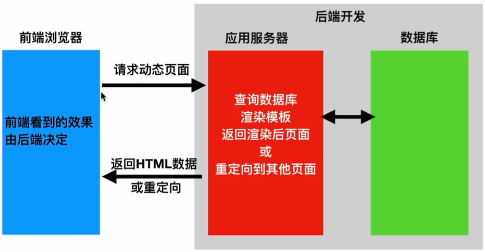
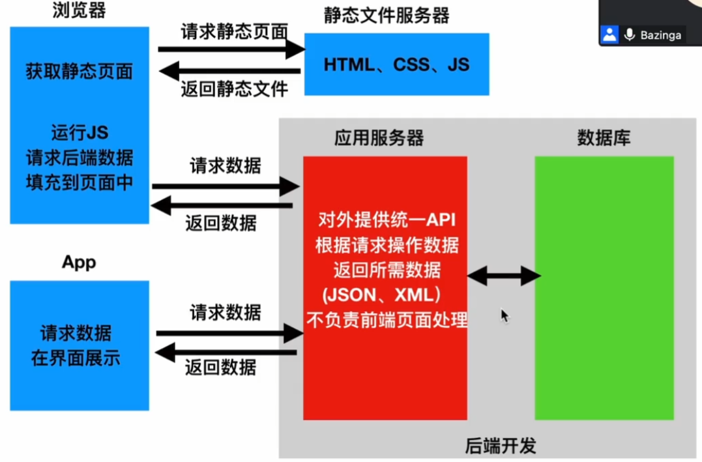

## Django_drf框架

#### 前后端分离/前后端不分离

##### 前后端不分离

```python
# 既要处理后端数据，也要处理前端页面
```

##### 前后端分离

```python
# 后端只处理数据接口   前端人员和后端人员职责分离
```

#### api接口

```python
# 应用程序编程接口，就是程序员对外提供了一个实现功能方法的入口，这个入口可以是一个函数或者方法，也可以是一个url地址或者一个网址

&& 以前
book/
book/add
book/delete/(\d+)
book/deit(\d+)
# 根据动作来用相关单词命名

&& 现在(基于请求的不同来达成不同的方法)
POST  http://www.xxx.com/api/students
GET	 http://www.xxx.com/api/students
GET	 http://www.xxx.com/api/students/<pk>   # 查询一个id为pk的学生
DELETE  http://www.xxx.com/api/students/<pk>  # 删除一个id为pk的学生
PUT  http://www.xxx.com/api/students<pk>   # 编辑一个学生的全部信息
.......
```

#### CBV

```python
# 之前我们使用的视图函数叫做FBV(也就是函数类型的视图函数)，这里我们用的CBV(类视图函数)

class BookViews(View):

    def get(self,request):
        return HttpResponse("views ok get")

    def post(self,request):
        return HttpResponse("views ok post")
```

##### cbv源码解析

```python
path('book/',BookViews.as_view())

1 先看as_view()方法
@classonlymethod
    def as_view(cls, **initkwargs):
        for key in initkwargs:                             ## 判断请求方法
            if key in cls.http_method_names:
                raise TypeError(
                    "The method name %s is not accepted as a keyword argument "
                    "to %s()." % (key, cls.__name__)
                )
            if not hasattr(cls, key):
                raise TypeError(
                    "%s() received an invalid keyword %r. as_view "
                    "only accepts arguments that are already "
                    "attributes of the class." % (cls.__name__, key)
                )
        def view(request, *args, **kwargs):
            self = cls(**initkwargs)
            self.setup(request, *args, **kwargs)
            if not hasattr(self, "request"):
                raise AttributeError(
                    "%s instance has no 'request' attribute. Did you override "
                    "setup() and forget to call super()?" % cls.__name__
                )
            return self.dispatch(request, *args, **kwargs)
        view.view_class = cls
        view.view_initkwargs = initkwargs
        # __name__ and __qualname__ are intentionally left unchanged as
        # view_class should be used to robustly determine the name of the view
        # instead.
        view.__doc__ = cls.__doc__
        view.__module__ = cls.__module__
        view.__annotations__ = cls.dispatch.__annotations__
        # Copy possible attributes set by decorators, e.g. @csrf_exempt, from
        # the dispatch method.
        view.__dict__.update(cls.dispatch.__dict__)

        # Mark the callback if the view class is async.
        if cls.view_is_async:
            markcoroutinefunction(view)
        return view                    # 返回了一个函数
    
2 path('book/',View.view)
class BookViews(View):     # 继承View
class View:
    def as_view():
		def view():
            self = cls(**initkwargs)
			# cls : BookViews
            return self.dispatch(request, *args, **kwargs)
        return view
# 一旦用户访问book，比如get请求 /book/ => view()（view函数的返回值） => view函数的返回值由dispatch来决定
    def dispatch(self, request, *args, **kwargs):
        if request.method.lower() in self.http_method_names:
            handler = getattr(self, request.method.lower())   # gatattr 执行self.方法 
        return handler(request, *args, **kwargs)  # 返回请求方法 先到BookViews找self.方法
# 一旦用户访问book，比如get请求 /book/ => view()（view函数的返回值） => view函数的返回值由dispatch来决定 => return get()
```

#### django_rest_framework

```python
#核心思想 大量缩减编写API接口的代码
安装：pip install djangorestframework

from rest_framework.views import APIView
class BookViews(APIView):

    def get(self,request):
        return HttpResponse("APIViews ok get")

    def post(self,request):
        return HttpResponse("APIViews ok post")
```

##### ApiView源码解析

```python
class BookViews(APIView):  # 继承ApiView
    def get(self,request):
        return HttpResponse("APIViews ok get")
    def post(self,request):
        return HttpResponse("APIViews ok post")
class ApiView(View):
    def as_view():
        view = super().as_view(**initkwargs)   # 执行超类 执行父类as_view方法
        return csrf_exempt(view) 
    def dispatch(self, request, *args, **kwargs):
		# 构建新的request对象
        # 原始的request.POSR具有局限性，不能处理json数据格式
        request = self.initialize_request(request, *args, **kwargs)
        self.request = request
        self.headers = self.default_response_headers  # deprecate?
		# 初始化，认证，权限，限流组件三件套
        self.initial(request, *args, **kwargs)
        # 分发逻辑，把新的request传给get 
        handler = getattr(self, request.method.lower(),self.http_method_not_allowed)
        response = handler(request, *args, **kwargs)
        self.response = self.finalize_response(request, response, *args, **kwargs)
        return self.response
class View:
    def as_view():
		def view():
            self = cls(**initkwargs)
			# cls : BookViews
            return self.dispatch(request, *args, **kwargs)
        return view
    def dispatch(self, request, *args, **kwargs):
        if request.method.lower() in self.http_method_names:
            handler = getattr(self, request.method.lower())   # gatattr 执行self.方法 
        return handler(request, *args, **kwargs)  # 返回请求方法 先到BookViews找self.方法
    
# Apiview内有as_view方法 父类View也有  所以执行ApiView内的as_view方法 但是ApiView内的as_view方法有超类，所以也执行父类as_view方法  
# Apiview内有dispatch方法 父类View也有  所以执行ApiView内的dispatch方法  
path('book/',BookViews.as_view())
path('book/',View.view)
request.data 类似于django原始的request.POST方法 和 request.FILES属性
reqeust.query_params 类型于django标准的request,GET
```

#### 序列化器-serializer

##### get post

```python
# 把模型对象转换成走到哪，经过request之后变成json字符串
from rest_framework import serializers
from rest_framework.response import Response
class BookSerializer(serializers.Serializer):
    title = serializers.CharField(max_length=32)
    price = serializers.IntegerField()
    date = serializers.DateField(source='pub_date')   # 根据前端的需要进行命名
class BookViews(APIView):
    """查看所有的接口"""
    def get(self,request):
        book_list = Book.objects.all()             
        #instance序列化 data反序列化 many有多个对象True 
        serializer = BookSerializer(instance=book_list, many=True)  # 获得序列化对象
        print(serializer)
        print(serializer.data)
        return Response(serializer.data)   # 传递序列化后的数据，APIVIEW里的Response能根据数据类型传递数据
    
   
# 接口规范
/book/ GET 查看所有资源，返回所有资源
/book/ POST 添加资源，返回添加的资源
/book/1	GET 查看某个人的资源
/book/1 PUT 编辑某一个人的资源，返回编辑后的资源
/book/1 DELETE 删除某个资源，返回空

def post(self,request):
    serializer = BookSerializer(data=request.data)  # 反序列化
    #serializer.validated_data      # 所有符合规范的数据存在里面
    #serializer.errors				# 存储错误信息，以一个键值对的形式
    if serializer.is_valid():       # 判断是否合法，合法返回True 不合法返回False
       print(serializer.validated_data)
       new_book = Book.objects.create(**serializer.validated_data)  # 打散保存的数据库
       return Response(serializer.data)         
    else:
       print(serializer.validated_data)
       return Response(serializer.errors)    # 返回错误
```

##### 序列化器的save操作

```python
# 源码
if self.instance is not None:
   self.instance = self.update(self.instance, validated_data)
   assert self.instance is not None, ('`update()` did not return an object instance.')
else:
   self.instance = self.create(validated_data)
   assert self.instance is not None, ('`create()` did not return an object instance.')
return self.instance
# 当方法为POST的时候，instance传入为空，所以执行else方法，就会继续执行create方法
    def create(self, validated_data):
        raise NotImplementedError('`create()` must be implemented.')
# 但是create方法需要被覆盖，需要我们自己写
class BookSerializer(serializers.Serializer):
    title = serializers.CharField(max_length=32)
    price = serializers.IntegerField()
    date = serializers.DateField(source='pub_date')
    def create(self, validated_data):
        return Book.objects.create(**validated_data)
```

##### 接口的实现

```python
http://localhost:8000/book/11
re_path("book/(\d+)",BookDetail.as_view())

class BookDetail(APIView):

    def get(self,request,pk):
        book = Book.objects.get(id=pk)
        serializer = BookSerializer(instance=book,many=False)
        return Response(serializer.data)

    def put(self,request,pk):
        book = Book.objects.get(id=pk)
        serializer = BookSerializer(instance=book,data=request.data)
        if serializer.is_valid():
            Book.objects.filter(id=pk).update(**serializer.validated_data)
            serializer.instance = Book.objects.get(id=pk)
            return Response(serializer.data)
        else:
            return Response(serializer.errors)
        
# data源码解析
@property
def data(self):
    ret = super().data
    return ReturnDict(ret, serializer=self)
def data:
	if not hasattr(self, '_data'):
  		if self.instance is not None and not getattr(self, '_errors', None):
            # 如果instance不为空而且没有错误信息 TRUE AND TRUE 还为TRUE 对instance 进行序列化
     		self._data = self.to_representation(self.instance)
    	elif hasattr(self, '_validated_data') and not getattr(self, '_errors', None):
            # 当没有传入 必须要在数据校验后才能调用.data方法
     		self._data = self.to_representation(self.validated_data)
 		else:
     		self._data = self.get_initial()
  		return self._data
```

##### save方法的完善

```python
# 源码
if self.instance is not None:
   self.instance = self.update(self.instance, validated_data)
   assert self.instance is not None, ('`update()` did not return an object instance.')
else:
   self.instance = self.create(validated_data)
   assert self.instance is not None, ('`create()` did not return an object instance.')
return self.instance

# 当执行更新的操作时候，执行update的操作
def update(self, instance, validated_data):
   Book.objects.filter(pk=instance.pk).update(**self.validated_data)
   return Book.objects.get(pk=instance.pk)  # 将新修改的数据传递给self.instance 
```

##### Midelserializer

```python
# 不用再重写create update方法 原来用Serializer的接口不用改变

class BookSerializer(serializers.ModelSerializer):
    date = serializers.DateField(source='pub_date')
    class Meta:
        model = Book                                # 表名称
        exclude = ['pub_date','id']          
        # fields = '__all__'						# 传递全部数据
```

#### 视图

##### GenericAPIView通用视图类

```python
# 继承的APIView，创建了几个新的方法

class PublishSerializer(serializers.ModelSerializer):
    class Meta:
        model = Publish
        fields = '__all__'

class PublishViews(GenericAPIView):
    queryset = Publish.objects.all()
    serializer_class = PublishSerializer      # 使用时首先传入这两个参数  
    def get(self, request):
        """ 查看所有书籍 """
        publish_list = self.get_queryset()
        # serializer = self.get_serializer_class()(instance=publish_list, many=True)
        serializer = self.get_serializer(instance=publish_list, many=True)
        return Response(serializer.data)
    def post(self, request):
        """ 添加数据 """
        serializer = self.get_serialize(data=request.data)
        if serializer.is_valid():
            serializer.save()
            return Response(serializer.data)
        else:
            return Response(serializer.errors)
        
class PublishDetail(GenericAPIView):
    queryset = Publish.objects.all()
    serializer_class = PublishSerializer
    def get(self,request,pk):
        serializer = self.get_serializer(instance=self.get_object(),many=False)
        return Response(serializer.data)
    def put(self,request,pk):
        serializer = self.get_serializer(instance=self.get_object(),data=request.data)
        if serializer.is_valid():
            serializer.save()
            return Response(serializer.data)
        else:
            return Response(serializer.errors)
    def delete(self,request,pk):
        self.get_object().delete()
        return Response('删除成功')
```

###### get_queryset源码解析

```python
queryset = self.queryset
if isinstance(queryset, QuerySet):
 # Ensure queryset is re-evaluated on each request.
    queryset = queryset.all()
    return queryset
# 会获取初始传入的queryset的值
```

###### get_serializer_class源码解析

```python
def get_serializer_class:
	return self.serializer_class
使用：serializer = self.get_serializer_class()(instance=publish_list, many=True)
```

###### get_serializer源码解析

```python
def get_serializer(self, *args, **kwargs):
    serializer_class = self.get_serializer_class()
    kwargs.setdefault('context', self.get_serializer_context())
    return serializer_class(*args, **kwargs)
# 会重新构造的序列化器
使用：serializer = self.get_serializer(instance=publish_list, many=True)
```

###### get_object源码解析

```python
def get_object:
    filter_kwargs = {self.lookup_field: self.kwargs[lookup_url_kwarg]}
    obj = get_object_or_404(queryset, **filter_kwargs)
    self.check_object_permissions(self.request, obj)
    return obj
	# 根据传入的pk值返回数据库中id = pk 的对象，只会读有名对象，所以url要对传入的数值进行命名为pk
        re_path("publish/(?P<pk>\d+)",PublishDetail.as_view())
使用：serializer = self.get_serializer(instance=self.get_object(),many=False)
```

#### minin混合类

````python
from rest_framework.mixins import ListModelMixin, RetrieveModelMixin, UpdateModelMixin, DestroyModelMixin,CreateModelMixin
class PublishSerializer(serializers.ModelSerializer):
    class Meta:
        model = Publish
        fields = '__all__'

class PublishViews(CreateModelMixin,GenericAPIView,ListModelMixin):
    queryset = Publish.objects.all()
    serializer_class = PublishSerializer
    def get(self, request):
        """ 查看所有书籍 """
        return self.list(request)
    def post(self, request):
        """ 添加数据 """
        return self.create(request)
    
class PublishDetail(GenericAPIView,UpdateModelMixin,DestroyModelMixin,RetrieveModelMixin):
    queryset = Publish.objects.all()
    serializer_class = PublishSerializer
    def get(self,request,pk):
        """查看单一书籍"""
        return self.retrieve(request,pk)
    def put(self,request,pk):
        """修改书籍信息"""
        return self.update(request,pk)
    def delete(self,request,pk):
        """删除书籍"""
        return self.destroy(request,pk)
````

##### 源码

```python
class CreateModelMixin:
    """
    Create a model instance.
    """
    def create(self, request, *args, **kwargs):
        serializer = self.get_serializer(data=request.data)
        serializer.is_valid(raise_exception=True)
        self.perform_create(serializer)
        headers = self.get_success_headers(serializer.data)
        return Response(serializer.data, status=status.HTTP_201_CREATED, headers=headers)
    def perform_create(self, serializer):
        serializer.save()
    def get_success_headers(self, data):
        try:
            return {'Location': str(data[api_settings.URL_FIELD_NAME])}
        except (TypeError, KeyError):
            return {}

class ListModelMixin:
    """
    List a queryset.
    """
    def list(self, request, *args, **kwargs):
        queryset = self.filter_queryset(self.get_queryset())

        page = self.paginate_queryset(queryset)
        if page is not None:
            serializer = self.get_serializer(page, many=True)
            return self.get_paginated_response(serializer.data)

        serializer = self.get_serializer(queryset, many=True)
        return Response(serializer.data)

class RetrieveModelMixin:
    """
    Retrieve a model instance.
    """
    def retrieve(self, request, *args, **kwargs):
        instance = self.get_object()
        serializer = self.get_serializer(instance)
        return Response(serializer.data)

class UpdateModelMixin:
    """
    Update a model instance.
    """
    def update(self, request, *args, **kwargs):
        partial = kwargs.pop('partial', False)
        instance = self.get_object()
        serializer = self.get_serializer(instance, data=request.data, partial=partial)
        serializer.is_valid(raise_exception=True)
        self.perform_update(serializer)
        if getattr(instance, '_prefetched_objects_cache', None):
            # If 'prefetch_related' has been applied to a queryset, we need to
            # forcibly invalidate the prefetch cache on the instance.
            instance._prefetched_objects_cache = {}
        return Response(serializer.data)
    def perform_update(self, serializer):
        serializer.save()
    def partial_update(self, request, *args, **kwargs):
        kwargs['partial'] = True
        return self.update(request, *args, **kwargs)
    
class DestroyModelMixin:
    """
    Destroy a model instance.
    """
    def destroy(self, request, *args, **kwargs):
        instance = self.get_object()
        self.perform_destroy(instance)
        return Response(status=status.HTTP_204_NO_CONTENT)

    def perform_destroy(self, instance):
        instance.delete()

```

##### minin混合类再封装

```python
from rest_framework.generics import ListCreateAPIView,RetrieveUpdateDestroyAPIView
class PublishSerializer(serializers.ModelSerializer):
    class Meta:
        model = Publish
        fields = '__all__'

class PublishViews(ListCreateAPIView):
    queryset = Publish.objects.all()
    serializer_class = PublishSerializer

class PublishDetail(RetrieveUpdateDestroyAPIView):
    queryset = Publish.objects.all()
    serializer_class = PublishSerializer

# 除此之外还有   RetrieveUpdateAPIView和RetrieveDestroyAPIView 查看/更新  查看/删除

# 源码（继承继承再继承）
class ListCreateAPIView(mixins.ListModelMixin, mixins.CreateModelMixin,GenericAPIView):  # 继承
    def get(self, request, *args, **kwargs):
        return self.list(request, *args, **kwargs)

    def post(self, request, *args, **kwargs):
        return self.create(request, *args, **kwargs)
    
class RetrieveUpdateDestroyAPIView(mixins.RetrieveModelMixin, GenericAPIView， mixins.UpdateModelMixin,mixins.DestroyModelMixin,):           # 继承
    def get(self, request, *args, **kwargs):
        return self.retrieve(request, *args, **kwargs)
    def put(self, request, *args, **kwargs):
        return self.update(request, *args, **kwargs)
    def patch(self, request, *args, **kwargs):
        return self.partial_update(request, *args, **kwargs)
    def delete(self, request, *args, **kwargs):
        return self.destroy(request, *args, **kwargs)
```

#### Viewset

可以让多个接口在一个视图函数下

```python
from rest_framework.viewsets import ViewSet
class PublishSerializer(serializers.ModelSerializer):
    class Meta:
        model = Publish
        fields = '__all__'

class PublishViews(ViewSet):
    def get_all(self,request):
        return Response("查看所有")
    def add_object(self,request):
        return Response("查看所有")
    def get_object(self,request,pk):
        return Response("查看单一")
    def update_object(self,request,pk):
        return Response("更新单一")
    def delete_object(self,request,pk):
        return Response("删除单一")
    
path('publish/',PublishViews.as_view({"get":"get_all","post":"add_object"})),
re_path("publish/(?P<pk>\d+)",
            PublishViews.as_view({"get":"get_object","put":"update_object","delete":"delete_object"})),
```

##### 源码解析

```python
# as_view =>> view 在这个ViewSet里 view函数被重写
 def view(request, *args, **kwargs):
     for method, action in actions.items():    # actions.items == {"get":"get_all","post":"add_object"}
         handler = getattr(self, action)         # 重构 get,post..... 方法
         setattr(self, method, handler)
```

#### GenericViewSet

```python
path('publish/',PublishViews.as_view({"get":"list","post":"create"})),
re_path("publish/(?P<pk>\d+)",
		PublishViews.as_view({"get":"retrieve","put":"update","delete":"destroy"})),
    
from rest_framework.viewsets import GenericViewSet
class PublishSerializer(serializers.ModelSerializer):
    class Meta:
        model = Publish
        fields = '__all__'

class PublishViews(GenericViewSet,ListModelMixin,CreateModelMixin,RetrieveModelMixin,UpdateModelMixin,DestroyModelMixin):
    queryset = Publish.objects.all()
    serializer_class = PublishSerializer
```

#### ModelViewSet

```python
from rest_framework.viewsets import ModelViewSet
class PublishSerializer(serializers.ModelSerializer):
    class Meta:
        model = Publish
        fields = '__all__'
class PublishViews(ModelViewSet):
    queryset = Publish.objects.all()
    serializer_class = PublishSerialize
    
# 封装程度高，但是灵活度差
```

#### 路由组件

```python
from rest_framework import routers
router = routers.DefaultRouter()
router.register('publish',PublishViews)      # 相当于下列
urlpatterns = [
    # path('publish/',PublishViews.as_view({"get":"list","post":"create"})),
    # re_path("publish/(?P<pk>\d+)",
    #         PublishViews.as_view({"get":"retrieve","put":"update","delete":"destroy"})),
]
urlpatterns += router.urls
```


