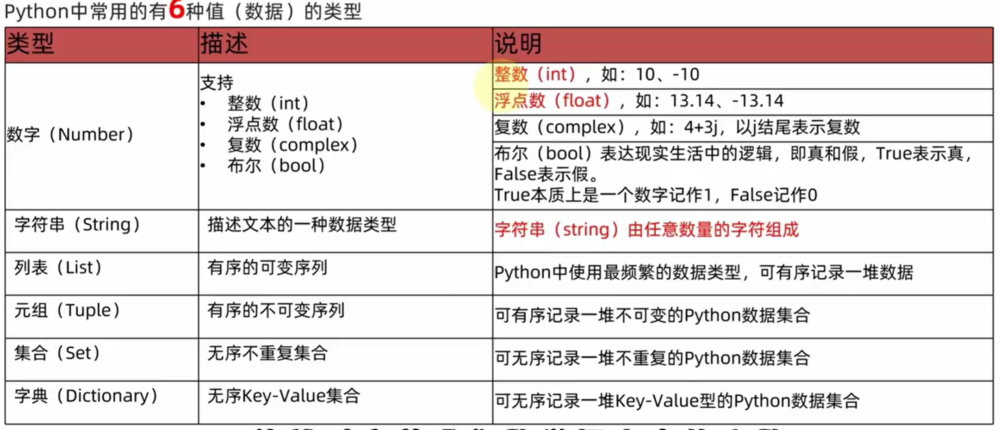
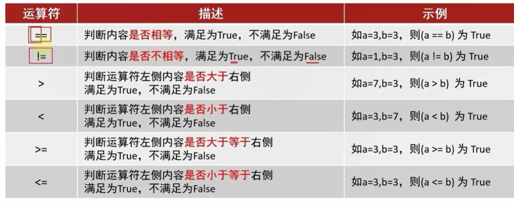
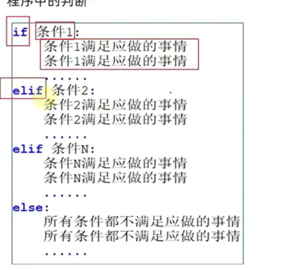

### python学习

#### **第二章**

##### 	字面量

```python
int() float() bool str() typle() list() set() dict()
```



##### 	注释

```python
# 这是单行注释   快捷键ctrl+/

"""
这是多行注释
这是多行注释
"""	
```

##### 变量

```python
# 变量是在程序运行时记录数据用的，赋值：将等号右边的赋值给等号左边的变量，每个变量都有自己唯一的名称
  money = 20
```

##### 数据类型的转换

```python 
 数据典型之间可以再特警场景下相互转换，如字符串转数字，数字转字符串  int("123")
 从文件中读取数字，默认是字符串，而我们要将他转换成数字   
 input()语句，默认结果也是字符串，我们需要数字时也需要转换    int(input())
 数字转字符串，字符串转数字但前提是字符串内容必须是数字
 整数可以转成浮点数，但是浮点数转整数会丢失精度
```

##### 运算符

```python
基本运算符
	加+ 减- 乘* 除/ 取整// 取余% 指数**
赋值运算符
	+= -= *= /= //= %= **=
```

##### 字符串扩展内容

```python
# 单引号 双引号
# 三引号可以扩住多行内容，print可以输出出来
\可以消除""''的作用，让他们变成字符串

字符串之间可以用加号进行拼接，但是字符串不能和其他类型的数据进行拼接
	"maker"+"zzuli"
```

##### 字符串格式化

```python
站位拼接
	name = "maker"
	message = "郑州轻工业大学 %s" % name
	time = 2024
	message = "郑州轻工业大学%d%s欢迎你" % (time,name)
格式化精度的控制
	我们可以用m.n来控制输出的宽度和精度  m控制宽度，要求是数字  .n控制小数精度
    %m.nf %md
字符串的格式化输出
	语法：name = "maker"
    	 print(f"你好呀{name}")
```

#### 第三章

##### 布尔类型

布尔类型 是(True)记作1   否(False)记作0

##### if elif else语句



#### 第四章

##### while循环

```python
while 条件:
	条件满足的时候，事情一
    条件满足的时候，事情二
    条件满足的时候，事情三
    ......

案例：求1到100的和
	i = 1
	sum_i = 0
	while i <= 100:
		sum_i += i
    	i += 1
	print("1-100的和是:"sum_i)

案例：猜数字
	import random
	a = random.randint(1,100)
	fage = True
	i = 0
	while fage:
		b = int(input("请输入你猜想的数字"))
		if a > b:
			print("猜小了")
		if a < b:
			print("猜大了")
		if a == b:
			print("猜中了")
			fage = False
		i=i+1
	print("猜了:”,i,"次")
```

###### while循环的嵌套

```python
案例：九九乘法表
	while i <= 9:
		j=1
		while j <= i:
			print(f"{j}x{i}={j*i}\t",end="")
			# if j< i:
			#print(f"{j} x{i}= {j*i}\t",end=')
			# else:
			#print(f"{j} x {i} = {j*i}\t",end="\n")
			j=j+1
		i=i+1
		print()
        
\t 相当于一个tab键  \n相当于换行符
```

##### for循环

###### for循环的基础

```python
for循环是一种轮询的机制，是对一批内容进行处理

#for循环遍历字符串
name = 'makerstudio'
for i in name:
	print(i)
```

###### for range配合使用

```python
for 临时变量 in 待处理的数据集  待处理的数据集严格来说，称之为：序列类型，包括字符串，列表，元祖，字典等

#range用法
range(num1,num2)  从num1开始到num2结束，包括num1不包括num2
range(num1,num2,step)  step表示是步长，不填步长默认是1
```

###### for循环临时变量作用


#### 第六章

##### 	数据容器

```python
字典 a = dict()  列表 a = list()  元组 a = tuple() 集合 a = set() 字典 a = dict()
```

##### 	列表list

```python
a = ["123",123,"maker"] 列表内的元素可以是字符串，也可以是数字，即可以容纳不同类型的数据，可以容纳多个元素，数据室有序存在的，允许重复存在，并且可以修改。

1,访问列表内元素
 	正序访问：例如上述列表a 第一个元素"123"排序为0 如果要访问它，即a[0],同理 123 = a[1] "maker" = a[2]
	倒序访问：最右边的元素起始数值为-1 即 "maker" = a[-1]  同理可得其他元素

 	列表内也同时可以有列表
	b = [["123","zzuli",222],"aaa","ccc"]
	如果想要访问列表b内第一个元素内的元素，同上述a[0][0],a[0][1],a[0][2]

2.列表的常用方法
	方法和函数的功能一样，有传入参数，有返回值，只是方法的使用格式不一样
	函数的使用：num = add(1,2)
	方法的使用方式 student = Student()
			 	 num = student.add(1,2)
	*查询元素
		语法：列表.index(元素)以上述a列表为例,如果该元素在列表中存在第一个打印会打印该元素的下标，如果不存			   在，程序会发生报错
			w = a.index("123")  print(w) 
			q = a.index("2")   print(q)
	*插入元素
		语法：列表.insert(下标,元素)在指定下标位置，插入指定的元素
			a.insert(1,"many makers")
			a = ["123","many makers",123,"maker"] 
	*删除元素(通过下标)
		语法1：del 列表[下标]   
       		del a[0]
		语法2：列表.pop(下标) 
        	a.pop(0)
        	element = a.pop(0)（我们还可以用变量来接受删除值）
    *删除元素(通过指定元素进行删除)
    	语法：列表.remove(元素) 从前到后找到该元素，找到第一个进行删除
        	a.remove("123")
    *追加元素(单个元素，批量元素)
		语法：列表.append(元素) 将指定元素，追加到列表的尾部
			a.append("123")
		语法：列表.extend(其他数据容器)，将其他数据的内容取出，追加到列表的尾部
			a.append(b)
			a = ["123",123,"maker",["123","zzuli",222],"aaa","ccc"]
	*清空列表
		语法：列表.clear()
        	a.clear()
	*修改元素
		语法：列表[需要修改的元素的下标] - "要修改的东西"
			a[0] = "maker"
	*统计某元素在列表内个数
    	语法：列表.count(元素)
        	print(a.count("123"))
    *统计列表内元素数量
    	语法：w = len(列表)
        	print(w)会得到列表内元素数量的个数
3.列表的循环
	while循环
    	语法：i = 0
        	 while i <len(列表):
				元素 = 列表[i]
                对元素进行处理
                i += 1
	for循环
    	语法：for i in 列表:
            	print(i)
```

##### 元组tuple

```python
列不是可以修改的，如果想要传递信息不被修改，列表就不合适了，元组和列表一样但是它里面的元素不能被修改

1.元组的定义
	语法:(元素，元素，元素)
    	 变量名称 = (元素，元素)
         变量名称 = tuple() 可以得到一个空元组
    当我们定义元祖时若里面只有一个元素 正确的方法是name = ("maker",) 如果写成name = ("maker")则它的类型	   不是元组而是字符串。
    
    访问元组内的元素和列表一样
    t = ((1,2,3),(1,2,3))
    t[1][2]
    
2.元组的常用操作
	*查找元素的下标
    	语法：a.index(元素)
    *统计元素的个数
    	语法：a.count(元素)
    *统计元素个数
    	语法：a = len(元组)
        
3.元组的遍历
	while循环
    	语法：i = 0
        	 while i <len(元组):
				元素 = 元组[i]
                对元素进行处理
                i += 1
	for循环
    	语法：for i in 元组:
            	print(i)

虽然元组内的元素不能被修改，但是如果在元组内定义了一个列表，那么元组内列表的元素可以修改
t = (1,2,[1,2,3])
t[2][0] = 3
```

##### 字符串str

```python
字符串是字符的容器，也是一个不可修改的容器，不可以修改字符串内特定下标的字符

1.字符串的下表
	name = "maker" m a k e r
    正向索引：m 0 a 1 k 2 e 3 r 4
    反向索引：m -5 a -4 k -3 e -2 r -1
2.字符串常用的操作
	*统计字符串内字母存在的个数
    	语法：字符串.index(元素)
	*字符串的查找
    	语法：name = "maker and zzuli"
        	 ele = a.index("and") #会得到第一个字母a的下标
    *字符串的替换
    	语法：name = "itheima and it itcast"
        	 new = name.repalce("it","程序")
             new = "程序theima and 程序cast"
    *字符串的分割
    	功能：按照指定的分隔符字符串，将字符串划分为多个字符串，并存入列表对象当中，字符串本身不变，而是得到		  了一个新的列表
    	语法：字符串.split(分割字符串符)
        	 a.split(" ")
    *字符串去除前后字符
    	语法：字符串.strip()  不传参数就是去除空格
             a = "  maker  "
             a.strip()  "maker"
             a = "12maker21"
             a.strip("12")
```

##### 数据容器(序列)的切片

```python
从一个序列中，取出一个子序列 语法：[起始下标:结束下标:步长]，会得到一个新的列表

my_list = [0,1,2,3,4,5,6]
result = my_list[1:4]  #表示从一开始到4结束
result = my_list[:]   #从头开始到尾结束
result = my_list[::2]   #从头开始到尾结束 步长为2
result = my_list[::-1]   #从末开始
```

##### 集合set

```python
集合与列表，元组不同的是不支持元素的重复，内容是无序的，所以不支持下标访问

1.集合的定义
	{元素，元素，元素}
    a = {}
    a = set{}

2.集合的常用操作
	*增添新元素
    	语法：集合.add(元素)
        	 a = {"maker","python","zzuli"}
        	 a.add("maker")
             a.add("ab")
             a = {"maker","ab","python","zzuli"}
    *移除元素
    	语法：集合.remove(元素)
        	 a.remove("maker")
    *随机取出一个元素
    	语法：集合。pop() #由于集合不能通过下标来操作，所有.pop会随机选择一个元素取出
        	 a.pop()
    *清空元素
    	语法：集合.clear()
         	 a,clear()
    *取两个集合的差集
    	语法：集合1.difference(集合2)  # 去除集合一和集合二的差集(集合1有的集合2没有的)得到一个新的合，			集合1和集合2不变
        	 set1 = {1,2,3}
             set2 = {1.5.6}
             set3 = set1.difference(set2) # {2,3}
    *消除两个元素的差集
        语法：集合1.difference_update(集合2) #对比集合1和集合2，在集合1内，删除和集合2相同的元素
        	 set1.difference_update(set2)  
        	 print(set1)  # {2,3}
    *两个集合的合并
    	语法：集合1.union(集合2)  将集合1和集合2组合成新的集合  结果得到新的集合，集合1和集合2不变
        	 set3 = set1.union(set2)   #{1,2,3,5,6}  
3.集合的遍历
	集合不支持下标索引，所以不可以用while循环，但是可以用for循环
    for循环
    	语法：for i in 集合:
            	print(i)
```

##### 字典dict

```python
字典 Key:value 
通过字典我们以通过key找到value的值，字典中不允许key的重复，不可以使用下标索引,key和value的数据可以是任何类型

1.字典的定义
{key:value,key:value,key:value}
my_dict = {}
my_dict = dict()

2.常用操作
	访问字典内的值
    	my_dict={"aaa":99,"bbb":98,"ccc":77}
        a = my_dict["aaa"]
    字典的嵌套
    	my_dict = {
            		"aaa":{"语文":100,"数学":120,"英语":90},
           			"bbb":{"语文":110,"数学":120,"英语":100},
                  }
        访问 my_dict["aaa"]["语文"]
    *新增元素
    	语法：my_dict={"aaa":99,"bbb":98,"ccc":77}
        	 my_dict["ddd"] = 88  
    *更新元素
    	语法：my_dict={"aaa":99,"bbb":98,"ccc":77}
        	 my_dict["aaa"] = 88  
    *删除元素 
    	语法：字典.pop(key)
        	 my_dict.pop("aaa")
    *清空字典
    	语法：字典.clear()
        	 my_dict.clear()
    *获取全部的key值
    	语法：字典.kyes()
        	 my_dict.keys()
    *遍历字典
    	for循环语法：
        		for i in my_dict,keys()
            		print(my_dict[i])
                for i in my_dict()
                	print(i)  #得到的就是key的值
                    
```


