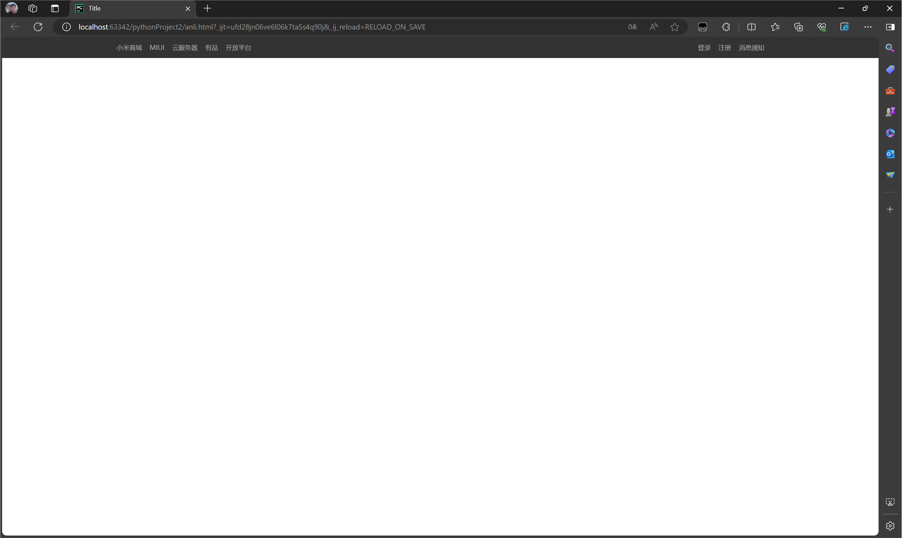
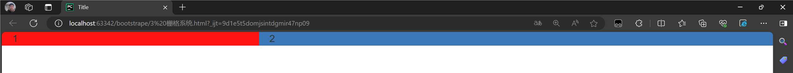

# web

## HTML

### 标题标签

```html
<!DOCTYPE html>
<html lang="en">
<head>
    <meta charset="UTF-8">
    <title>视听云上猪</title>
</head>
<body>
    <h1>1级标题</h1>
    <h2>2级标题</h2>
    <h3>3级标题</h3>
    <h4>4级标题</h4>
    <h5>5级标题</h5>
    <h6>6级标题</h6>
</body>
</html>
```

### div和span

```html
<div>挖掘机</div>
<span>挖掘机</span>

div 一人占一整行 【块级标签】
span 自己多大占多少 【行内标签，内敛标签】
```

### a标签跳转

```html
<a href="http://www.baidu.com">点击跳转</a>  跳转到其他网站

<a href="http://127.0.0.1:8001/login">点击跳转</a>  跳转到自己的网站、
<a href="/login">点击跳转</a>
```

### 图片展示

```html
自闭和标签

   直接用别人图片的链接

显示自己的图片（static）目录 ， 显示的图片要放在static目录

 设置图片宽度和高度
```

### 嵌套

```html
<div>
    <a></a>
    <span></span>
</div>
点击图片跳转
<a href="/login">
    
</a>
重新生成一个页面跳转
<a href="/login" target="_blank">
    
</a>
```

### 列表标签

```html
无序列表
<ul>
    <li>中国移动</li>
    <li>中国电信</li>
</ul>
```

```html
有序列表 1 2 3
<ol>
    <li></li>
    <li></li>
</ol>
```

### 表格标签

```html
<table>
    <thead>
        <tr> <th>ID</th> <th>姓名</th> <th>年龄</th> </tr>  表头
    </thead>
    <tbody>
        <tr> <td>10</td> <td>王钰滔</td> <td>19</td> </tr>  表内容
    </tbody>
</table>
```

### input系列

```html
<input tyle="text" />
<input tyle="password" />
<input type="file" /> 选择文件的框体

<input type="radio" name="n1">男
<input type="radio" name="n1">女  单选框

<input type="checkbox">复选框

    <input type="button" value="登录" />  普通的按钮
    <input type="submit" value="提交" />  提交表单 -->form
```

### 下拉框标签

```html
单选下拉框
<select>
    <option>北京</option>
    <option>上海</option>
</select>

多选下拉框
<select multiple>
    <option>北京</option>
    <option>上海</option>
    <option>深圳</option>
</select>    
```

### 多行文本

```html
<textarea></textarea>
```

### Form表单

```html
<form method="post" action="提交的地址">   
    <div>
        用户名：<input type="text" />

    </div>
    <div>
        密码：<input type="password" />
    </div>
    <div>
        <input type="submit" value="submit提交" />
    </div>
</form>
method 提交的方式 action 提交的地址  必须被form标签包裹才能进行提交 内置必须有submit进行提交
在form内的一些标签 input select textarea
一定要有name属性  
```

HTML标签（有自己默认的格式 通过一些手段 可以自己修改）

HTML标签与编程语言无关 java+web python+web

## CSS样式

专门用来美化css标签的

```html
 
<div style="color:red">china</div>     简单的css样式
```

### css应用

#### 1 在标签上

```html
 
<div style="color:red">china</div> 
```

#### 2 在head标签中写style标签

```html
<!DOCTYPE html>
<html lang="en">
<head>
    <meta charset="UTF-8">
    <title>Title</title>
    <style>
        .c1{
            color:red;
        }
    </style>
</head>
<body>
    <h1 class="c1">用户列表</h1>
    <table border="1">
        <thead>
            <tr>
                <th>ID</th>
                <th>用户名</th>
                <th>年龄</th>
                <th>操作</th>
            </tr>
        </thead>
        <tbody>
            
                <tr>
                    <td>{{ key }}</td>
                    <td>{{ value.name }}</td>
                    <td>{{ value.age }}</td>
                    <td>
                        <a href="/edit?nid={{ key }}">编辑</a>
                        <a href="/delete/{{ key }}">删除</a>
                    </td>
                </tr>
            
        </tbody>
    </table>
</body>
</html>
```

#### 3 写到文件中

```html
.c1{

}
.c2{

}
```

```html
<!DOCTYPE html>
<html lang="en">
<head>
    <meta charset="UTF-8">
    <title>Title</title>
    <link rel="stylesheet" href="common.css" />
</head>
<body>
    <h1 calss="c1">登录</h1>
    <form method="post">
        <input type="text" name="user">
        <input type="text" name="pwd">
        <input type="submit" value="提交"><span style="color:red">{{ error }}</span>
    </form>
</body>
</html>
```

```html
<style>
    #c1{
        color: red;         找到id的标签
    }
    .c2{
        height: 30px;       找到class标签（最多）
        width: 200px;       
    }
    li{
        color: pink;        渲染所有的li标签
    }
</style>

<div class="c2">中国</div>
<div id="c1">广西</div>
<div>联通</div>
<ul>
    <li>a</li>
    <li>b</li>
    <li>c</li>
</ul>
```

#### 4 属性选择器

```html
<style>
    input[type="text"]{
        border:2px solid red;
    }
</style>
找到所有type="text"的进行装饰

<style>
    .v1[xx="abc"]{
        color: gold;
    }
</style>
找到所有class="v1" xx="abc"的进行装饰
<li class="v1" xx="abc">a</li>
```

#### 5 后代选择器

```html
<style>
    .v1[xx="abc"]{
        color: gold;
    }
</style>
<ul class="yy">
    <li class="v1" xx="abc">a</li>
    <li>b</li>
    <li>c</li>
</ul>
```

#### 6 覆盖

```html
<!DOCTYPE html>
<html lang="en">
<head>
    <meta charset="UTF-8">
    <title>Title</title>
    <style>
        .c1{
            color: gold;
            border: 2px solid gold;
        }
        .c2{
            color: aqua;
            border: 2px solid red;
        }
    </style>
</head>
<body>
    <div>
        <span class="c1 c2">china</span>
    </div>
</body>
</html>
c2 覆盖 c1

<!DOCTYPE html>
<html lang="en">
<head>
    <meta charset="UTF-8">
    <title>Title</title>
    <style>
        .c1{
            color: gold !important;
            border: 2px solid gold;
        }
        .c2{
            color: aqua;
            border: 2px solid red;
        }
    </style>
</head>
<body>
    <div>
        <span class="c1 c2">china</span>
    </div>
</body>
</html>
添加!important 表示很重要 不会被覆盖
```

### 具体样式

#### 1 高度和宽度

```css
.c3{
    height: 300px;
    width: 500px;
}
```

```css
.c3{
    width: 50%; 宽度支持百分比   高度不支持
}
```

高度宽度 对于行内标签不生效   对块级标签生效   右侧空白 霸道 自己不用也不给你用

#### 2 块级和行内标签

```css
css样式 ：标签-> display:inline-block  具有块级标签和行内标签的特性
.c4{
    display: inline-block;
    height: 100px;
}
```

```html
<div style="display: inline">china</div>  让块级标签编程行内标签
<span style="display: block">联通</span>   让行内标签编程块级标签
```

#### 3 字体大小和颜色

```css
.c5{
    color: darkgoldenrod;    		字体颜色
    font-size: 58px;        		字体大小
    font-weight: bolder;     		字体加粗
    font-family: Microsoft Yahei;   字体样式
}
```

#### 4 文字对齐方式

```css
.c5{
    height: 100px;
    color: darkgoldenrod;
    font-size: 58px;
    font-weight: bolder;
    text-align: center; /* 水平方向居中 */
    line-height: 100px; /* 垂直方向居中 */
}
```

#### 5 浮动样式 

```html
<span>left</span>
<span style="float: right">right</span>  放到最右边

块级标签浮动起来 没那么霸道
<!DOCTYPE html>
<html lang="en">
<head>
    <meta charset="UTF-8">
    <title>Title</title>
    <style>
        .item{
            float:left;
            width: 288px;
            height: 170px;
            border: 2px solid gold;
        }
    </style>
</head>
<body>
    <div>
        <div class="item">item</div>
        <div class="item">item</div>
        <div class="item">item</div>
        <div class="item">item</div>
    </div>
</body>
</html>
```

让块级标签浮动起来 会脱离文档流

```html
<!DOCTYPE html>
<html lang="en">
<head>
    <meta charset="UTF-8">
    <title>Title</title>
    <style>
        .item{
            float:left;
            width: 288px;
            height: 170px;
            border: 2px solid gold;
        }
    </style>
</head>
<body>
    <div style="background-color: red">
        <div class="item">item</div>
        <div class="item">item</div>
        <div class="item">item</div>
        <div class="item">item</div>
        <div style="clear: both"></div>   		添加这个拽回来 让父类div撑起来
    </div>
</body>
</html>
```

#### 6 边距

内边距，我自己内部设置的距离

```css
<style>
    .outer{
        width: 288px;
        height: 170px;
        border: 2px solid gold;
        padding-top: 20px;      内边距
        padding-left: 20px;
        padding-right: 20px;
        padding: 20px;   上下左右都距离20px
        padding: 20px 10px 20px 10px;  上 右 下 左
    }
</style>
```

外边距

```html
<div style="height: 200px;background-color: red"></div>
<div style="height: 100px;background-color: dodgerblue;margin-top: 20px"></div>  
margin-top 外边距距离顶部  其余的同上内边距
```

#### 案例-1：小米商城头部复刻

```html
<!DOCTYPE html>
<html lang="en">
<head>
    <meta charset="UTF-8">
    <title>Title</title>
    <style>
        .container{
            width: 1226px;
            margin:0 auto;
        }
        body{
            margin: 0;
        }
        .header{
            background-color: #333;
        }
        .header .menu{
            float:left;
            color: white;
        }
        .header .account {
            float: right;
            color: white;
        }
        .header .menu a{
            color: #b0b0b0;
            line-height: 40px;
            display: inline-block;
            font-size: 12px;
            margin-right: 10px;
        }
        .header .account a{
            color: #b0b0b0;
            line-height: 40px;
            display: inline-block;
            font-size: 12px;
            margin-left: 10px;
        }
    </style>
</head>
<body>
    <div class="header">
        <div class="container">
            <div class="menu">
                <a>小米商城</a>
                <a>MIUI</a>
                <a>云服务器</a>
                <a>有品</a>
                <a>开放平台</a>
            </div>
            <div class="account">
                <a>登录</a>
                <a>注册</a>
                <a>消息通知</a>
            </div>
            <div style="clear: both"></div>
        </div>
    </div>
</body>
</html>
```



#### 总结-1

页面消除距离

```      css
body标签，默认有一个边距，造成页面四方都有白色的间距，使用margin:0消除间距
body{
	margin:0
}
```

文本居中

```html
文本内容居中
<div style:"text-align: center;">王钰滔</div>
```

区域居中

```css
自己要有宽度+margin-left:auto;margin-right:auto
.container{
    width: 1226px;
    margin:0 auto;
}
```

父亲没有高度或者宽度会被自己的子标签撑起来

如果存在float一定要加入

```html
<div style="clear: both"></div>
```

想要用别人的样式  使用浏览器查看页面源代码

#### CSS案例

取消链接的下划线，鼠标触及的时候会变色

```css
.sub-header .menu-list a{
    text-decoration: none;
}
.sub-header .menu-list a:hover{
    color: coral;                     选择触及时候的颜色
}
```

案例

```html
<!DOCTYPE html>
<html lang="en">
<head>
    <meta charset="UTF-8">
    <title>Title</title>
    <style>
        .container{
            width: 1228px;
            margin:0 auto;
        }
        body{
            margin: 0;
        }
        .header{
            background-color: #333;
        }
        .header .menu{
            float:left;
            color: white;
        }
        .header .account {
            float: right;
            color: white;
        }
        .header .menu a{
            color: #b0b0b0;
            line-height: 40px;
            display: inline-block;
            font-size: 12px;
            margin-right: 10px;
        }
        .header .menu a:hover{
            color: white;
        }
        .header .account a{
            color: #b0b0b0;
            line-height: 40px;
            display: inline-block;
            font-size: 12px;
            margin-left: 10px;
        }
        .header .account a:hover{
            color: white;
        }
        .sub-header{
            height: 100px;
        }
        .sub-header .logo{
                float: left;
                width: 234px;
                height: 100px;
        }
        .sub-header .menu-list{
            float: left;
            height: 100px;
            line-height: 100px;
        }
        .sub-header .search{
            float: right;
            height: 100px;
        }
        .sub-header .logo a{
            margin-top: 22px;
            display: inline-block;
        }
        .sub-header .menu-list a{
            color: black;
            line-height: 40px;
            display: inline-block;
            font-size: 16px;
            padding: 0 10px 0 10px;
            text-decoration: none;
        }
        .sub-header .menu-list a:hover{
            color: coral;
        }
    </style>
</head>
<body>
    <div class="header">
        <div class="container">
            <div class="menu">
                <a>小米商城</a>
                <a>MIUI</a>
                <a>云服务器</a>
                <a>有品</a>
                <a>开放平台</a>
            </div>
            <div class="account">
                <a>登录</a>
                <a>注册</a>
                <a>消息通知</a>
            </div>
            <div style="clear: both"></div>
        </div>
    </div>
    <div class="sub-header">
        <div class="container">
            <div class="logo">
                <a href="https://www.mi.com/" >
                    
                </a>
            </div>
            <div class="menu-list">
                <a href="https://www.mi.com/xiaomimixfold2">小米手机</a>
                <a href="https://www.mi.com/shop/buy/detail?product_id=19752">红米</a>
                <a href="https://www.mi.com/xiaomi-tvs/s-pro-85">电视</a>
                <a href="https://www.mi.com/shop/buy/detail?product_id=16620&selected=16620&pClass=p">平板</a>
                <a href="https://www.mi.com/shop/buy/detail?product_id=16523&selected=16523&pClass=p">笔记本</a>
            </div>
            <div class="search">2</div>
            <div style="clear: both"></div>
        </div>
    </div>
</body>
</html>
```

#### 总结-2

```html
a标签是行内标签 行内标签高度 宽度 默认无效
垂直标签居中
	文本 +line-height
	图片 +边距
去下划线
鼠标放上去变色
```

#### 7 字体透明度设置

```css
.news .channel .items a{
    color: white;
    text-decoration: none;
    font-size: 12px;
    display: inline-block;
    padding-top: 18px;
    opacity: 0.7;
}
```

#### 案例-2 ：中间复刻

```html
<!DOCTYPE html>
<html lang="en">
<head>
    <meta charset="UTF-8">
    <title>Title</title>
    <style>
        .container{
            width: 1228px;
            margin:0 auto;
        }
        body{
            margin: 0;
        }
        .header{
            background-color: #333;
        }
        .header .menu{
            float:left;
            color: white;
        }
        .header .account {
            float: right;
            color: white;
        }
        .header .menu a{
            color: #b0b0b0;
            line-height: 40px;
            display: inline-block;
            font-size: 12px;
            margin-right: 10px;
        }
        .header .menu a:hover{
            color: white;
        }
        .header .account a{
            color: #b0b0b0;
            line-height: 40px;
            display: inline-block;
            font-size: 12px;
            margin-left: 10px;
        }
        .header .account a:hover{
            color: white;
        }
        .sub-header{
            height: 100px;
        }
        .sub-header .logo{
                float: left;
                width: 234px;
                height: 100px;
        }
        .sub-header .menu-list{
            float: left;
            height: 100px;
            line-height: 100px;
        }
        .sub-header .search{
            float: right;
            height: 100px;
        }
        .sub-header .logo a{
            margin-top: 22px;
            display: inline-block;
        }
        .sub-header .menu-list a{
            color: black;
            line-height: 40px;
            display: inline-block;
            font-size: 16px;
            padding: 0 10px 0 10px;
            text-decoration: none;
        }
        .sub-header .menu-list a:hover{
            color: coral;
        }
        .slider .sd-img{
            width: 1226px;
            height: 460px;
            display: block;
        }
        .news .channel{
            float: left;
            width: 228px;
            height: 172px;
            background-color: #333333;
            margin-top: 14px;
            padding: 3px;
        }
        .news .list-item{
                margin-top: 14px;
                float: left;
                height: 178px;
                width: 316px;
        }
        .news .list-item img{
            height: 100%;
            width: 100%;
        }
        .news .channel .items{
            float: left;
            height: 86px;
            width: 76px;
            text-align: center;
        }
        .news .channel .items a{
            color: white;
            text-decoration: none;
            font-size: 12px;
            display: inline-block;
            padding-top: 18px;
            opacity: 0.7;
        }
        .news .channel .items a:hover{
            color: black;
        }
        .news .channel img{
            width: 24px;
            height: 24px;
            display: block;
            margin: 0 auto;
        }
    </style>
</head>
<body>
    <div class="header">
        <div class="container">
            <div class="menu">
                <a>小米商城</a>
                <a>MIUI</a>
                <a>云服务器</a>
                <a>有品</a>
                <a>开放平台</a>
            </div>
            <div class="account">
                <a>登录</a>
                <a>注册</a>
                <a>消息通知</a>
            </div>
            <div style="clear: both"></div>
        </div>
    </div>
    <div class="sub-header">
        <div class="container">
            <div class="logo">
                <a href="https://www.mi.com/" >
                    
                </a>
            </div>
            <div class="menu-list">
                <a href="https://www.mi.com/xiaomimixfold2">小米手机</a>
                <a href="https://www.mi.com/shop/buy/detail?product_id=19752">红米</a>
                <a href="https://www.mi.com/xiaomi-tvs/s-pro-85">电视</a>
                <a href="https://www.mi.com/shop/buy/detail?product_id=16620&selected=16620&pClass=p">平板</a>
                <a href="https://www.mi.com/shop/buy/detail?product_id=16523&selected=16523&pClass=p">笔记本</a>
            </div>
            <div class="search">2
            </div>
            <div style="clear: both"></div>
        </div>
    </div>
    <div class="slider">
        <div class="container">
            <div class="sd-img">
                
            </div>
        </div>
    </div>
    <div class="news">
        <div class="container">
            <div class="channel">
                <div class="items">
                    <a href="https://www.mi.com/seckill">
                        
                        <span >小米秒杀</span>
                    </a>
                </div>
                <div class="items">
                    <a href="https://qiye.mi.com/">
                        
                        <span >企业团购</span>
                    </a>
                </div>
                <div class="items">
                    <a href="https://www.mi.com/mimobile">
                        
                        <span >米粉卡</span>
                    </a>
                </div>
                <div class="items">
                    <a href="https://www.mi.com/a/h/16769.html">
                        
                        <span >以旧换新</span>
                    </a>
                </div>
                <div class="items">
                    <a href="https://www.mi.com/seckill">
                        
                        <span >话费充值</span>
                    </a>
                </div>
                <div class="items">
                    <a href="https://www.mi.com/shop/order/fcode">
                        
                        <span >F码通道</span>
                    </a>
                </div>
                <div style="clear: both"></div>
            </div>

            <div class="list-item" style="margin-left: 14.666px">
                
            </div>
            <div class="list-item" style="margin-left: 14.666px">
                
            </div>
            <div class="list-item" style="margin-left: 14.666px">
                
            </div>

        </div>
    </div>
</body>
</html>
```

#### 8 hover

```html
<!DOCTYPE html>
<html lang="en">
<head>
    <meta charset="UTF-8">
    <title>Title</title>
    <style>
        .download{
            display: none;
        }
        .app:hover .download{
            display: block;
        }
    </style>
</head>
<body>
    <div class="app">
        <div >点我下载</div>
        <div class="download">
            
        </div>
    </div>
</body>
</html>
```

#### 9 after:内容追加

```html
<!DOCTYPE html>
<html lang="en">
<head>
    <meta charset="UTF-8">
    <title>Title</title>
    <style>
        .c1:after{
            content: "大帅哥";
        }
        .items{
            float: left;
        }
        .c2{
            content: "";
            display: block;      清楚浮动
            clear: both;
        }
    </style>
</head>
<body>
    <div class="c1">王钰滔</div>
    <div class="c1">王秋童</div>
    <div class="c2">
        <div class="items">你好</div>
        <div class="items">你好</div>
        <div class="items">你好</div>
        <div class="items">你好</div>
    </div>
</body>
</html>
```

#### 10 position

```css
1 fixed
固定在窗口的某个位置
案例：返回顶部
.back{
    position: fixed;
    width: 60px;
    height: 60px;
    border: 1px solid red;
    right:10px;
    bottom:50px;
}
```

##### 返回顶部

##### 弹出对话框

```html
<!DOCTYPE html>
<html lang="en">
<head>
    <meta charset="UTF-8">
    <title>Title</title>
    <style>
        body{
            margin:0;
        }
        .dialog{
            position: fixed;
            height: 300px;
            width: 500px;
            background-color: white;
            left: 0;
            right: 0;
            margin: 0 auto;
            top: 200px;
            z-index: 1000;
        }
        .mask{
            background-color: black;
            left: 0;
            position: fixed;
            right: 0;
            top: 0;
            opacity: 0.7;
            bottom: 0;
            z-index: 999;
        }
    </style>
</head>
<body>


<div style="height: 2000px;">nihaodoquwoq</div>
<div class="mask"></div>
<div class="dialog"></div>

</body>
</html>
```

#### 11 relative和absolute

```html
<!DOCTYPE html>
<html lang="en">
<head>
    <meta charset="UTF-8">
    <title>Title</title>
  <style>
    .c1{
      height: 300px;
      width: 500px;
      border: 1px solid red;
      margin: 100px;
      position: relative;
    }
    .c1 .c2{
        height: 59px;
        width: 59px;
        background-color: chartreuse;
        position: absolute;
        right: 0;
        top: 0;
    }
  </style>
</head>
<body>
    <div class="c1">
      <div class="c2"></div>
      <div class="c2"></div>
      <div class="c2"></div>
      <div class="c2"></div>
    </div>
</body>
</html>
```

案例 ： 下载APP

```html
<!DOCTYPE html>
<html lang="en">
<head>
    <meta charset="UTF-8">
    <title>Title</title>
    <style>
        .container{
            width: 1228px;
            margin:0 auto;
        }
        body{
            margin: 0;
        }
        .header{
            background-color: #333;
        }
        .header .menu{
            float:left;
            color: white;
        }
        .header .account {
            float: right;
            color: white;
        }
        .header .menu a{
            color: #b0b0b0;
            line-height: 40px;
            display: inline-block;
            font-size: 12px;
            margin-right: 10px;
        }
        .header .menu a:hover{
            color: white;
        }
        .header .account a{
            color: #b0b0b0;
            line-height: 40px;
            display: inline-block;
            font-size: 12px;
            margin-left: 10px;
        }
        .header .account a:hover{
            color: white;
        }
        .app{
            position: relative
        }
        .app .download{
            position: absolute;
            height: 100px;
            width: 100px;
            display: none;
        }
        .app:hover .download{
            display: block;
        }
    </style>
</head>
<body>
    <div class="header">
        <div class="container">
            <div class="menu">
                <a>小米商城</a>
                <a>MIUI</a>
                <a>云服务器</a>
                <a>云服务器</a>
                <a>云服务器</a>
                <a class="app">下载APP
                    <div class="download">
                        
                    </div>
                </a>
                <a>有品</a>
                <a>开放平台</a>
            </div>
            <div class="account">
                <a>登录</a>
                <a>注册</a>
                <a>消息通知</a>
            </div>
            <div style="clear: both"></div>
        </div>
    </div>
</body>
</html>
```

#### 12 border

```css
边框
border 3px solid (颜色：可以是英文名字 也可以是rgb颜色)

只想左边边框
border-left 

透明色
<!DOCTYPE html>
<html lang="en">
<head>
    <meta charset="UTF-8">
    <title>Title</title>
    <style>
        .c1{
            height: 300px;
            width:500px;
            margin: 100px;
            border-left: 2px solid transparent ;   透明色
        }
        .c1:hover{
            border-left: 2px solid red ;
        }
    </style>
</head>
<body>
    <div class="c1">菜单</div>
</body>
</html>
```

#### 背景色

```html
background-color
```

### 总结

```css
至此css知识全部讲完
模版：{
    模版基本使用逻辑
    模版+自己的css知识点（开发页面）
}
```

## Bootstrap

是别人已经写好的css样式，我们如果想用需要下载

### 1 按钮

```html
<input type="button" value="提交" />
<input type="button" class="btn btn-primary btn-xs btn-edit" value="编辑">
<input type="button" value="提交" class="btn btn-primary btn-xs btn-edit" />
<input type="button" value="提交" class="btn btn-success" />
<input type="button" value="提交" class="btn btn-danger" />
<input type="button" value="提交" class="btn btn-danger btn-xs" />
```

### 2 菜单栏

```html
<!DOCTYPE html>
<html lang="en">
<head>
    <meta charset="UTF-8">
    <title>Title</title>
    <link rel="stylesheet" href="static/plugins/bootstrap-3.4.1/css/bootstrap.css">
    <style>
      .navbar{
        border-radius: 0;
      }
    </style>
</head>
<body>
<nav class="navbar navbar-default">
  <div class="container-fluid">
    <!-- Brand and toggle get grouped for better mobile display -->
    <div class="navbar-header">
      <button type="button" class="navbar-toggle collapsed" data-toggle="collapse" data-target="#bs-example-navbar-collapse-1" aria-expanded="false">
        <span class="sr-only">Toggle navigation</span>
        <span class="icon-bar"></span>
        <span class="icon-bar"></span>
        <span class="icon-bar"></span>
      </button>
      <a class="navbar-brand" href="#">Brand</a>
    </div>

    <!-- Collect the nav links, forms, and other content for toggling -->
    <div class="collapse navbar-collapse" id="bs-example-navbar-collapse-1">
      <ul class="nav navbar-nav">
        <li class="active"><a href="#">Link <span class="sr-only">(current)</span></a></li>
        <li><a href="#">Link</a></li>
        <li class="dropdown">
          <a href="#" class="dropdown-toggle" data-toggle="dropdown" role="button" aria-haspopup="true" aria-expanded="false">Dropdown <span class="caret"></span></a>
          <ul class="dropdown-menu">
            <li><a href="#">Action</a></li>
            <li><a href="#">Another action</a></li>
            <li><a href="#">Something else here</a></li>
            <li><a href="#">Separated link</a></li>
            <li><a href="#">One more separated link</a></li>
          </ul>
        </li>
      </ul>
      <form class="navbar-form navbar-left">
        <div class="form-group">
          <input type="text" class="form-control" placeholder="Search">
        </div>
        <button type="submit" class="btn btn-default">Submit</button>
      </form>
      <ul class="nav navbar-nav navbar-right">
        <li><a href="#">Link</a></li>
        <li class="dropdown">
          <a href="#" class="dropdown-toggle" data-toggle="dropdown" role="button" aria-haspopup="true" aria-expanded="false">Dropdown <span class="caret"></span></a>
          <ul class="dropdown-menu">
            <li><a href="#">Action</a></li>
            <li><a href="#">Another action</a></li>
            <li><a href="#">Something else here</a></li>
            <li role="separator" class="divider"></li>
            <li><a href="#">Separated link</a></li>
          </ul>
        </li>
      </ul>
    </div><!-- /.navbar-collapse -->
  </div><!-- /.container-fluid -->
</nav>
</body>
</html>
```

### 3 栅格系统

```html
把一行分为12格子

<!DOCTYPE html>
<html lang="en">
<head>
    <meta charset="UTF-8">
    <title>Title</title>
    <link rel="stylesheet" href="static/plugins/bootstrap-3.4.1/css/bootstrap.css">
    <style>
        .col-md-4{
            background-color: red;
        }
        .col-md-8{
            background-color: #337ab7;
        }
    </style>
</head>
<body>
    <div class="col-md-4">1</div><div class="col-md-8">2</div>
</body>
</html>
```



#### 栅格分类

响应式（会随着网页大小  屏幕大小做出相应的改变）

```html
.col-sm-	.col-md-	.col-lg-
```

非响应式

```html
.col-xs-
```

列偏移

```html
<div class="row">
  <div class="col-md-4">.col-md-4</div>
  <div class="col-md-4 col-md-offset-4">.col-md-4 .col-md-offset-4</div>
</div>
<div class="row">
  <div class="col-md-3 col-md-offset-3">.col-md-3 .col-md-offset-3</div>
  <div class="col-md-3 col-md-offset-3">.col-md-3 .col-md-offset-3</div>
</div>
<div class="row">
  <div class="col-md-6 col-md-offset-3">.col-md-6 .col-md-offset-3</div>
</div>
```

### 4 container

#### container-fluid

```html
页面两边空出来一小部分
```

#### container

```html
页面两边空出来很大一部分
```

### 5 面板

```html
<div class="panel panel-default">
  <div class="panel-body">
    Basic panel example
  </div>
</div>
```

### 案例（博客界面）

```html
<!DOCTYPE html>
<html lang="en">
<head>
    <meta charset="UTF-8">
    <title>Title</title>
    <link rel="stylesheet" href="static/plugins/bootstrap-3.4.1/css/bootstrap.css">
</head>
<body>
<div class="navbar navbar-default">
  <div class="container-fluid">
    <!-- Brand and toggle get grouped for better mobile display -->
    <div class="navbar-header">
      <button type="button" class="navbar-toggle collapsed" data-toggle="collapse" data-target="#bs-example-navbar-collapse-1" aria-expanded="false">
        <span class="sr-only">Toggle navigation</span>
        <span class="icon-bar"></span>
        <span class="icon-bar"></span>
        <span class="icon-bar"></span>
      </button>
      <a class="navbar-brand" href="#">中国联通</a>
    </div>

    <!-- Collect the nav links, forms, and other content for toggling -->
    <div class="collapse navbar-collapse" id="bs-example-navbar-collapse-1">
      <ul class="nav navbar-nav">
        <li class="active"><a href="#">广西 <span class="sr-only">(current)</span></a></li>
        <li><a href="#">上海</a></li>
        <li class="dropdown">
          <a href="#" class="dropdown-toggle" data-toggle="dropdown" role="button" aria-haspopup="true" aria-expanded="false">河南 <span class="caret"></span></a>
          <ul class="dropdown-menu">
            <li><a href="#">Action</a></li>
            <li><a href="#">Another action</a></li>
            <li><a href="#">Something else here</a></li>
            <li><a href="#">Separated link</a></li>
            <li><a href="#">One more separated link</a></li>
          </ul>
        </li>
      </ul>
      <form class="navbar-form navbar-left">
        <div class="form-group">
          <input type="text" class="form-control" placeholder="Search">
        </div>
        <button type="submit" class="btn btn-default">搜索</button>
      </form>
      <ul class="nav navbar-nav navbar-right">
        <li><a href="#">登录</a></li>
        <li class="dropdown">
          <a href="#" class="dropdown-toggle" data-toggle="dropdown" role="button" aria-haspopup="true" aria-expanded="false">注册 <span class="caret"></span></a>
          <ul class="dropdown-menu">
            <li><a href="#">Action</a></li>
            <li><a href="#">Another action</a></li>
            <li><a href="#">Something else here</a></li>
            <li role="separator" class="divider"></li>
            <li><a href="#">Separated link</a></li>
          </ul>
        </li>
      </ul>
    </div><!-- /.navbar-collapse -->
  </div><!-- /.container-fluid -->
</div>

<div class="container-fluid clearfix">
  <div class="col-sm-9">
    <div class="bs-example" data-example-id="media-alignment">
    <div class="media">
      <div class="media-left">
        <a href="#">
          
        </a>
      </div>
      <div class="media-body">
        <h4 class="media-heading">Top aligned media</h4>
        <p></p>
      </div>
    </div>
    <div class="media">
      <div class="media-left media-middle">
        <a href="#">
          
        </a>
      </div>
      <div class="media-body">
        <h4 class="media-heading">Middle aligned media</h4>
        <p></p>
      </div>
    </div>
    <div class="media">
      <div class="media-left media-bottom">
        <a href="#">
          
        </a>
      </div>
      <div class="media-body">
        <h4 class="media-heading">Bottom aligned media</h4>
        <p>Cras sit amet nibh libero, in gravida nulla. Nulla vel metus scelerisque ante sollicitudin commodo. Cras purus odio, vestibulum in vulputate at, tempus viverra turpis. Fusce condimentum nunc ac nisi vulputate fringilla. Donec lacinia congue felis in faucibus.</p>
        <p>Donec sed odio dui. Nullam quis risus eget urna mollis ornare vel eu leo. Cum sociis natoque penatibus et magnis dis parturient montes, nascetur ridiculus mus.</p>
      </div>
    </div>
      <ul class="pagination">
        <li class="disabled"><a href="#" aria-label="Previous"><span aria-hidden="true">«</span></a></li>
        <li class="active"><a href="#">1 <span class="sr-only">(current)</span></a></li>
        <li><a href="#">2</a></li>
        <li><a href="#">3</a></li>
        <li><a href="#">4</a></li>
        <li><a href="#">5</a></li>
        <li><a href="#" aria-label="Next"><span aria-hidden="true">»</span></a></li>
     </ul>
  </div>
  </div>
  <div class="col-sm-3">
    <div class="panel panel-default">
      <div class="panel-heading">最新推荐</div>
      <div class="panel-body">
        Panel content
      </div>
    </div>

    <div class="panel panel-success">
      <div class="panel-heading">最新推荐</div>
      <div class="panel-body">
        Panel content
      </div>
    </div>

    <div class="panel panel-warning">
      <div class="panel-heading">最新推荐</div>
      <div class="panel-body">
        Panel content
      </div>
    </div>

  </div>
</div>
</body>
</html>
```

### 案例（登录界面）

```html
宽度+居中
内边距
表单
<!DOCTYPE html>
<html lang="en">
<head>
    <meta charset="UTF-8">
    <title>Title</title>
    <link rel="stylesheet" href="static/plugins/bootstrap-3.4.1/css/bootstrap.css">
    <style>
        .c1{
            width: 400px;
            height: 300px;
            margin-left: auto;
            margin-right: auto;
            margin-top: 200px;
            border: 1px solid #dddddd;
            border-radius: 5px;
            box-shadow: 5px 5px 20px #aaa;
            padding: 20px;
        }
        .c1 h2{
            margin-top: 20px;
            text-align: center;
            font-size: 30px;
            font-family: Microsoft YaHei UI,serif;
        }
    </style>
</head>
<body>
<div class="c1">
    <h2>登录</h2>
    <form>
        <div class="form-group">
            <label for="exampleInputEmail1">邮箱地址</label>
            <input type="email" class="form-control" id="exampleInputEmail1" placeholder="请输入邮箱地址">
        </div>
        <div class="form-group">
            <label for="exampleInputPassword1">密码</label>
            <input type="password" class="form-control" id="exampleInputPassword1" placeholder="请输入对应密码">
        </div>
        <button type="submit" class="btn btn-primary">登录</button>
    </form>
</div>
</body>
</html>

placeholder 输入提醒
value 输入行默认值
```

### 案例（后台管理）

```html
<!DOCTYPE html>
<html lang="en">
<head>
    <meta charset="UTF-8">
    <title>Title</title>
    <link rel="stylesheet" href="static/plugins/bootstrap-3.4.1/css/bootstrap.css">
</head>
<body>
<div class="navbar navbar-default">
    <div class="container">
        <!-- Brand and toggle get grouped for better mobile display -->
        <div class="navbar-header">
            <button type="button" class="navbar-toggle collapsed" data-toggle="collapse"
                    data-target="#bs-example-navbar-collapse-1" aria-expanded="false">
                <span class="sr-only">Toggle navigation</span>
                <span class="icon-bar"></span>
                <span class="icon-bar"></span>
                <span class="icon-bar"></span>
            </button>
            <a class="navbar-brand" href="#">后台管理系统</a>
        </div>

        <!-- Collect the nav links, forms, and other content for toggling -->
        <div class="collapse navbar-collapse" id="bs-example-navbar-collapse-1">
            <ul class="nav navbar-nav">
                <li class="active"><a href="#">员工列表 <span class="sr-only">(current)</span></a></li>
                <li><a href="#">管理员账号管理</a></li>
                <li class="dropdown">
                    <a href="#" class="dropdown-toggle" data-toggle="dropdown" role="button" aria-haspopup="true"
                       aria-expanded="false">功能选择 <span class="caret"></span></a>
                    <ul class="dropdown-menu">
                        <li><a href="#">Action</a></li>
                        <li><a href="#">Another action</a></li>
                        <li><a href="#">Something else here</a></li>
                        <li><a href="#">Separated link</a></li>
                        <li><a href="#">One more separated link</a></li>
                    </ul>
                </li>
            </ul>
            <form class="navbar-form navbar-left">
                <div class="form-group">
                    <input type="text" class="form-control" placeholder="Search">
                </div>
                <button type="submit" class="btn btn-default">搜索</button>
            </form>
            <ul class="nav navbar-nav navbar-right">
                <li><a href="#">wangyutao</a></li>
                <li class="dropdown">
                    <a href="#" class="dropdown-toggle" data-toggle="dropdown" role="button" aria-haspopup="true"
                       aria-expanded="false">设置 <span class="caret"></span></a>
                    <ul class="dropdown-menu">
                        <li><a href="#">Action</a></li>
                        <li><a href="#">Another action</a></li>
                        <li><a href="#">Something else here</a></li>
                        <li role="separator" class="divider"></li>
                        <li><a href="#">Separated link</a></li>
                    </ul>
                </li>
            </ul>
        </div><!-- /.navbar-collapse -->
    </div><!-- /.container-fluid -->
</div>
<div class="container">
    <div class="panel panel-success">
        <div class="panel-heading">添加数据</div>
        <div class="panel-body">
            <form class="form-inline">
                <div class="form-group">
                    <label for="exampleInputName2">姓名</label>
                    <input type="text" class="form-control" id="exampleInputName2" placeholder="姓名">
                </div>
                <div class="form-group">
                    <label for="exampleInputEmail2">年龄</label>
                    <input type="email" class="form-control" id="exampleInputEmail2" placeholder="年龄">
                </div>
                <div class="form-group">
                    <label for="exampleInputEmail2">职业</label>
                    <input type="email" class="form-control" id="exampleInputAge2" placeholder="职业">
                </div>
                <button type="submit" class="btn btn-success">保存</button>
            </form>
        </div>
    </div>
</div>
<div class="container" style="margin-top: 20px">
    <div class="panel panel-default panel-primary">
        <div class="panel-heading" >员工列表</div>
            <table class="table table-bordered">
                <thead>
                <tr>
                    <th>#</th>
                    <th>First Name</th>
                    <th>Last Name</th>
                    <th>操作</th>
                </tr>
                </thead>
                <tbody>
                <tr>
                    <th scope="row">1</th>
                    <td>Mark</td>
                    <td>Otto</td>
                    <td>
                        <a class="btn-success btn-xs btn">编辑</a>
                        <a class="btn-danger btn-xs btn">删除</a>
                    </td>
                </tr>
                <tr>
                    <th scope="row">2</th>
                    <td>Jacob</td>
                    <td>Thornton</td>
                    <td>
                        <a class="btn-success btn-xs btn">编辑</a>
                        <a class="btn-danger btn-xs btn">删除</a>
                    </td>
                </tr>
                <tr>
                    <th scope="row">3</th>
                    <td>Larry</td>
                    <td>the Bird</td>
                    <td>
                        <a class="btn-success btn-xs btn">编辑</a>
                        <a class="btn-danger btn-xs btn">删除</a>
                    </td>
                </tr>
                </tbody>
            </table>
    </div>
</div>
</body>
</html>

```

### 6 图标

```html
bootstrape提供了 但是不多
fontawesome组件
网站：https://fontawesome.dashgame.com/
```

### 7 Bootstrape依赖

下载jQuery 在页面上运用jQuery

在页面上运用BoostStrape类库

## javascript

javascript是一门编程语言。浏览器充当这门语言的解释器。

DOM和BOM

```html
相当于的这门语言内置的模块。内置函数
相当于python中的re random time json模块
```

jQuery

```html
相当于编程语言的第三方模块
例如：requests openpyxl
```

#### 初始javascript

```javascript
<script type="text/javascript">
    function myFunc() {
        alert("你好呀")                 # 弹窗
        confirm("是否要继续")           # 弹出窗口  是都继续
    }
</script>
```

#### 1 关于代码

```html
<!DOCTYPE html>
<html lang="en">
<head>
    <meta charset="UTF-8">
    <title>Title</title>
    <style>
        .menus{
            width: 200px;
            border: 3px solid red;
        }
        .menus .header{
            background-color: gold;
            padding: 20px 10px;
        }
    </style>
    
    <script type="text/javascript">
        function myFunc() {                        <--! 位置1 -->
            alert("你好呀")
            confirm("是否要继续")
        }
    </script>
    
</head>
<body>
    <div class="menus">
        <div class="header" onclick="myFunc()">大标题</div>
        <div class="items">内容</div>
    </div>

    <script type="text/javascript">
        function myFunc() {                         <--! 位置2  一般放在位置2 -->
            alert("你好呀")
            confirm("是否要继续")
        }
    </script>
    
</body>
</html>
```

##### 1.1 js存在形式

```javascript
1 存在于js文件里
2 html页面里面
3 一般放在页面最底下 
```

##### 1.2 js注释

```html
1 html的注释 <!-- 注释的内容 -->
2 css的注释 /* 注释内容 */  只能在<style></style>里面
3 js注释 //注释内容  /* 注释内容 */  只能在<stript></stript>里面
```

##### 1.3 变量、输出

```html
<!DOCTYPE html>
<html lang="en">
<head>
</head>
<body>
    <script>
		var name = "王钰滔";
        console.log(name);
    </script>
</body>
</html>
```

##### 1.4 字符串类型

```js
声明
var name = "王钰滔"
var name = String("王钰滔")
```

```javascript
常见功能
var name = "china联通"
var v1 = name.length;   获取字符串长度
var v2 = name[0];       获取字符串的第一个   name.charAt(3)
var name.trim();        去除空格
var name.substring(0,2);   前取后不取
```

##### 案例：跑马灯------函数内容/定时器函数

```html
<!DOCTYPE html>
<html lang="en">
<head>
    <meta charset="UTF-8">
    <title>ok</title>
</head>
<body>
    <span id="txt">欢迎中国联通领导来我单位指导</span>
    <script type="text/javascript">
    function show() {
        // 1 去html中找到某个标签并且获取它的内容 （DOM)
        var tag = document.getElementById("txt");
        var v1 = tag.innerText;
        console.log(v1)
        // 2 动态起来，获取第一个字符放到最后面
        var firststring = v1[0]
        var otherstring = v1.substring(1, v1.length)
        var newtxt = otherstring + firststring
        console.log(newtxt);
        // 3 在html标签更新内容
        tag.innerText = newtxt
    }
    // javascript 中的定时器  每一秒执行一次函数
    setInterval(show,1000)
    </script>
</body>
</html>
```

##### 1.5 数组

```js
//定义
var v1 = [11,22,33,44]
var v2 = Array([11,22,33,44])

//操作
v1[1]
v1[0] = "OK"

v1.push("okk")  //在尾部进行追加
vi.unshift("okk")  //在前面追加
v1.splice(索引,0,元素)  //指定位置

v1.pop()  //尾部删除
v1.shift() //头部删除
v1.splice(2,1) //把索引为2的元素删除

//循环
for(var idx in v1){
    // idx = 0/1/2/3 循环的索引
}
for(var i = 0;i < v1.length; i++){
    //第一次i = 0
}
```

```javascript
<!DOCTYPE html>
<html lang="en">
<head>
    <meta charset="UTF-8">
    <title>ok</title>
</head>
<body>
    <ul id="city">

    </ul>
    <script type="text/javascript">
        var citylist = ["北京","上海","深圳"];
        for(var idx in citylist){
            var text = citylist[idx];
            // 文本添加
            var tag = document.createElement("li");   //创建<li></li>
            tag.innerText = text;    //在li标签添加内容
            // 添加到id="city“的标签里面
            var parentTag = document.getElementById("city")
            parentTag.appendChild(tag)   //将添加好的li标签 加入到ul标签中去
        }
    </script>
</body>
</html>
```

##### 1.6 对象（字典）

```js
info = {
    "name":"王钰滔",
    "age":18
}
info = 
    name:"王钰滔",    
    age:18
}

info.age
info.name

info["age"]
info["name"]

delete info["age"]

//循环
for(var key in info){
    //key = name/age  data = info[key]
}
```

##### 案例：动态表格

```html
<!DOCTYPE html>
<html lang="en">
<head>
    <meta charset="UTF-8">
    <title>ok</title>
</head>
<body>
    <table border="2">
        <thead>
            <tr>
                <th>ID</th>
                <th>姓名</th>
                <th>年龄</th>
            </tr>
        </thead>
        <tbody id="body">
        </tbody>
    </table>
    <script type="text/javascript">
        var datalist = [{id:1,name:"王钰滔",age:19},{id:2,name:"王秋童",age:19},{id:3,name:"王钰滔",age:19},{id:4,name:"王钰滔",age:19}]
        for(var idx in datalist) {
            info = datalist[idx]
            var tr = document.createElement("tr")
            for (var key in info) {
                var text = info[key]
                var td = document.createElement("td")
                td.innerText = text
                tr.appendChild(td)
            }
            var body = document.getElementById("body")
            body.appendChild(tr)
        }
    </script>
</body>
</html>
```

##### 1.7 条件语句

```js
if (条件){
    
}else if (条件){
    
}else{
    
}
```

##### 1.8 函数

```js
function func(){
    ....
}

func() //执行函数
```

#### 2 DOM

dom就是一个模块，基于dom可以对html标签进行操作

```js
//根据id获得标签
var body = document.getElementById("xx")

//获取标签的文本
tag.innerText

//修改标签的内容
tag.innerText = "hhhhh"

//创建标签
var div = document.creatElement("div")

//标签内容
div.innerText = "哈哈哈哈"

//在内部添加标签
var newTag = document.createElement("li")
newTag.innerText = "beijing"
div.appendChild(newTag)
```

##### 2.1 事件的绑定

```html
<!DOCTYPE html>
<html lang="en">
<head>
    <meta charset="UTF-8">
    <title>Title</title>
</head>
<body>
    <input type="button" value="点击添加" onclick="cityaddinfo()">   <!-- ondbclick双击触发 -->
    <ul id="city">

    </ul>
    <script type="text/javascript">
        function cityaddinfo(){
          var li = document.createElement("li")
          li.innerText = "联通"
          var ul = document.getElementById("city")
          ul.appendChild(li)
        }
    </script>
</body>
</html>
```

```html
<!DOCTYPE html>
<html lang="en">
<head>
    <meta charset="UTF-8">
    <title>Title</title>
</head>
<body>
<input type="text" placeholder="请输入内容" id="text"/>
<input type="button" value="点击添加" onclick="cityaddinfo()">
<ul id="city">

</ul>
<script type="text/javascript">
    function cityaddinfo() {
        // 获取输入框输入的数据
        var input = document.getElementById("text")
        // 获取input框输入的内容
        var newstring = input.value
        if (newstring.length > 0){
            var li = document.createElement("li")
            li.innerText = newstring
            var ul = document.getElementById("city")
            ul.appendChild(li)
        }else{
            alert("输入不能为空")
        }
        //清空输入内容
        input.value = ""
    }
</script>
</body>
</html>
```

#### 3 jquery

##### 3.1 初始jquery

```html
<!DOCTYPE html>
<html lang="en">
<head>
    <meta charset="UTF-8">
    <title>Title</title>
</head>
<body>
    <h1 id = "txt">中国联通</h1>
    <script src="static/js/jquery-3.6.0.min.js"></script>
    <script type="text/javascript">
        //利用jquery的功能实现某些效果
        // 1 找到id= txt的标签
        $("#txt").text("河南")
        // 2 内容修改
    </script>
</body>
</html>
```

##### 3.2 寻找标签(直接寻找)

1 根据id

```js
$("#txt")
```

2 根据样式

```javascript
<h1 class= "c1"></h1>
$(".c1")
```

3 标签选择器

```js
$("div")
```

4 层级选择器

```js
$(".c1 .c2 a")
```

5 多个选择器

```js
$("#c3,#c2,li")
```

6 属性选择器

```html
<input type="text" name ="n1">
$("input[name='n1']")
```

##### 3.3 间接寻找

找到兄弟，父亲

```html
<div>
    <div>北京</div>
    <div id="c1">上海</div>
    <div>深圳</div>
</div>
```

```js
$("#c1").prev()  //上一个
$("#c1").next()  //下一个
$("#c1").siblings  //所有的兄弟标签
$("#c1").parent()  //父亲标签
$("#c1").parent().parent()  //父亲的父亲

$("#c1").parent()            // 父亲
$("#c1").parent().parent()   // 父亲、父亲

$("#c1").children()                // 所有的儿子
$("#c1").children(".p10")          // 所有的儿子中寻找class=p10

$("#c1").find(".p10")              // 去所有子孙中寻找class=p10
$("#c1").find("div")              // 去所有子孙中寻找class=p10
```

##### 案例：菜单

```html
<!DOCTYPE html>
<html lang="en">
<head>
    <meta charset="UTF-8">
    <title>Title</title>
    <style>
        .menus{
            width: 200px;
            height: 800px;
            border: 1px solid palevioletred;
        }
        .menus .header{
            background-color: gold;
            padding: 10px 5px;
            cursor: pointer;
        }
        .menus .content a{
            display: block;
            padding: 5px 5px;
            border-bottom: 1px dotted #dddddd;
        }
        .hide{
            display: none;
        }
    </style>
</head>
<body>
    <div class="menus">
        <div class="item">
            <div class="header" onclick="clickme(this)">北京</div>
            <div class="content hide">
                <a>海淀区</a>
                <a>朝阳区</a>
                <a>大兴区</a>
                <a>昌平区</a>
            </div>
        </div>
        <div class="item">
            <div class="header" onclick="clickme(this)">上海</div>
            <div class="content hide">
                <a>宝山区</a>
                <a>青浦区</a>
                <a>浦东新区</a>
                <a>OK区</a>
            </div>
        </div>
    </div>
    <script src="static/js/jquery-3.6.0.min.js"></script>
    <script>
        function clickme(self){
            if($(self).next().hasClass("hide")){
                $(self).next().removeClass("hide")
            }else{
                $(self).next().addClass("hide")
            }
        }
    </script>
</body>
</html>
```

```html
<!DOCTYPE html>
<html lang="en">
<head>
    <meta charset="UTF-8">
    <title>Title</title>
    <style>
        .menus{
            width: 200px;
            height: 800px;
            border: 1px solid palevioletred;
        }
        .menus .header{
            background-color: gold;
            padding: 10px 5px;
            cursor: pointer;
        }
        .menus .content a{
            display: block;
            padding: 5px 5px;
            border-bottom: 1px dotted #dddddd;
        }
        .hide{
            display: none;
        }
    </style>
</head>
<body>
    <div class="menus">
        <div class="item">
            <div class="header" onclick="clickme(this)">北京</div>
            <div class="content hide">
                <a>海淀区</a>
                <a>朝阳区</a>
                <a>大兴区</a>
                <a>昌平区</a>
            </div>
        </div>
        <div class="item">
            <div class="header" onclick="clickme(this)">北京2</div>
            <div class="content hide">
                <a>海淀区</a>
                <a>朝阳区</a>
                <a>大兴区</a>
                <a>昌平区</a>
            </div>
        </div>
        <div class="item">
            <div class="header" onclick="clickme(this)">上海</div>
            <div class="content hide">
                <a>宝山区</a>
                <a>青浦区</a>
                <a>浦东新区</a>
                <a>OK区</a>
            </div>
        </div>
        <div class="item">
            <div class="header" onclick="clickme(this)">上海2</div>
            <div class="content hide">
                <a>宝山区</a>
                <a>青浦区</a>
                <a>浦东新区</a>
                <a>OK区</a>
            </div>
        </div>
    </div>
    <script src="static/js/jquery-3.6.0.min.js"></script>
    <script>
        function clickme(self) {
            $(self).next().removeClass("hide")
            $(self).parent().siblings().find(".content").addClass("hide")
        }
    </script>
</body>
</html>
```

##### 3.4 操作样式

```js
addClass
removeClass
hasClass
```

##### 3.5 值的操作

```html
<div id="c1">内容</div>
```

```js
$("#c1").text()
$("#c1").text("设置文本内容")
```

```html
<input type="text" id="c2">
```

```js
$("#c2").val()
$("#c2").val("设置值")
```

##### 案例：动态创建数据

```html
<!DOCTYPE html>
<html lang="en">
<head>
    <meta charset="UTF-8">
    <title>Title</title>
</head>
<body>
    <input type="text" id="txtuser" placeholder="用户名" />
    <input type="text" id="txtemail" placeholder="邮箱" />
    <input type="button" value="提交" onclick="getinfo()">

    <ul id="view">
    </ul>
    <script src="static/js/jquery-3.6.0.min.js"></script>
    <script>
        function getinfo(){
            // 获取用户输入的账号密码
            var user = $("#txtuser").val();
            var email = $("#txtemail").val();

            // 创建li标签 在li内部写入
            var newli = $("<li>").text(user);
            var newli2 = $("<li>").text(email);

            $("#view").append(newli,newli2);
        }
    </script>
</body>
</html>
```

##### 3.6 事件

```html
<ul>
    <li>百度</li>
    <li>谷歌</li>
    <li>搜狗</li>
</ul>

<script>
    $("li").click(function)(){
        //点击li标签，自动执行这个函数
        //$(this) 当前点击的是哪个标签
    })
</script>

<!DOCTYPE html>
<html lang="en">
<head>
    <meta charset="UTF-8">
    <title>Title</title>
</head>
<body>
    <ul>
        <li>百度</li>
        <li>百度</li>
        <li>百度</li>
    </ul>
    <script src="static/js/jquery-3.6.0.min.js"></script>
    <script>
        $("li").click(function (){
            var text = $(this).text()
            console.log(text)
        })
    </script>
</body>
</html>
```

可以删除某个标签

```html
<!DOCTYPE html>
<html lang="en">
<head>
    <meta charset="UTF-8">
    <title>Title</title>
</head>
<body>
<ul>
    <li>百度</li>
    <li>谷歌</li>
    <li>搜狗</li>
</ul>
<script src="static/js/jquery-3.6.0.min.js"></script>
<script>
    $(function () {
        //当页面框架加载完成之后 自动执行
        $("li").click(function () {
            $(this).remove()
        })
    })
</script>
</body>
</html>
```

##### 3.7 表格操作

```html
<!DOCTYPE html>
<html lang="en">
<head>
    <meta charset="UTF-8">
    <title>Title</title>
</head>
<body>
<table border="2">
    <thead>
    <tr>
        <th>ID</th>
        <th>姓名</th>
        <th>操作</th>
    </tr>
    </thead>
    <tbody>
    <tr>
        <td>1</td>
        <td>吴佩琪</td>
        <td>
            <input type="button" value="删除" class="delete">
        </td>
    </tr>
    <tr>
        <td>2</td>
        <td>吴佩琪</td>
        <td>
            <input type="button" value="删除" class="delete">
        </td>
    </tr>
    <tr>
        <td>3</td>
        <td>吴佩琪</td>
        <td>
            <input type="button" value="删除" class="delete">
        </td>
    </tr>
    <tr>
        <td>4</td>
        <td>吴佩琪</td>
        <td>
            <input type="button" value="删除" class="delete">
        </td>
    </tr>
    </tbody>
    <script src="static/js/jquery-3.6.0.min.js"></script>
    <script>
        $(function (){
            $(".delete").click(function (){
                $(this).parent().parent().remove()
            })
        })
    </script>
</table>
</body>
</html>
```

## 前段整合

1  html

2 css

3 javascript jquery

4 bootstrap

5 对于时间的选择可以用插件（bootstrap-datepicker)
