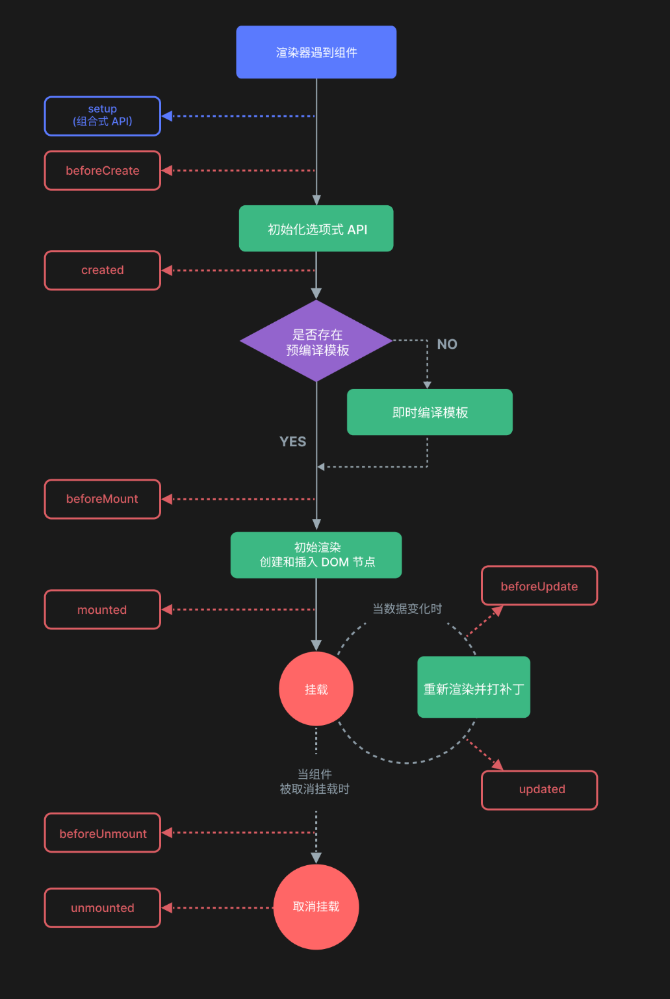
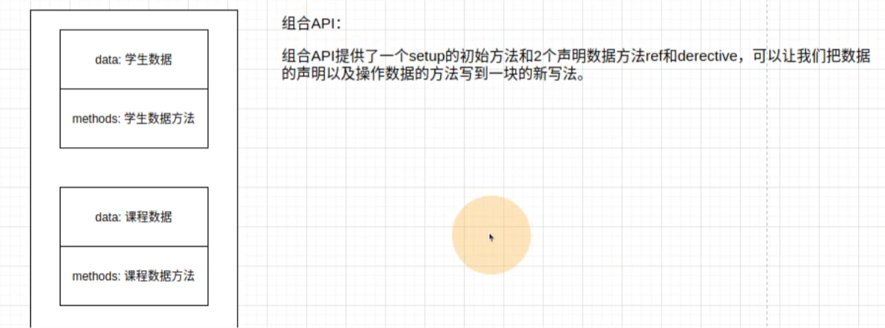
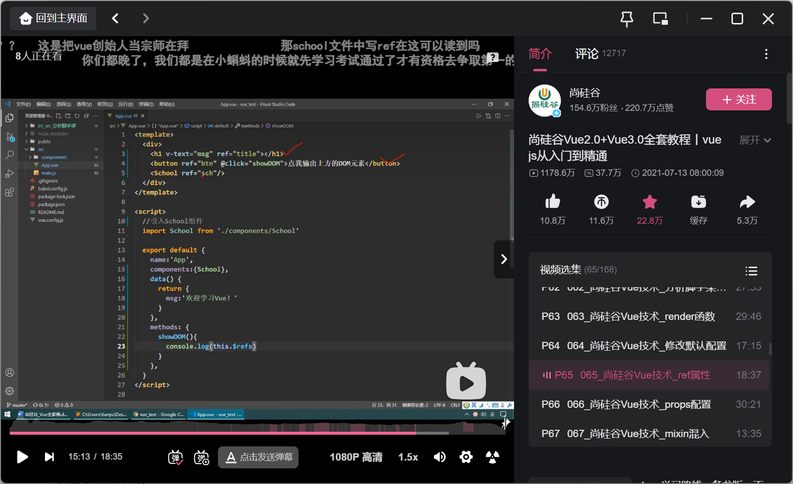

## VUE

```vue
vue.js的使用官方提供了两种方式

1 基于脚本的导入 下载vue.js文件 通过script标签引入的html网页
2 基于项目构建工具来进行使用，需要安装项目构建工具，自动生成一个独立的项目
```

### 1 脚本引入式

#### 1.1 创建APP

```vue
<!DOCTYPE html>
<html lang="en">
<head>
    <meta charset="UTF-8">
    <title>Title</title>
</head>
<body>
    <div id="app">
        <p>{{msg}}</p>
        <p>{{num}}</p>
    </div>
<script src="./vue.global.js"></script>
<script>
    // vue 的核心代码全度开始于vue的对象 这个对象名字一般是vm
    Vue.createApp({  //创建一个app
        data(){   //存储数据的地方 会在这里设置vue所需要的变量，并且给其一个默认值
            return{
                msg:"这是一个数据一半来自服务端",
                num:2
            }
        }
    }).mount('#app');
</script>
</body>
</html>

Vue.createApp({}).mount('#app');
```

#### 1.2 vue.js的M-V-VM思想

```vue
MVVM 是Model-View-ViewModel的缩写，它是一种基于前端开发的架构模式，是一种代码分工思想来的。

Mode1 指代的就是vue对象的data属性里面的数据。这里的数据要显示到页面中。

view 指代的就是vue中数据要显示的HTML页面，在vue中，也称之为“视图模板”

viewmde1 指代的是vuejs中我们编写代码时的vm对象了,它是vue.js的核心,负责连接 View 和 Model,保证视图和数据的
致性，所以前面代码中，data里面的数据被显示中p标签中就是vm对象自动完成的。vm对象会时刻的监控View和Model的变
化，并保持双方数据的一致性!!!
```


```vue
<!DOCTYPE html>
<html lang="en">
<head>
    <meta charset="UTF-8">
    <title>Title</title>
</head>
<body>
    <div id="app">
        <p>num = {{num}}</p>
    </div>
<script src="./vue.global.js"></script>
<script>
    var vm = Vue.createApp({  //data中声明的所有的数据将来都会被vm对象进行遍历 复制给vm对象作为属性 我们要访问的或者操作的data里面的数据直接通过this来访问
        data(){
            return{
                num:0
            }
        },
        mounted(){
            //会在vue加载完html的时候自动执行这里的代码
            // setInterval  js提供的定时器   参数1是一个匿名函数或者函数名字  参数2是间隔时间
            // this对象相当于python中的self
            setInterval(()=>{
                this.num=this.num+1
            },1000);
        }
    }).mount('#app');
</script>
</body>
</html>
```

#### 1.3 表单元素(显示数据)

```vue
使用v-mode1把data里面的数据显示到表单元素以后，一旦用户修改表单元素的值，则data里面对应数据的值也会随之发生
改变，甚至，页面中凡是使用了这个数据都会发生变化。还有，用户修改了的数据，会变成字符串格式的!!
v-model.number

v-html输出原生的html内容<p></p>  只能在普通的双标签中 单标签或者表单标签都不行

{{双括号内部也可以调用js代码，但是必须以变量名字开头}}
{{message.toUpperCase()}} 把数据中的字母变成大写
{{message.toLowerCase()}} 把数据中的字母变成小写
{{message.split("")}} 把数据中的字符按照字符边界分割成单个字符组成的数组
{{message.reverse()}} 把数组的成员进行反转排序
{{message.join("")}} 把数组的成员使用字符边界进行合并拼接成字符串 
```

### 2 常用指令

```vue
指令(Directives)是指代写在html标签中带有“v-”前缀的特殊属性。每一个指令在vue中都有固定的作用,
在vue中，提供了很多指令，常用的有:v-if、v-model、vfor等等,指令会在vm对象的data属性的数据发生变化时，会同时改变元素中的其控制的内容或属性
因为vue的历史版本原因，所以有一部分指令都有两种写法

一般写法
v-html
v-text:"普通文本"   {{'普通文本'}}
v-bind:属性          :属性
v-on:事件名          @事件名
```

vue的指令无非就是针对html的文档中的属性，标签内容，事件，样式和数据进行操作和页面控制

#### 2.1 属性操作

##### 1 图片轮换

```vue
<!DOCTYPE html>
<html lang="en">
<head>
    <meta charset="UTF-8">
    <title>Title</title>
    <style>
        .btn{
            width: 100px;
            height: 100px;
            border: 1px solid #000;
            padding: 3px;
        }
    </style>
</head>
<body>
    <div id="app">
        
    </div>
<script src="./vue.global.js"></script>
<script>
    var vm = Vue.createApp({
        data(){
            return{
                img_url:"./OK.jpg"
            }
        },
        mounted(){   //mounted方法中的代码会在vue加载完html之后自动执行
            setInterval(()=>{
                if(this.img_url === "./OK.jpg"){
                    this.img_url = "./OK1.jpg"
                }else if(this.img_url === "./OK1.jpg"){
                    this.img_url = "./OIP-C.jpeg"

                }else{
                    this.img_url = "./OK.jpg"
                }
            },1000)
        }
    }).mount('#app');
</script>
</body>
</html>
```

##### 2 密码展现不显示

```vue
<!DOCTYPE html>
<html lang="en">
<head>
    <meta charset="UTF-8">
    <title>Title</title>
    <style>
        .pwd{
            width: 140px;
            margin-top: 10px;
        }
        .btn{
            cursor: pointer;
            user-select: none;
            margin-left: 5px;
        }
    </style>
</head>
<body>
    <div id="app">
        账号 ： <input type="text" v-model="user"><br>
        密码 ： <input :type="pwd_type" class="pwd" v-model="pwd">
        <span @click="pwd_type=(pwd_type==='password'?'text':'password')" class="btn">&#920;</span>
        <br>
    </div>
<script src="./vue.global.js"></script>
<script>
    var vm = Vue.createApp({
        data(){
            return{
                pwd_type:"password"
            }
        },
    }).mount('#app');
</script>
</body>
</html>
```

#### 2.2 事件操作

```vue
<button v-on:click="num++"></button>
<button @click="num+5"></button>

@click  点击事件
@submit  -->  onsubmit  点单提交事件
@focus   -->  onfocus   焦点事件
@click   -->  onclick   点击事件
@buler   -->  onblur    失去焦点事件


<!DOCTYPE html>
<html lang="en">
<head>
    <meta charset="UTF-8">
    <title>Title</title>
</head>
<body>
<div id="app">
    <button @click="num++">点赞：{{num}}</button>
</div>
<script src="./vue.global.js"></script>
<script>
    var vm = Vue.createApp({
        data(){
            return{
                num:0
            }
        },
    }).mount('#app');
</script>
</body>
</html>
```

```vue
<!DOCTYPE html>
<html lang="en">
<head>
    <meta charset="UTF-8">
    <title>Title</title>
</head>
<body>
<div id="app">
    <button @click="num++">点赞：{{num}}</button>
    <br>
    <button @click="zan">点赞：{{total}}</button>  <!-- @click中的值可以是js代码 也可以是methods中定义的方法 -->
    <br>
    <button @click.ctrl="zan1(3)">点赞：{{total1}}</button>
</div>
<script src="./vue.global.js"></script>
<script>
    var vm = Vue.createApp({
        data(){
            return{
                num:0,
                total:0,
                total1:0,
            }
        },
        methods:{
            zan(){
                if(this.total<=3){
                    this.total ++
                }
            },
            zan1(n){
                this.total1 += n;
            }
        }
    }).mount('#app');
</script>
</body>
</html>

<!-- 单击事件将停止传递 -->
<a @click.stop="doThis"></a>

<!-- 提交事件将不再重新加载页面 -->
<form @submit.prevent="onSubmit"></form>

<!-- 修饰语可以使用链式书写 -->
<a @click.stop.prevent="doThat"></a>

<!-- 点击事件最多被触发一次 -->
<a @click.once="doThis"></a>
```

##### 案例

```vue
<!DOCTYPE html>
<html lang="en">
<head>
    <meta charset="UTF-8">
    <title>Title</title>
    <style>
        table tr td{
            border:1px solid red;
            border-collapse: collapse;
        }
        td{
            width:120px;
            text-align:center;
            vertical-align:center;
        }
        .btn{
            width:30px;
            text-align:center;
        }
    </style>
</head>
<body>
<div id="app">
    <table>
        <tr>
            <td>商品标题</td>
            <td>商品价格</td>
            <td>商品推荐</td>
            <td>购买数量</td>
        </tr>
        <tr>
            <td>python入门</td>
            <td>30</td>
            <td>推荐</td>
            <td>
                <button @click="add">+</button>
                <input class="btn" type="text" v-model="num">
                <button @click="ok">-</button>
            </td>
        </tr>
    </table>
</div>
<script src="./vue.global.js"></script>
<script>
    var vm = Vue.createApp({
        data(){
            return{
                num:0,
            }
        },
        methods:{
            add(){
                this.num+=1;
            },
            ok(){
                this.num-=1;
            }
        }
    }).mount('#app');
</script>
</body>
</html>
```

#### 2.3 样式操作

样式操作。本质就是属性操作，使用冒号:

##### 2.3.1 样式操作类名

```vue
格式
<h1 class="值">元素</h1>  值可以是字符串，对象，对象名，数组

<!DOCTYPE html>
<html lang="en">
<head>
    <meta charset="UTF-8">
    <title>Title</title>
    <style>
        .cls1{
            color: blue;
        }
        .cls2{
            background-color: darkorange;
        }
    </style>
</head>
<body>
<div id="app">
    <ul>
        <li class="cls1">第一个</li>
        <li class="cls1 cls2">第二个</li>
        <li :class="exterior1">第三个</li>
        <li :class="[exterior1,exterior2]">第四个</li>
        <li :class="{cls1:true,cls2:is_add_cls2}" @click="change_cls2">第五个</li>
        <li :class="exterior3" @click="exterior3.cls2=!exterior3.cls2">第六个</li>
        <!-- 第三个 第四个 第六个操作常用 -->
    </ul>
</div>
<script src="./vue.global.js"></script>
<script>
    var vm = Vue.createApp({
        data(){
            return{
                exterior1:"cls1",
                exterior2:"cls1 cls2",
                is_add_cls2:true,
                exterior3:{
                    cls1:true,
                    cls2:true,
                }
            }
        },
        methods:{
            change_cls2(){
                this.is_add_cls2= !this.is_add_cls2;
            }
        }
    }).mount('#app');
</script>
</body>
</html>
```

#### 案例：选项卡

```vue
<!DOCTYPE html>
<html lang="en">
<head>
    <meta charset="UTF-8">
    <title>Title</title>
    <style>
         #optioncard .titlebar span{
            background-color: darkgray;
             height: 32px;
             width: 100px;
             text-align: center;
             color: #000;
             display: block;
             text-decoration: none;
             vertical-align: middle;
             line-height: 32px;
             float: left;
             margin-right: 4px;
        }
         #optioncard .contentbox .content{
             height: 200px;
             width: 300px;
             background-color: yellow;
             display: none;
         }
         #optioncard .contentbox .active{
             display: block;
         }
         #optioncard .titlebar .current{
             background-color: yellow;
         }
    </style>
</head>
<body>
    <div id="optioncard">
        <div class="titlebar">
            <span :class="{current:current_title==0}" @click="current_title=0">体育新闻</span>
            <span :class="{current:current_title==1}" @click="current_title=1">财经资讯</span>
            <span :class="{current:current_title==2}" @click="current_title=2">娱乐八卦</span>
            <div style="clear: both"></div>
        </div>
        <div class="contentbox">
            <div :class="{content:true, active: current_title==0}">
                体育新闻
            </div>
            <div :class="{content:true, active: current_title==1}">
                财经资讯
            </div>
            <div :class="{content:true, active: current_title==2}">
                娱乐八卦
            </div>
        </div>
    </div>
<script src="./vue.global.js"></script>
<script>
    var vm = Vue.createApp({
        data(){
            return{
                current_title:0
            }
        }
    }).mount('#optioncard');
</script>
</body>
</html>
```

#### 2.4 条件渲染指令

v-if和v-show

##### 2.4.1 v-if

通过js中的dom进行移除

```vue
<!DOCTYPE html>
<html lang="en">
<head>
    <meta charset="UTF-8">
    <title>Title</title>
    <style>
    </style>
</head>
<body>
    <div id="box">
        <p v-if="role==2">尊敬的vip会员你好，欢迎来到我们的网站</p>
        <p v-else-if="role==1">尊敬的普通会员你好，欢迎来到我们的网站</p>
        <p v-else>尊敬的游客你好，欢迎来到我们的网站</p>
    </div>
<script src="./vue.global.js"></script>
<script>
    var vm = Vue.createApp({
        data(){
            return{
                role:0  //0表示没有登陆 1表示普通用户 2表示vip会员
            }
        }
    }).mount('#box');
</script>
</body>
</html>
```

##### 2.4.2 v-show

通过css代码中的display来进行隐藏

```vue
<!DOCTYPE html>
<html lang="en">
<head>
    <meta charset="UTF-8">
    <title>Title</title>
    <style>
    </style>
</head>
<body>
    <div id="box">
        <div v-show="role==0">
            尊敬的游客如果你想要继续访问本站，请进行注册
        </div>
    </div>
<script src="./vue.global.js"></script>
<script>
    var vm = Vue.createApp({
        data(){
            return{
                role:0  //0表示没有登陆 1表示普通用户 2表示vip会员
            }
        }
    }).mount('#box');
</script>
</body>
</html>
```

#### 2.5 列表渲染

v-for

数据是数组的时候

```vue
<!DOCTYPE html>
<html lang="en">
<head>
    <meta charset="UTF-8">
    <title>Title</title>
    <style>
        table,tr,th,td{

            border-collapse: collapse;
            border:1px solid red ;
        }
        th,td{
            text-align: center;
            width: 120px;
            height: 32px;
            line-height: 32px;
            vertical-align: center;
        }
    </style>
</head>
<body>
    <div id="box">
        <table>
            <tr>
                <th>id</th>
                <th>name</th>
                <th>age</th>
                <th>sex</th>
            </tr>
            <tr v-for="item in student">
                <td>{{item.id}}</td>
                <td>{{item.name}}</td>
                <td>{{item.age}}</td>
                <td v-if="item.sex">男</td>
                <td v-else>女</td>
            </tr>
        </table>
    </div>
<script src="./vue.global.js"></script>
<script>
    var vm = Vue.createApp({
        data(){
            return{
                role:0,  //0表示没有登陆 1表示普通用户 2表示vip会员
                student:[
                    {"id":1,"name":"wyt","age":10,"sex":true},
                    {"id":2,"name":"wyt","age":10,"sex":true},
                    {"id":3,"name":"wyt","age":10,"sex":false},
                    {"id":4,"name":"wyt","age":10,"sex":true},
                    {"id":5,"name":"wyt","age":10,"sex":true},
                    {"id":6,"name":"wyt","age":10,"sex":true},
                ]
            }
        }
    }).mount('#box');
</script>
</body>
</html>
```

##### 案例

```vue
<!DOCTYPE html>
<html lang="en">
<head>
    <meta charset="UTF-8">
    <title>Title</title>
    <style>
        table,tr,th,td{

            border-collapse: collapse;
            border:1px solid red ;
        }
        th,td{
            text-align: center;
            width: 120px;
            height: 32px;
            line-height: 32px;
            vertical-align: center;
        }
        .current{
            background-color: lightblue;
        }
        .all{
            color: blue;
        }
    </style>
</head>
<body>
    <div id="box">
        <table>
            <tr>
                <th>name</th>
                <th>price</th>
                <th>pages</th>
            </tr>
            <tr v-for="item in goods" :class="{current:item.price>60,all:item.pages>200}">
                <td >{{item.name}}</td>
                <td>{{item.price}}</td>
                <td>{{item.pages}}</td>
            </tr>
        </table>
    </div>
<script src="./vue.global.js"></script>
<script>
    var vm = Vue.createApp({
        data(){
            return {
                role: 0,  //0表示没有登陆 1表示普通用户 2表示vip会员
                goods:[
                    {"name":"python入门","price":150,"pages":200},
                    {"name":"python入门","price":100,"pages":200},
                    {"name":"python入门","price":75,"pages":210},
                    {"name":"python入门","price":60,"pages":290},
                    {"name":"python入门","price":110,"pages":100}
                ]
            }
        }
    }).mount('#box');
</script>
</body>
</html>
```

### 3 vue对象提供的属性功能

#### 3.1 计算和侦听属性

##### 3.1.1 计算属性

```vue
<!DOCTYPE html>
<html lang="en">
<head>
    <meta charset="UTF-8">
    <title>Title</title>
    <style>
        input[type=text]{
            width: 80px;
        }
    </style>
</head>
<body>
    <div id="app">
        <p>{{a_money}}美元={{p_money}}人民币</p>
        <input type="text" v-model="a_money">美元
    </div>
<script src="./vue.global.js"></script>
<script>
    var vm = Vue.createApp({
        data(){
            return {
                a_money:0,
                rate:6.4701
            }
        },
        // 计算属性，实际上而言，这里的每一个方法最终对于html都是一个变量，这个变量要在已有变量的基础上通过计算得到
        computed:{
            p_money(){
                return (this.a_money * this.rate).toFixed(2);
            }
        }
    }).mount('#app');
</script>
</body>
</html>
```

###### 计算属性用法

```vue
<!DOCTYPE html>
<html lang="en">
<head>
    <meta charset="UTF-8">
    <title>Title</title>
    <style>
        input[type=text]{
            width: 80px;
        }
    </style>
</head>
<body>
    <div id="app">
        <input type="password" v-model="password">
        <p>{{password}}</p>
        <p>{{password2}}</p>
    </div>
<script src="./vue.global.js"></script>
<script>
    var vm = Vue.createApp({
        data(){
            return {
                password2 : ""
            }
        },
        // 计算属性，实际上而言，这里的每一个方法最终对于html都是一个变量，这个变量要在已有变量的基础上通过计算得到
        computed:{
            password:{
                //读取器
                get(){
                    return atob(this.password2)
                },
                //存储器
                set(data){
                    this.password2 =  btoa(data)
                }
            }
        }
    }).mount('#app');
</script>
</body>
</html>
```

##### 3.2.2 侦听器

```vue
<!DOCTYPE html>
<html lang="en">
<head>
    <meta charset="UTF-8">
    <title>Title</title>
    <style>
        input[type=text]{
            text-align: center;
        }
    </style>
</head>
<body>
    <div id="app">
        <button @click="num++">+</button>
        <input type="text" v-model="num">
        <button @click="num--">-</button>
    </div>
<script src="./vue.global.js"></script>
<script>
    var vm = Vue.createApp({
        data(){
            return {
                num:0,
                max_num:10
            }
        },
        watch:{
            num(){ //此处表示为时刻监控num的变化，当num一旦发生变化，则自动调用此方法
                if(this.num <= 0){
                    this.num = 0
                }else if(this.num >= this.max_num){
                    this.num = this.max_num
                }
            }
        }
    }).mount('#app');
</script>
</body>
</html>
```

###### 案例:城市选择框

```vue
<!DOCTYPE html>
<html lang="en">
<head>
    <meta charset="UTF-8">
    <title>Title</title>
    <style>
    </style>
</head>
<body>
    <div id="app">
        省份:<select v-model="province">
        <option :value="province.name" v-for="province in province_list">{{province.name}}</option>
    </select>
        城市:<select v-model="city">
        <option :value="city.name" v-for="city in citys">{{city.name}}</option>
    </select>
        地区:<select v-model="area">
        <option :value="area.name" v-for="area in areas">{{area.name}}</option>
    </select>
    </div>
<script src="./vue.global.js"></script>
<script>
    var vm = Vue.createApp({
        data(){
            return {
                province:"",
                city:"",
                area:"",
                citys:[],
                areas:[],
                province_list:[
                    {"id":1,name:"湖南省"},
                    {"id":2,name:"河北省"},
                    {"id":3,name:"河南省"},
                ],
                city_list:[
                    {"id":4,name:"长沙市","ped":1},
                    {"id":5,name:"石家庄市","ped":2},
                    {"id":6,name:"邯郸市","ped":2},
                    {"id":7,name:"郑州市","ped":3},
                    {"id":8,name:"南阳市","ped":3},
                ],
                area_list:[
                    {"id":9,name:"芙蓉区","ped":4},
                    {"id":10,name:"天心区","ped":4},
                    {"id":11,name:"长安区","ped":5},
                    {"id":12,name:"桥西区","ped":5},
                    {"id":13,name:"复兴区","ped":6},
                    {"id":14,name:"金水区","ped":7},
                    {"id":15,name:"中原区","ped":7},
                    {"id":16,name:"淅川县","ped":8},
                    {"id":17,name:"西峡县","ped":8},
                    {"id":18,name:"社旗县","ped":8},
                ]
            }
        },
        watch:{
            province(){
                this.city = "";
                let province_id = -1;
                for(let key in this.province_list){  //of左边得到的是对象   in的左边得到的是对象下标
                    if(this.province_list[key].name === this.province){
                        province_id = this.province_list[key].id;
                        break;
                    }
                }
                this.citys = []
                for(let key in this.city_list){
                    if(this.city_list[key].ped === province_id){
                        this.citys.push(this.city_list[key]);
                    }
                }
                this.area = ""
            },
            city(){
                let city_id = -1;
                for(let key in this.city_list){
                    if(this.city_list[key].name === this.city){
                        city_id = this.city_list[key].id;
                        break;
                    }
                }
                this.areas = []
                for(let key in this.area_list){
                    if(this.area_list[key].ped === city_id){
                        this.areas.push(this.area_list[key]);
                    }
                }
            }
        }
    }).mount('#app');
</script>
</body>
</html>
```

#### 3.2 生命周期勾子

```vue
7个周期函数
<!DOCTYPE html>
<html lang="en">
<head>
    <meta charset="UTF-8">
    <title>Title</title>
    <style>

    </style>
</head>
<body>
    <div id="app">
        {{message}}
        <input type="text" v-model="message">
    </div>
<script src="./vue.global.js"></script>
<script>
    var vm = Vue.createApp({
        data(){
            return {
               message:"Hello",
            }
        },
        beforeCreate(){
            //data数据初始化之前
            console.log("beforeCreate已经执行");
        },
        created(){
            // data数据已经注入到vm对象当中
            console.log("created已经执行");  //工作中用这个方法去ajax方法请求获取服务器的数据，并且加载
        },
        beforeMount(){
            console.log("beforeMount已经执行");
            console.log(this.$el);
            // data 数据已经渲染到html模版之前
        },
        mounted(){
            // data 数据渲染到html模版之后
            console.log("mounted已经执行了");
            console.log(this.$el);   //工作中一般这里编写页面初始化的操作代码 在用户看到页面之前 修改html页面代码
            console.log(this.$el.parentElement);
        },
        beforeUpdate(){
            // 用户数据更新前的钩子
            // 工作中这里判断数据是否有效
            console.log("beforeUpdate已经执行了");
            console.log(this.message); //data数据被改动了
            console.log(this.$el.parentElement.innerHTML);  //还没有同步到html页面当中
        },
        updated(){
            // data数据更新到html模版的钩子
            console.log("update已经执行了");  //工作中，这里填写数据改动以后，同步保存到数据库中
            console.log(this.$el.parentElement.innerHTML);  //还没有同步到html页面当中
        }
    }).mount('#app');
</script>
</body>
</html>
```



#### 3.3修饰符

指令修饰符

```vue
作用是为了增加或者限制指令本身的工作作用
.stop      阻止事件冒泡
.prevent   防止跳转刷新
.number   把表单的输入内容转换成数值类型
.once    时间只允许触发一次
.trim    把表单输入的内容左右两边空格删除
```

#### 案例：todolist

```vue
<!DOCTYPE html>
<html lang="en">
<head>
    <meta charset="UTF-8">
    <title>Title</title>
    <style>
        .list_con{
            width: 600px;
            margin: 50px auto 0;
        }
        .inputtxt{
            width: 550px;
            height: 30px;
            border:1px solid #ccc;
            padding: 0px;
            text-indent: 10px;
            margin-right: 5px;
        }
        .inputbin{
            width: 40px;
            height: 32px;
            padding: 0px;
            border: 1px solid #ccc;
        }
        .list{
            margin: 0;
            padding: 0;
            list-style: none;
            margin-top: 20px;
        }
        .list li{
            height: 40px;
            line-height: 40px;
            border-bottom: 1px solid #ccc;
        }
        .list li span{
            float: left;
        }
        .list li a{
            float: right;
            text-decoration: none;
            margin: 0 10px;
        }
    </style>
</head>
<body>
    <div class="list_con" id="app">
        <h2>TO DO LIST</h2>
        <input type="text" name="" id="text" class="inputtxt" v-model="task_add">
        <input type="button" name="" value="增加" class="inputbin" @click="add(task_add)">
        <ul id="list" class="list">
            <li v-for="(task,key) in task_list" >
                <span style="margin-right: 20px" >{{key+1}}</span>
                <span >{{task}}</span>
                <a href="javascript:" class="up" @click="up(key)"> ↑ </a>
                <a href="javascript:" class="down" @click="down(key)"> ↓ </a>
                <a href="javascript:" class="del" @click="del(key)"> 删除 </a>
            </li>
        </ul>
    </div>
<script src="./vue.global.js"></script>
<script>
    var vm = Vue.createApp({
        data(){
            return {
                task_add:"",
                task_del:"",
                task_list:[
                    "学习html",
                    "学习css",
                    "学习javascript"
                ]
            }
        },
        methods:{
            add(task_add){
                if(task_add == ""){
                    alert("输入不能为空")
                }else{
                    this.task_list.push(task_add);
                    this.task_add="";
                }
            },
            del(key){
                this.task_list.splice(key,1);
            },
            down(key){
                let del_task = this.task_list.splice(key,1)[0];
                this.task_list.splice(key+1,0,del_task);
            },
            up(key){
                let del_task = this.task_list.splice(key,1)[0];
                this.task_list.splice(key-1,0,del_task);
            }
        }
    }).mount('#app');
</script>
</body>
</html>
```

### 4 组件化开发（component）

```vue
组件是自定义的封装代码的功能 在前端开发的过程中 经常出现 多个网页功能是重复的 而且不同页面之间也存在相同的功能

而在网页中实现一个功能，需要使用html定义功能的内容结构，使用css声明功能的外观样式，还要使用js来定义功能的特效因此就产生了把一个功能相关的[HTML、css和javascript]代码封装在一起组成一个整体的代码块封装模式，我们称之为“组件”。所以，组件就是一个html网页中的功能，一般就是一个标签，标签中有自己的html内容结构，css样式和js特效。这样，前端人员就可以在组件化开发时，只需要书写一次代码，随处引入即可使用。vue的组件有两种:默认组件[全局组件]和 单文件组件。组件名:单词小写加横杠。
```

#### 4.1 全局注册

```vue
<!DOCTYPE html>
<html lang="en">
<head>
    <meta charset="UTF-8">
    <title>Title</title>
    <style>
    </style>
</head>
<body>
<div id="app">
    <header-nav></header-nav>
</div>
<script src="./vue.global.js"></script>
<script>
    //组件内部的数据是相互独立的，在这个操作中有属于当前组件的vm对象进行控制
    //以往，我们学习过搜有的vue的语法都可以在组件中进行
    const headerNav = {//使用的时候组件名字作为标签名字来用
        data(){
            //组件内部的数据
            return{
                nav_list:["首页","注册"]
            }
        },
        methods:{
            //组件内部的操作方法
        },
        template:`
            <ul>
              <li><a href="">首页</a></li>
              <li><a href="">列表</a></li>
              <li><a href="">注册</a></li>
            </ul>
        `   //组件内部的html代码
    }
    const app = Vue.createApp({
        data(){
            return {

            }
        },
    });
    app.component("header-nav",headerNav);
    app.mount("#app");
</script>
</body>
</html>
```

#### 4.2 局部注册

```vue
<!DOCTYPE html>
<html lang="en">
<head>
    <meta charset="UTF-8">
    <title>Title</title>
    <style>
    </style>
</head>
<body>
<div id="app">
    <header-nav></header-nav>
</div>
<script src="./vue.global.js"></script>
<script>
    //组件内部的数据是相互独立的，在这个操作中有属于当前组件的vm对象进行控制
    //以往，我们学习过搜有的vue的语法都可以在组件中进行
    const headerNav = {//使用的时候组件名字作为标签名字来用
        data(){
            //组件内部的数据
            return{
                nav_list:["首页","注册"]
            }
        },
        methods:{
            //组件内部的操作方法
        },
        template:`
            <ul>
              <li><a href="">首页</a></li>
              <li><a href="">列表</a></li>
              <li><a href="">注册</a></li>
            </ul>
        `   //组件内部的html代码
    }
    const app = Vue.createApp({
        data(){
            return {

            }
        },
        components: {
            "header-nav": headerNav
            //写法二 当属性名字和属性值是一个名字的时候可以简写  herderNav <herder-nav><herder-nav>
        }
    });
    app.mount("#app");
</script>
</body>
</html>
```

### 5 项目目录

```vue
项目目录/
|-node_modules/   #本地项目开发的时候项目运行的依赖库目录
|-package.json/	  #项目运行的配置文件
|-dist/			  #项目完成以后，如果项目上云，会编译整个项目，编译后代码保存在这里
|-public/		  #访问入口目录
|	|_index.html  #项目唯一的html页面，整个项目所有的内容都是被index.html加载提供给用户访问的
|_src/			  #核心开发目录 所有的源代码都保存在这里
	|-APP.vue     #项目的根组件，由App.vue进行加载所有的组件页面和子组件
	|-assets/	  #资产目录，保存项目所需的静态资源[img/视频/音频等]
	|-main.js     #全局初始化入口脚本，index.html被运行时会自动加载这个js文件 
	|-router/     #路由文件保存
	| |_index.js  #默认情况下路由文件
	|-store/      #全局状态管理器，保存公共数据/公共变量的
	| |_index,js  #默认情况的全局变量保存文件
	|-views/	  #页面组件目录，一个vue文件就一个页面内容。
	| |_home.vue
```

```vue
整个项目是一主文件index.html ,index.html中会引入src文件夹中的main,js,main,js中会导入顶级单文件组件App.vue
App.vue中会通过组件嵌套或者路由来引用components文件夹中的其他单文件组件。
```

#### 5.1 创建并且注册插件

components文件目录下创建文件

```vue
<script>
export default {
  name:"Demo",
  data(){
    return {
      num:10,
    }
  }
}
</script>

<template>
  <button @click="num++">{{num}}</button>
</template>

<style>
  button{
    color: red;
  }
</style>
```

App.vue调用组件

```vue
<template>
  
  <HelloWorld msg="Welcome to Your Vue.js App"/>
  <Demo />
</template>

<script>
import HelloWorld from './components/HelloWorld.vue'
import Demo from "@/components/Demo.vue";    //先引入

export default {
  name: 'App',
  components: {
    Demo,                             //再在这里引入
    HelloWorld
  }
}
</script>

<style>
#app {
  font-family: Avenir, Helvetica, Arial, sans-serif;
  -webkit-font-smoothing: antialiased;
  -moz-osx-font-smoothing: grayscale;
  text-align: center;
  color: #2c3e50;
  margin-top: 60px;
}
</style>
```

防止style全局污染

```vue
<style scoped>  加上scoped
  button{
    color: red;
  }
</style>
```

#### 5.2 组件之间的数据传递

##### 5.2.1 父组件传递给子组件

Home.vue

```vue
<template>
  <h1>Home页面</h1>
    <button @click="num++">home的{{num}}</button>
  <Menu :htnum="num" />
</template>
<script>
import Menu from "@/components/Menu.vue";
export default {
  // eslint-disable-next-line vue/multi-word-component-names
  name:"Home",
  data(){
    return{
      num:0
    }
  },
  components:{
    // eslint-disable-next-line vue/no-unused-components
    Menu
  }
}
</script>
<style scoped>
</style>
```

Menu.vue

```vue
<template>
  <div>
    <p>来自Home父组件的数据{{htnum}}</p>
  <ul>
    <li><a href="">首页</a></li>
    <li><a href="">菜单</a></li>
    <li><a href="">登录</a></li>
    <li><a href="">注册</a></li>
  </ul>
  </div>
</template>
<script>
export default {
  // eslint-disable-next-line vue/multi-word-component-names
  name: 'Menu',
  //来自父组件的数据   变量名字：数值类型  //Number数值（整数，浮点数）  String字符串     Boolean布尔值
  props: {
    htnum:{
        type:Number,
        default:100  //默认值
    }
  },
}
</script>
<style scoped>
</style>
```

传入静态值

```vue
<BlogPost title="My journey with Vue" />
```

传入动态值

```vue
<!-- 根据一个变量的值动态传入 -->
<BlogPost :title="post.title" />
<!-- 根据一个更复杂表达式的值动态传入 -->
<BlogPost :title="post.title + ' by ' + post.author.name" />
```

```vue
prop被用于传入初始值；而子组件想在之后将其作为一个局部数据属*。在这种情况下，最好是新定义一个局部数据属性，从 props 上获取初始值即可

！！！注意！！！
1 传递数据是变量,则需要在属性左边添加英文冒号
传递数据是变量,这种数据称之为"动态数据传递”,父组件数据改动的时候，子组件中被随之改动.
传递数据不是变量,这种数据称之为"静态数据传递”
2 父组件中修改了数据,在子组件中会被同步修改。但是来自props的数据，在子组件是不能修改的，因为不是data中声明
的。在开发时这种情况，也被称为"单向数据流”
```

```vue
数据类型
Number数值(整数,浮点数)
String字符串，
Boolean布尔值，
Array数组，
0bject对象，
函数Function，
异步对象 Promise
```

此外还有数据的校验   官网：[prop/vue.js](https://vue-docs-zh-cn.netlify.app/guide/components/props.html)

##### 5.2.2 子组件传递给父组件

Menu.vue

```vue
<template>
  <div>
    <p>来自Home父组件的数据{{htnum}}</p>
  <ul>
    <li><a href="">首页</a></li>
    <li><a href="">菜单</a></li>
    <li><a href="">登录</a></li>
    <li><a href="">注册</a></li>
    <hr>
    <p>要发送给父组件的数据{{num}}</p>
    <button @click="abc">{{num}}</button>
  </ul>
  </div>
</template>
<script>
export default {
  // eslint-disable-next-line vue/multi-word-component-names
  name: 'Menu',
  //来自父组件的数据   变量名字：数值类型  //Number数值（整数，浮点数）  String字符串     Boolean布尔值
  props: {
    htnum:Number
  },
  methods:{
    abc(){
      this.num++
      //传递数据给父组件
      //通过this.emit传递数据(自定义事件名字，变量1，变量2）
      this.$emit("add_num",this.num,this.message);
    }
  },
  data(){
    return{
      num:10,
      message:"hello我是子组件传来的数据"
    }
  }
}
</script>
<style scoped>
</style>
```

```vue
//通过this.emit传递数据(自定义事件名字，变量1，变量2）
this.$emit("add_num",this.num,this.message)；
最好是写一个事件{
	this.$emit("add_num",this.num,this.message)；
}

在子组件中，通过this.$emit()来声明一个自定义的信号，父组件中针对这个信号在调用子组件爱你的组件名处进行@监听
```

Home.vue

```vue
<template>
  <h1>Home页面</h1>
    <button @click="num++">home的{{num}}</button>
  <Menu :htnum="num" @add_num="get_data" />
</template>
<script>
import Menu from "@/components/Menu.vue";
export default {
  // eslint-disable-next-line vue/multi-word-component-names
  name:"Home",
  data(){
    return{
      num:0
    }
  },
  components:{
    // eslint-disable-next-line vue/no-unused-components
    Menu
  },
  methods:{
    get_data(a1,a2){
      console.log("子组件传递数据过来了");
      console.log(a1,a2);
    }
  }
}
</script>
<style scoped>
</style>
```

```vue
<Menu :htnum="num" @add_num="get_data" />    度组件获得这个时间并且定义为函数
  methods:{
    get_data(a1,a2){
      console.log("子组件传递数据过来了");
      console.log(a1,a2);
    }
  } 
获取参数值

父组件声明一个方法用于自定义事件发生时获取数据
```

也存在单项数据流问题 父亲不能操作子组件的数据

#### 5.3 axios发送请求

##### get方法/delete和get用法一致

创建一个js文件

```js
import axios from 'axios';

const httptool = axios.create({
    baseURL: 'https://jsonplaceholder.typicode.com/',    //请求地址  一般填写服务器api地址
    timeout: 1000,                         //请求最大超时时间，超过这个时间进行报错
    headers:{'X-Custom-Header':'foobar'}                             //预定义请求头，一般工作中隐藏了客户端身份的字段
    });
export default httptool;
```

引入

```vue
<template>
  <h1>注册页面</h1>
  <Menu />
  <button @click="send">点击发送请求</button>
</template>
<script>

import Menu from "@/components/Menu.vue";
// eslint-disable-next-line no-unused-vars
import httptool from "../http";
export default {
  // eslint-disable-next-line vue/multi-word-component-names
  name:"Register",
  components:{
    // eslint-disable-next-line vue/no-unused-components
    Menu
  },
  methods:{
    send(){
      // http://127.0.0.1:8000/test?id=1&name=王钰滔          
      // http://127.0.0.1:8000/填写在http.js中 baseurl当中   
      // test填写在axios的http方法的第一个参数当中
      httptool.get("comments",{
        params:{  //查询字符串
            postId:1
        },
        headers:{"Company":"Vue Company"}
      }).then(response=>{
        console.log(response);   //http响应头
        console.log(response.data);   //响应数据
        console.log(response.data.data);   //响应数据
      }).catch(error=>{
        console.log(error);   //error可以是本地的错误，也可以是服务端错误
        console.log(error.response);   //接受服务端的相应错误，如果服务端没有错误则没有response属性
      })
    }
  }
}
</script>
<style scoped>
</style>
```

###### 跨域问题

```vue
使用的时候本质上来说使用的是javascript的ajax，所以也会和普通的javascript出现同源策略的影响  跨域问题
```

##### post方法/put方法

```vue
<template>
  <input type="text" v-model="message">
  <button @click="send">发送请求</button>
</template>
<script>
import httptool from '../http'
export default {
  // eslint-disable-next-line vue/multi-word-component-names
  name:"Robat",
  data(){
    return{
      message:""
    }
  },
  methods:{
    send(){
      let data={
        "text":this.message,
      }
      httptool.post("http://localhost:8000/ceshi/",data).then(response => {
          console.log(response);   //http响应头
          console.log(response.data);
      })
    }
  }
}
</script>
<style scoped>
</style>
```

###### django安装django-cors-headers解决跨域问题

settings.py

```python
INSTALLED_APPS = [
    'django.contrib.admin',
    'django.contrib.auth',
    'django.contrib.contenttypes',
    'django.contrib.sessions',
    'django.contrib.messages',
    'django.contrib.staticfiles',
    'app01.apps.App01Config',
    'corsheaders',                   //加上
]
CORS_ALLOW_ALL_ORIGINS = True           //加上
CORS_ALLOW_HEADERS = ["*"]				//加上					
MIDDLEWARE = [
    'corsheaders.middleware.CorsMiddleware',    //放在最上面
    'django.middleware.security.SecurityMiddleware',
    'django.contrib.sessions.middleware.SessionMiddleware',
    'django.middleware.common.CommonMiddleware',
    'django.contrib.auth.middleware.AuthenticationMiddleware',
    'django.contrib.messages.middleware.MessageMiddleware',
    'django.middleware.clickjacking.XFrameOptionsMiddleware',
]
```

##### 同源策略以及解决方案

```bash
所谓的同源策略，实际上是浏览器内部提供的一个为了保护用户在服务端的数据而提供的一种安全机制。同源策略的作用主要是为了限制javascript代码在非法客户端下执行的一种安全策略。

所谓的同源，实际上就是把客户端的请求ur地址与服务端的请求ur地址进行协议，域名(IP)，端口三者的比较，如果三者一致，则表示双方同源，否则任意一个位置不一致则表示不同源。

因为同源策略的问题，所以我们一般情况下只要使用了ajax进行服务端的数据的操作都会面临着同源策略的拦截和影响。一般在开发中这个问题，我们也叫ajax的跨域(跨源)问题。

所谓的跨域实际是就是让我们的javascript在基于与服务端不同源的客户端下正常运行。

般出现跨域问题时，代码在浏览器的console终端下，都会显示如下如此错

在工作中，跨域的解决方案一般无非以下三种
1.cors方案
2.服务端代理
3.jsonp方案
```

##### 拦截器

```js
import axios from 'axios';

const httptool = axios.create({
    baseURL: 'https://jsonplaceholder.typicode.com/',    //请求地址  一般填写服务器api地址
    timeout: 1000,                         //请求最大超时时间，超过这个时间进行报错
    headers:{'X-Custom-Header':'foobar'}                             //预定义请求头，一般工作中隐藏了客户端身份的字段
    });
// 添加一个请求拦截器
httptool.interceptors.request.use(config => {
    console.log("请求之前");
    return config;
}),(error)=>{
    console.log("请求错误")
    return Promise.reject(error);
}
//添加一个响应拦截器
httptool.interceptors.response.use(response => {
    console.log("服务器响应数据成功以后，返回结果给客户端第一时间执行then之前")
    return response;
}),(error)=>{
    console.log("服务器响应错误内容的时候")
    return Promise.reject(error);
}
export default httptool;
```

#### 5.4 路由

##### ./router/index.js

```js
//路由列表
import {createRouter,createWebHistory} from 'vue-router'
import Home from "../views/Home.vue";
import Register from "../views/Register.vue";
export default createRouter({
    history: createWebHistory(),
    routes :[
        {
            path:"/",                //访问路径
            component : Home,		//组件名字
            name:"Home"
        },
        {
            path:"/register",
            component : Register,
            name:'Register'
        }
    ]
}
)
```

##### main.js

```js
import { createApp } from 'vue'
import App from './App.vue'
import router from './router/index'
createApp(App).use(router).mount('#app')
```

##### App.vue

```vue
<template>
  <router-view></router-view>
</template>
<script>

export default {
  name: 'App',
  components: {
  },
}
</script>

<style>
#app {
  font-family: Avenir, Helvetica, Arial, sans-serif;
  -webkit-font-smoothing: antialiased;
  -moz-osx-font-smoothing: grayscale;
  text-align: center;
  color: #2c3e50;
  margin-top: 60px;
}
</style>
```

##### 页面的跳转

###### html标签跳转

```vue
<li><router-link to="/">首页</router-link></li>
<li><router-link to="/register">注册</router-link></li>
或者
<a></a>
```

###### js跳转

```js
<li><a href="" @click.prevent="goto('/')">首页</a></li>
<li><a href="" @click.prevent="goto('/register')">注册</a></li>
    
goto(url){
  this.$router.push(url);    跳转到指定的url
  this.$router.go()			//跳转到指定的n个页面，整数表示前进，负数表示后退
}
```

##### 页面数据传递参数

list.vue

```vue
<template>
  <p>List页面</p>
  <router-link to="/goods?id=5">五号商品</router-link>
  <hr>
  <router-link to="/goods?id=9">九号商品</router-link>
</template>
<script>
export default {
  // eslint-disable-next-line vue/multi-word-component-names
  name:"List"
}
</script>
<style scoped>
</style>
```

goods.vue

```vue
<template>
  <p>Goods页面</p>
  <p>{{id_message}}号商品的信息</p>
</template>
<script>
export default {
  // eslint-disable-next-line vue/multi-word-component-names
  name:"Goods",
  data(){
    return{
      id_message:0
    }
  },
  created() {
    this.id_message = this.$route.query.id
  }
}
</script>
<style scoped>
</style>
```

###### 动态路由设置

```js
{
    path:"/register/:id",   设置动态路由
    component : Register,
    name:'Register'
}
```

###### 子路由index.js

```js
{
path:"/user",
component : User,
name:'User',
children:[
    {
        path:"friend",
        component : UserFriend
    }
}
```

user.vue

```vue
<template>
  <h2>用户中心的公共代码[页面的头部]</h2>
  <router-view></router-view>
  <div v-if="$route.path==='/user'">
    <div>用户：小红</div>
    <div>登录时间：2024-8-3</div>
  </div>
</template>

<script>
  export default {
    // eslint-disable-next-line vue/multi-word-component-names
    name: 'User',
    created() {
      console.log(this.$route.path)
    }
  }

</script>

<style>

</style>
```

#### 5.5 路由守卫

也叫做导航守卫，功能作用类似于上面的axios拦截器，我们可以基于导航守卫编写一些在页面跳转过程中需要编写的公共代码，例如：权限的盐城，页面公共初始化

###### 前置守卫

```js
router.beforeEach((to, from, next) => {
    console.log(to);    //下一个页面的路由对象
    console.log(from);  //当前页面跳转对象
    console.log(next);  //执行next函数就会往下一个页面跳转
    //返回True允许跳转 否则不允许跳转
    if(to.path !== '/' && to.path !== '/login'){
        if(to.query.user && to.query.user === '小明'){
            return next();
        }else{
            return next('/');
        }
    }
    return next()
})
```

###### 后置守卫

```js
router.afterEach((to, from, failure) => {
    console.log("对不起你没有权限进入");
    if(!failure){
        console.log(to.fullPath);
    }
})
```

独享守卫

```js
```

#### 5.6 组合式API



```vue
<template>
  <p>组合式API{{user}}</p>
  <p>{{user.name}}</p>
  <input type="text" v-model="user.name">
</template>

<script>
import { reactive } from 'vue'
export default {
  // eslint-disable-next-line vue/multi-word-component-names
  name : "Options",
  setup(){  //自动执行并且在beforeCreated执行之前就自动执行了
    console.log("setup自动执行")
    let data = {name:"小明",age:18};
    let user = reactive(data);
    //把数据通过reactive函数进行处理的目的是为了把数据转换为响应式数据
    //一旦数据转化为响应式数据格式，则vm对象就会自动维护和保持数据的一致性
    // 也就是HTML里面的数据 vm对象的setup数据也会改动
    return {user}
    //显示一个变量到页面当中
  },
  beforeCreate(){
    console.log("beforeCreate")
  }
}
</script>

<style scoped>

</style>
```

ref

```vue
<template>
  <p>组合式API{{user}}</p>
  <p>{{user.name}}</p>
  <input type="text" v-model="user.name">
  <p>{{msg}}</p>
  <input type="text" v-model="msg">
</template>

<script>
import { ref, reactive } from 'vue'
export default {
  // eslint-disable-next-line vue/multi-word-component-names
  name : "Options",
  setup(){  //自动执行并且在beforeCreated执行之前就自动执行了
    console.log("setup自动执行")
    let data = {name:"小明",age:18};
    let user = reactive(data);
    //把数据通过reactive函数进行处理的目的是为了把数据转换为响应式数据
    //一旦数据转化为响应式数据格式，则vm对象就会自动维护和保持数据的一致性
    // 也就是HTML里面的数据 vm对象的setup数据也会改动
    let message = 'hello';
    let msg = ref(message);//把message转成了响应式数据
    console.log(msg,msg.value)   //调用msg的值需要用到value属性
    return {
      user,
      msg
    }
    //显示一个变量到页面当中
  },
  beforeCreate(){
    console.log("beforeCreate")
  }
}
</script>

<style scoped>

</style>
```

### 6 硅谷课程笔记

#### 1 

```js
methods:{
	add(event){
		event.target.value  //获取发生事件的元素的值
	}
}
```

#### 2

```vue
import {nanoid} from 'nanoid'
nanoid() 调用函数
```

#### 3 遍历

```vue
todos:[
        {id:'001',title:'抽烟',done:true},
        {id:'002',title:'喝酒',done:false},
        {id:'003',title:'开车',done:true}
    ]

checkTodo(id){
    this.todos.forEach((todo)=>{
        if(todo.id === id) todo.done = !todo.done
    })
},
```

#### 4 reduce

```vue
return this.todos.reduce((pre,todo)=> pre + (todo.done ? 1 : 0) ,0)
```

#### 5 ref



#### 6 local储存

```vue
<!DOCTYPE html>
<html lang="en">
<head>
    <meta charset="UTF-8">
    <title>localstorage</title>
</head>
<body>
    <h2>浏览器存储数据</h2>
    <button onclick="saveData()">点我保存数据</button>
    <button onclick="readData()">点我获取数据</button>
    <button onclick="deleteData()">点我删除数据</button>
    <script type="text/javascript">
        let p = {name:'张三',age:19}
        function saveData() {
            localStorage.setItem("title", "title")
            localStorage.setItem("meg",JSON.stringify(p))
        }
        function readData(){
            console.log(localStorage.getItem("title"))
            const a = localStorage.getItem("meg")
            console.log(JSON.parse(a))
        }
        function deleteData(){
            localStorage.removeItem("title")
        }
    </script>
</body>
</html>
```

session和local语法一样 session当浏览器关闭的时候就会销毁

#### 7 深度监听

```vue
watch: {
// 深度监视 todos
  todos: {handler(newValue) {
    // 当 todos 或其内部属性发生变化时，这里的代码会执行
      console.log('Todos have changed:', newValue);
    // 你可以在这里执行其他操作，比如保存到 localStorage
      localStorage.setItem('todos', JSON.stringify(newValue));
  },
  deep: true, // 启用深度监视
  // 可选：设置立即执行（在组件创建时立即以当前的 todos 值触发一次回调）
  immediate: false,
},
},
```

#### 8 vuex

...mapState(['sum','school','subject'])

