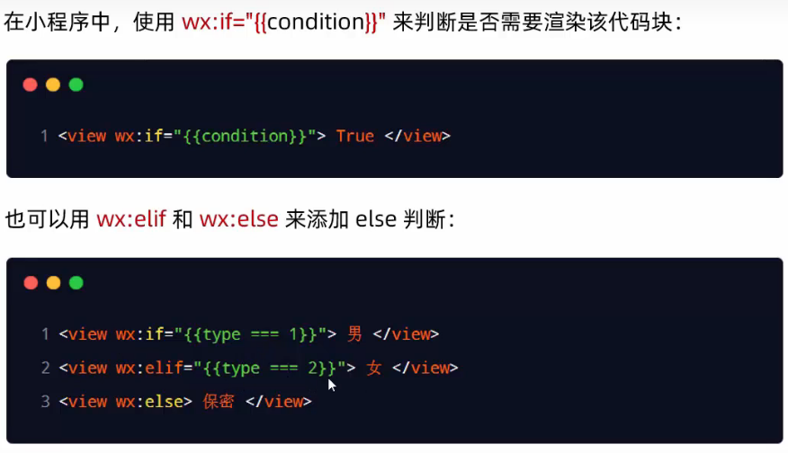
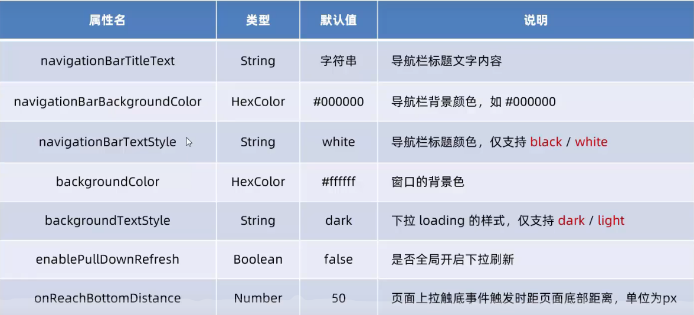
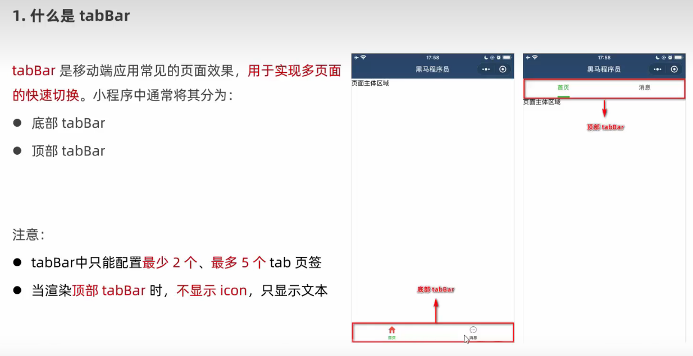
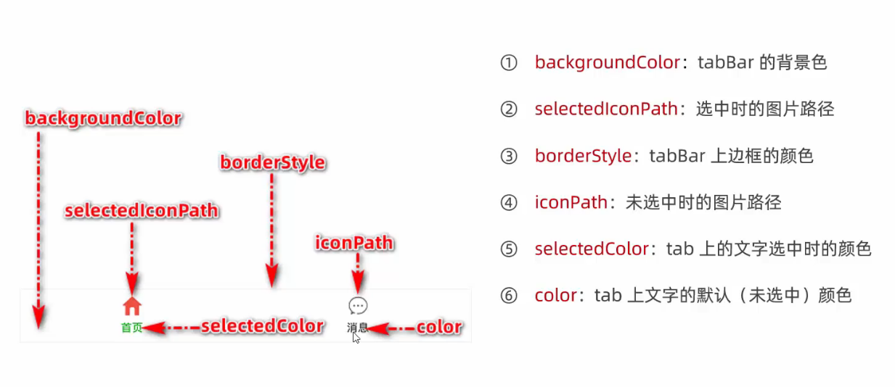
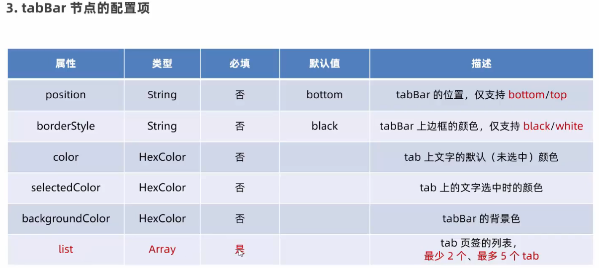
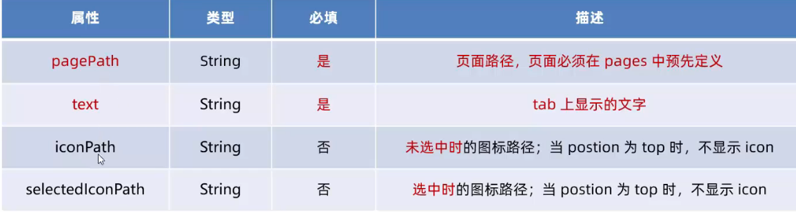
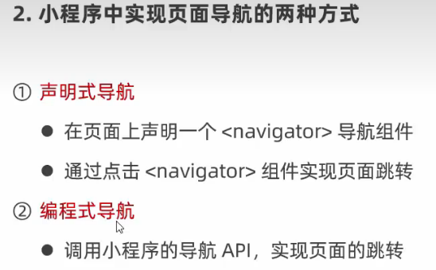
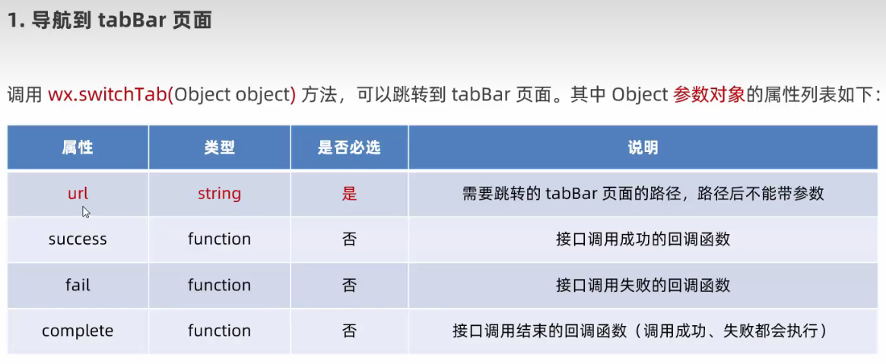
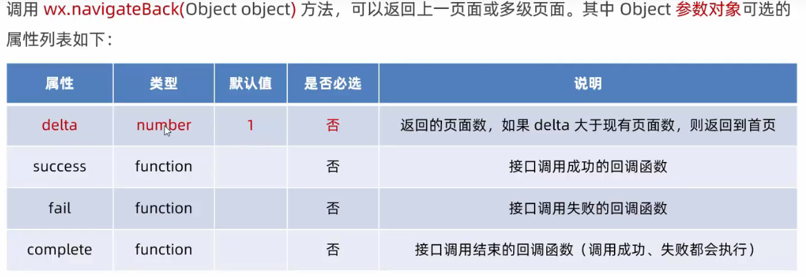

## 微信小程序开发

### 1 项目的基本组成结构

```py
pages 用来存放小程序所有的页面
utils 用来存放工具性质的模块
app.js 小程序项目的入口文件
app.json 小程序的全局配置文件
app.wxss 小程序的全局配置文件
project.config.json 小程序项配置文件
sitemap.json 用来配置小程序以及页面是都允许被微信索引
```

#### 1.1 app.json

```json
{
  "pages": [    //记录小程序所有的页面路径
    "pages/index/index",
    "pages/logs/logs"
  ],
  "window": {   //定义全局页面背景颜色，文字颜色等等
    "navigationBarTextStyle": "black",
    "navigationBarTitleText": "Weixin",
    "navigationBarBackgroundColor": "#ffffff"
  },
  "style": "v2",   //全局定义小程序样式
  "componentFramework": "glass-easel",
  "sitemapLocation": "sitemap.json",
  "lazyCodeLoading": "requiredComponents"
}
```

#### 1.2 project.config.json

```json
{
  "compileType": "miniprogram",
  "libVersion": "trial",
  "packOptions": {
    "ignore": [],
    "include": []
  },
  "setting": {
    "coverView": true,
    "es6": true,
    "postcss": true,
    "minified": true,
    "enhance": true,
    "showShadowRootInWxmlPanel": true,
    "packNpmRelationList": [],
    "babelSetting": {
      "ignore": [],
      "disablePlugins": [],
      "outputPath": ""
    }
  },
  "condition": {},
  "editorSetting": {
    "tabIndent": "auto",
    "tabSize": 2
  },
  "appid": "wx3758b1bdf8ec5635"
}
```

#### 1.3 新建小程序页面

```html
app.js pages添加直接帮你创建
```

### 2 模版区别

#### 2.1 wxml和html

```html
标签不同
HTML (div span img a)
WXML (view text image navigator)

属性节点不同
<a href='#'>超链接</a>
<navigator url='#'>点击跳转</navigator>

提供了类似于VUE的模版语法
属性绑定
列表渲染
条件渲染
```

#### 2.2 wxss和css

```css
新增加了rpx的尺寸单位
css需要手动进行单位的换算，例如rem
wxss在底层支持新的尺寸和rpx，在不同屏幕的小程序上进行尺寸单位换算

提供了全局样式和局部样式

wxss仅支持部分css选择器
```

### 3 组件

#### 3.1 常见组件

```html
1 view
普通视图区域，类似于html的div，是一个块级标签，常用与页面的布局效果

2 scroll-view
可滚动的视图取余，常用于实现滚动列表的效果

3 swiper和swiper-item
轮播图容器组件和轮播图item组件
```

##### 3.1.1 组件的使用(view scroll-view)

```html
<!--pages/list/list.wxml-->
<view class="container1">
  <view>A</view>
  <view>B</view>
  <view>C</view>
</view>

<scroll-view class="container2" scroll-y>  -y y方向拉取 -x x方向拉取
  <view>A</view>
  <view>B</view>
  <view>C</view>
</scroll-view>
```

```css
/* pages/list/list.wxss */
.container1{
  margin-top: 10px;
}
.container1 view{
  width: 100px;
  height: 100px;
  text-align: center;
  line-height: 100px;
}

.container1 view:nth-child(1){
  background-color: lightgreen;
}
.container1 view:nth-child(2){
  background-color: lightskyblue;
}
.container1 view:nth-child(3){
  background-color: lightpink;
}
.container1{
  display: flex;
  justify-content: space-around;
}

.container2{
  border:1px solid red;
  width: 100px;
  margin-top: 10px;
  height: 110px;
}

.container2 view{
  width: 100px;
  height: 100px;
  text-align: center;
  line-height: 100px;
}

.container2 view:nth-child(1){
  background-color: lightgreen;
}
.container2 view:nth-child(2){
  background-color: lightskyblue;
}
.container2 view:nth-child(3){
  background-color: lightpink;
}
```

##### 3.1.2 组件的使用(swiper)

```html
<swiper class='swiper'>
  <swiper-item>
    <view class='item'>A</view>
  </swiper-item>
  <swiper-item>
    <view class='item'>B</view>
  </swiper-item>
  <swiper-item>
    <view class="item">C</view>
  </swiper-item>
</swiper>
```

```css
.swiper{
  height: 200px;
  margin-top: 10px;
}

.item{
  height: 100%;
  line-height:200px;
  text-align: center;
}

swiper-item:nth-child(1){
  background-color: lightseagreen;
}
swiper-item:nth-child(2){
  background-color: lightsteelblue;
}
swiper-item:nth-child(3){
  background-color: lightyellow;
}
```

相关属性

##### 3.1.3 组件的使用(text)

```html
<text selectable>长按选中属性</text>
```

##### 3.1.4 组件的使用(rich-text)

```html
通过rich-text的组件爱你nodes属性节点，可以吧html字符串渲染为对应的ui结构
```

##### 3.15 组件的使用（button)

```html
<!--pages/list/list.wxml-->
<button>普通按钮</button>
<button type="primary">主色调按钮</button>
<button type='warn'>警告按钮</button>
<view>--------小尺寸按钮-------</view>
<button size="mini">普通按钮</button>
<button size="mini" type="primary">主色调按钮</button>
<button size="mini" type='warn'>警告按钮</button>
<view>--------镂空按钮-------</view>
<button size="mini" plain>普通按钮</button>
<button size="mini" type="primary" plain>主色调按钮</button>
<button size="mini" type='warn' plain>警告按钮</button>
```

##### 3.16 组件的使用（image）


```html
<image style="border: 1px solid red;"></image>
<image style="border: 1px solid red;" src="/images/1.png" mode="aspectFill"></image>
```

#### 3.2 API

##### 3.2.1 事件监听API

```js
on开头，用来监听事件的触发 wx.onWindowResize(function callback)监听窗口尺寸的变化
```

##### 3.2.2 同步API

```js
以sync结尾的API 执行结果，可以通过函数返回值直接获取，如果执行出错会抛出异常
wx.setStorageSync("key","value")本地存储写入数据
```

##### 3.2.3 异步API

```js
类似于jquery的$.ajax(options)函数，需要通过success,fail,complete接受调用的结果
wx.request()发送请求，通过success接受回调函数
```

### 4 js文件操作

#### 4.1 数据的绑定

```vue
页面js文件 data里面 然后运用插值语法即可
<view>{{randomnum * 100}}</view>
<view>{{randomnum >= 5 ? '大于五等于' : '小于五'}}</view>
```

#### 4.2 事件的绑定


##### 4.2.1 事件的绑定与数据赋值

```js
  data: {
    count:0
  },

  bindtap(e){
    this.setData({
      count:this.data.count +=1
    })
  },
```

##### 4.2.2 事件传参与数据同步

```html
<button type="primary" bindtap='bindtap' data-data="{{ 2 }}">按钮+2</button>  data-* 传输数据
<button type="primary" bindtap='bindtap' data-data="{{ 1 }}">按钮+1</button>  
```

```js
  bindtap(e){
    this.setData({
      count:this.data.count += e.target.dataset.data
    })
  },
 e.target.dataset.data可以拿到传入的data数据  
```

##### 4.2.3 bindinput语法格式

```html
<input style="border:1px solid red;" type="text" bindinput="inputbind"></input>
<input value="{{msg}}" type="text" bindinput="inputbind"></input>
```

```js
inputbind(e){
    console.log(e.detail.value)
},
获取输入的数值

inputbind(e){
    this.setData({
      msg:e.detail.value
})
},
```

#### 4.3 条件渲染

##### 4.3.1 wx:if



```html
<view wx:if='{{type === 1 }}'>男</view>
<view wx:elif='{{ type === 2 }}'>女</view>
<view wx:else>不男不女</view>

<block>可以当做包裹标签不起任何实际作用</block>

hidden="{{ condition }}" 也能控制元素的显示与隐藏  true隐藏 flase显示
```

#### 4.4 列表渲染

```html
wx:for  msg:['苹果','葡萄','蔬菜']
<view wx:for='{{ msg }}'>
  索引是{{index}}项是{{item}}
</view>
```

### 5 WXSS

#### 5.1 rpx

```css
```

#### 5.2 全局样式

```html
app.wxss 全局样式
```

### 6 全局配置

#### 6.1 window



#### 6.2 tabar







### 7 请求

#### 1 先配置

#### 2 代码

```js
  getinfo(e){
    wx.request({
      url:'https://applet-base-api-t.itheima.net/api/get',
      method:'GET',
      data:{
        name:"wyt",
        age:122
      },
      success:(res)=>{
        console.log(res.data)
      }
    })
  },
      
    onLoad(options) {

  },
页面一加载请求数据
```

### 8 导航



导航

```html
<!--pages/info/info.wxml-->
<text>pages/info/info.wxml</text>
<navigator open-type="navigateBack" delta="1">后退</navigator>

<!--pages/message/message.wxml-->
<text>pages/message/message.wxml</text>
<navigator url="/pages/home/home" open-type="switchTab">导航到首页</navigator>
<navigator url="/pages/info/info" open-type="navigate">导航到info</navigator>
```


